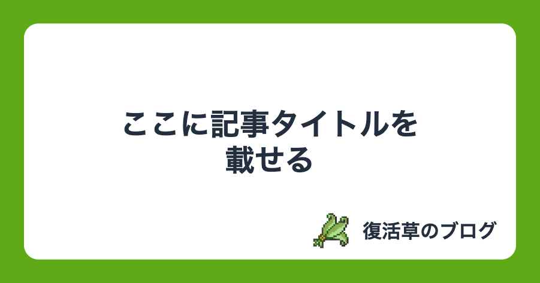
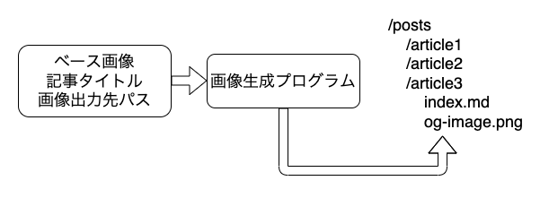
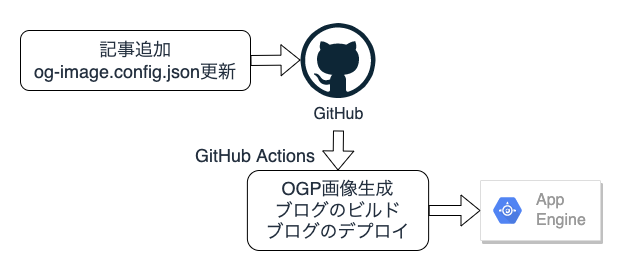
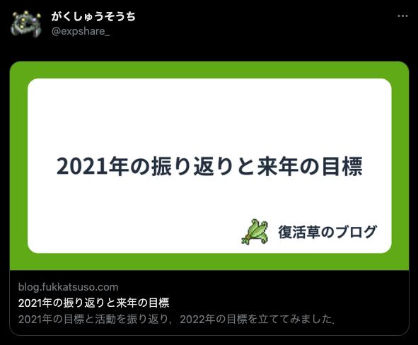
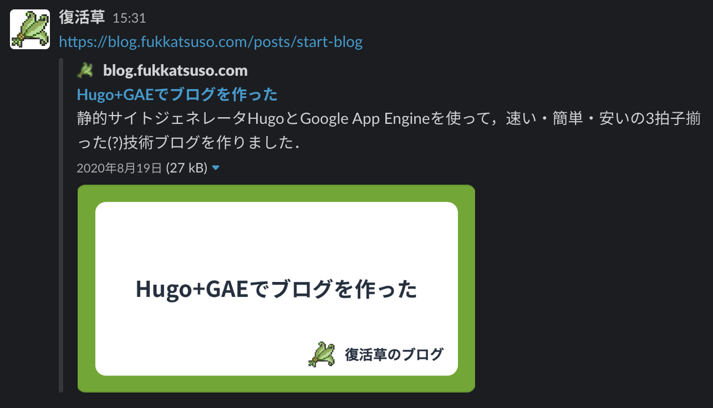

当ブログが開設して1年以上経ちますが，OGP設定を後回しにしたままだったので対応しました．
また，OGP画像を自動生成するフローも作りました．

## 必要な対応

大きく分けて2つ必要です．

- OGP画像の用意
- 記事HTMLのメタデータにOGPの設定を追加
  - TwitterのOGPにも対応する

後者については[OGPの公式サイト](https://ogp.me)や[TwitterのOGPリファレンス](https://developer.twitter.com/en/docs/twitter-for-websites/cards/overview/summary-card-with-large-image)に大体のことが書かれています．
今回は，以下のプロパティをHTMLの`<head>`内の`<meta>`タグとして配置する方針で行います．

| property            | 必須 | 意味・記入するもの    |
| ------------------- | ---- | --------------------- |
| og:title            | Yes  | 記事タイトル          |
| og:type             | Yes  | "article"             |
| og:image            | Yes  | 画像URL               |
| og:url              | Yes  | 記事URL               |
| og:description      | No   | 記事の説明            |
| twitter:card        | Yes  | "summary_large_image" |
| twitter:title       | Yes  | 記事タイトル          |
| twitter:description | No   | 記事の説明            |
| twitter:image       | No   | 画像URL               |

当ブログではHugoを使用しているため，メタデータの設定に関してはHugoを使用している方向けの内容になります．

## OGP画像の用意

まず何をOGP画像にするかですが，1記事ごとに記事タイトル等を載せた別々の画像にするパターンと，1枚の画像を全記事で使い回せるようにサイト名等の共通情報を載せた画像にするパターンがあります．
サイト名だけ載せた画像だと手抜き感があるなと思い，今回は1記事ごとに記事タイトルを載せた別々の画像を用意することにしました．

完成イメージをdrawioで作成したものがこちら．
最近は技術記事投稿サービスといえばzennという風潮があるので，zennのOGP画像を参考にさせてもらいました．



### OGP画像を自動生成する

先ほどの画像の記事タイトル以外をベース画像にして，記事1つにつき1枚のOGP画像を生成します．

今はまだ記事数も少なく，記事タイトルを手作業でベース画像に記入することはそれほど大変ではありません．
ですが今後記事数が増えたり，ベース画像を変えたくなってきたりすると，手作業での画像生成は当然手間がかかります．
手作業による細かなミスを減らすためにも，自動でOGP画像を生成するのが妥当と判断しました．

OGP画像を生成する流れは次の通りです．

1. ベース画像と記事タイトルと画像出力先パスを入力として与える
2. ベース画像に記事タイトルを記入してOGP画像を生成
3. 画像を出力先のパスに保存



画像生成プログラムはGo言語で書きました．

フォントは[Kinto](https://github.com/ookamiinc/kinto)を使用させていただきました．
当初の予定では`Noto Sans JP`を使う予定だったのですが，[Goの画像処理ライブラリ](https://github.com/fogleman/gg)がTrueTypeのフォントにしか対応していない状況で，`Noto Sans JP`のttfファイルを取得することができなかったため，`Noto Sans JP`に近い他のフォントを選択したという経緯です．

画像生成に関するGoプログラムを以下に載せておきます．

```go
import (
	"image"
	"strings"

	"github.com/fogleman/gg"
)

const (
	fontPath = "/usr/share/fonts/Kinto Sans/KintoSans-Bold.ttf"
)

type Config struct {
	TemplatePath string   // ベース画像のパス
	OutputPath   string   // 画像出力先のパス
	Title        []string // 記事タイトル．i番目の文字列が画像内タイトルのi行目として記入される
}

func CreateImage(config Config) (image.Image, error) {
	// px数値をpt単位に変換
	width := 1200 * 3 / 4 // 1200px
	height := 630 * 3 / 4 // 630px
	// ベース
	dc := gg.NewContext(width, height)

	// テンプレート画像をベースにのせる
	backgroundImage, err := gg.LoadImage(config.TemplatePath)
	if err != nil {
		return nil, err
	}
	dc.DrawImage(backgroundImage, 0, 0)

	// フォントサイズ50で読み込み
	if err := dc.LoadFontFace(fontPath, 50); err != nil {
		return nil, err
	}
	// フォントカラー
	dc.SetHexColor("232F3E")

	// 記事タイトルをベースにのせる
	title := strings.Join(config.Title, "\n")
	maxWidth := float64(dc.Width()) * 0.85
	dc.DrawStringWrapped(title, float64(width)/2, float64(height)/2, 0.5, 0.5, maxWidth, 1.5, gg.AlignCenter)

	return dc.Image(), nil
}
```

### 画像生成のタイミング

このブログは記事の更新があるとGitHub Actionsでビルドされ，成果物まるごとGAEにデプロイされます．

そこで，いつOGP画像を生成するのかは少し悩みました．

- A案: 手元で新規記事分の画像生成プログラムを走らせてOGP画像もGitHubにpushする
- B案: GitHub Actionsのワークフローでビルド前に全記事分の画像生成プログラムを走らせる

A案の場合，メリットとしては追加された記事の分だけ画像生成すればいいので，デプロイの時間が短くなると予想されます．
デメリットとしては，ベース画像やフォント設定など全記事のOGP画像に影響のある変更があった際，全記事のOGP画像を生成し直す必要があります．
通常は新規記事の画像だけだが例外として全記事の画像を生成することもある，というように条件分岐が発生してしまい，思わぬところで画像が生成されなかったりするかもしれません．

B案の場合，考えることは全記事分の画像生成だけでよく，条件分岐のないシンプルさがメリットになります．
デメリットとして画像生成に時間がかかるのではないかという点がありますが，手元で試してみたところ，10枚ちょっとの画像生成でも1秒程度しか要しませんでした．
GitHub Actionsでプログラムを動かすためにDocker化する前提なので，画像生成全体に要する時間はDockerイメージのビルド（数十秒かかる）がほとんどを占めることになります．

ということで，シンプルなフローで管理もラク，そして記事数が増えても問題なく画像生成できる**B案**を採用しました．

### 全記事分のOGP画像を生成

先ほどの`CreateImage`関数を使って全記事分のOGP画像を生成します．

方法としては，記事ごとにベース画像のパス(`template`)，画像出力先のパス(`path`)，記事タイトル(`title`)をそれぞれ記した以下のようなjsonファイル(`og-image.config.json`)を用意します．
プログラムのコマンドライン引数でjsonファイルのパスを受け取ることで，全記事のOGP画像生成に必要な情報を読み込むという仕組みです．

```json
// og-image.config.json
[
  {
    "template": "og-image/base.drawio.png",
    "path": "content/posts/article2/og-image.png",
    "title": [
      "これは1行目",
      "これは2行目"
    ]
  },
  {
    "template": "og-image/base.drawio.png",
    "path": "content/posts/blog-ogp/og-image.png",
    "title": [
      "Hugo製ブログのOGP画像を",
      "GitHub Actionsで自動生成する"
    ]
  },
]
```

```go
// og-image/main.go

type Config struct {
	TemplatePath string   `json:"template"`
	OutputPath   string   `json:"path"`
	Title        []string `json:"title"`
}

func CreateImage(config Config) (image.Image, error)

// jsonファイルからConfigリストを読み取る
func readConfig(path string) ([]Config, error) {
	raw, err := ioutil.ReadFile(path)
	if err != nil {
		return nil, err
	}

	var configs []Config
	if err := json.Unmarshal(raw, &configs); err != nil {
		return nil, err
	}

	return configs, nil
}

func main() {
	if len(os.Args) < 2 {
		fmt.Println("please pass the config file path as an argument")
		os.Exit(1)
	}

	configFilePath := os.Args[1]
	configs, err := readConfig(configFilePath)
	if err != nil {
		fmt.Println(err)
		os.Exit(1)
	}

	for _, config := range configs {
		// 画像生成
		img, err := CreateImage(config)
		if err != nil {
			fmt.Println(err)
			os.Exit(1)
		}

		// 画像保存
		if err := gg.SavePNG(config.OutputPath, img); err != nil {
			fmt.Println(err)
			os.Exit(1)
		}
	}
}
```

プログラム全体は[こちら](https://github.com/Fukkatsuso/blog/blob/master/og-image/main.go)です．

プログラムは次のように実行します．

```sh
$ go run og-image/main.go og-image.config.json
```

以上でOGP画像の用意ができるようになりました．

## Hugo側のOGP対応

2つの作業を行います．
なお，当ブログではデザインテーマに[Hugo Notepadium](https://themes.gohugo.io/hugo-notepadium)を使用しています．

### 記事のmetaタグを追加

OGPに関する根幹の部分は，Hugoで提供されている`_internal/opengraph.html`を使用しました．
(<https://github.com/gohugoio/hugo/blob/master/tpl/tplimpl/embedded/templates/opengraph.html>)

```html
<!-- layouts/partials/head-extra.html -->
<link rel="icon" type="image/vnd.microsoft.icon" href="{{ .Site.BaseURL }}favicon.ico">

{{ if .Description }}
  <meta name="description" content="{{ .Description }}">
{{ else if .IsPage }}
  <meta name="description" content="{{ .Summary | plainify }}">
{{ end }}

{{ template "_internal/opengraph.html" . }}
```

TwitterのOGPについては，Hugo Notepadiumの`partials/twitter-card.html`をベースに，カードサイズを大きくしたり変数名を修正したりしたものを作成しました．

```html
<!-- layouts/partials/twitter-card.html -->
<meta name="twitter:card" content="summary_large_image" />
<meta name="twitter:title" content="{{- .Title -}}" />

{{ if .Description }}
  <meta name="twitter:description" content="{{ .Description }}">
{{ else if .IsPage }}
  <meta name="twitter:description" content="{{ .Summary | plainify }}">
{{ end }}

{{ $imgurl := "" }}
{{ if .Params.images }}
  {{ $imgurl = index .Params.images 0 }}
{{ end }}
{{ if gt (len $imgurl) 0 }}
  {{ $imgurl = lower $imgurl }}
  {{ if and (not (hasPrefix $imgurl "http://")) (not (hasPrefix $imgurl "https://")) }}
    {{ $imgurl = print .Site.BaseURL $imgurl }}
  {{ end }}
  <meta name="twitter:image" content="{{ $imgurl }}" />
{{ end }}
```

### 記事MarkdownのメタデータにOGP画像へのパスを追加

Hugoのビルド時に`.Params.images`パラメータの最初の要素がOGP画像へのリンクとして設定されます．

ということで各記事のMarkdownのメタデータに`images`タグを追加し，その最初の要素にOGP画像へのリンクを入れればOKです．
記事から見たOGP画像へのパスではなく，ブログ内でのOGP画像の相対リンクもしくは絶対リンクでないといけないので注意してください．

```md
---
title: "Hugo製ブログのOGP画像をGitHub Actionsで自動生成する"
images:
  - posts/blog-ogp/og-image.png
---
```

## GitHub Actionsのワークフロー

OGP画像生成も含めた，新規記事の作成からGAEへのデプロイまでのフローはこのようになります．



GitHub Actionsでは，画像生成プログラムをDockerコンテナ上で動かします．
そのためのDockerfileがこちらです．

```dockerfile
FROM golang:1.17-bullseye

RUN apt-get update \
    && apt-get install -y unzip \
    && cp /usr/share/zoneinfo/Asia/Tokyo /etc/localtime \
    && echo "Asia/Tokyo" > /etc/timezone

WORKDIR /go/src/github.com/Fukkatsuso/blog/og-image

# 最新releaseだけをダウンロードしてttfファイルを取り出す
RUN curl -s https://api.github.com/repos/ookamiinc/kinto/releases/latest \
    | grep "browser_download_url.*zip" \
    | cut -d : -f 2,3 \
    | tr -d '"' \
    | wget -qi - \
    && mkdir -p /usr/share/fonts/ \
    && unzip KintoSans.zip Kinto\ Sans/*.ttf -d /usr/share/fonts \
    && chmod 644 /usr/share/fonts/Kinto\ Sans \
    && rm KintoSans.zip

COPY go.* ./
RUN go mod download

COPY main.go ./
RUN CGO_ENABLED=0 GOOS=linux go build -mod=readonly -x -o /go/bin/og-image

ENTRYPOINT [ "/go/bin/og-image" ]
```

`go.mod`も含めたプログラム一式はここにアップロードしています．
<https://github.com/Fukkatsuso/blog/tree/master/og-image>

上の図の通り，OGP画像の生成はブログのビルド直前に行います．
`Create OG-Image`のステップにて，画像生成用Dockerイメージの作成とコンテナ実行をします．

```yml
# .github/workflows/deploy.yml
name: Deploy

on:
  push:
    branches:
      - master
    paths:
      - "**"
      - "!README.md"
      - "!.gitignore"

jobs:
  deploy:
    runs-on: ubuntu-latest

    steps:
      - name: Checkout the repository
        uses: actions/checkout@v2
        with:
          submodules: true

      - name: Create OG-Image
        run: |
          docker build -t og-image og-image/
          docker run --rm \
            -v `pwd`:/go/src/github.com/Fukkatsuso/blog \
            -w /go/src/github.com/Fukkatsuso/blog \
            og-image og-image.config.json

      # 以下，ビルドとデプロイ
```

その後のビルドによってOGP画像を含んだ静的ファイルが成果物として生成されるので，静的ファイル一式をそのままデプロイすればOKです．

(<https://github.com/Fukkatsuso/blog/blob/master/.github/workflows/deploy.yml>)

## OGPに対応できているかのチェック

これにてOGP対応に必要な作業は完了です．

確認として，TwitterとSlackで記事へのリンクを貼ってみました．





OGPに対応できていますね．
画像生成が少し大変だっただけで，必要な設定自体は少なく，思ったよりも簡単にできました．

## 参考

- https://ogp.me
- https://developer.twitter.com/en/docs/twitter-for-websites/cards/overview/summary-card-with-large-image
- https://ladicle.com/post/20200623_164459
- https://sotaro.io/ja/googp-ja
- https://miyahara.hikaru.dev/posts/20200319
