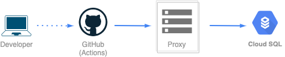

GCPのCloud SQLを利用したプロジェクトで，GitHub Actionsとgolang-migrateを使ってDBのマイグレーションを自動化してみました．

## 構成

### 使用したツール・サービス

- GitHub Actions
- golang-migrate
- Cloud SQL Auth Proxy (Dockerイメージ)
- Cloud SQL (MySQL5.7, db-f1-micro)

### サービス構成，フロー



流れは簡単で，

1. 開発者（Developer）がGitHubにpush
2. GitHub Actionsでプロキシを使用してCloud SQLに接続し，マイグレーション

これだけです．

### ディレクトリ構成

```bash
.
├── .github
│   └── workflows
│       └── migration.yml
└── db
    └── migrations
        ├── 000001_create_users_table.down.sql
        ├── 000001_create_users_table.up.sql
        ├── 000002_create_posts_table.down.sql
        └── 000002_create_posts_table.up.sql
```

`db/migrations`以下に，golang-migrateの仕様に合わせたマイグレーションファイルを配置しています．
上では例として，usersテーブルの作成，postsテーブルの作成をするつもりのファイルを配置しました．

GitHub Actionsでは`.github/workflows/migration.yml`に書いたワークフローを走らせます．
`migrate up`コマンドで`db/migrations/XXX.up.sql`が実行され，`migrate down`コマンドで`db/migrations/XXX.down.sql`が実行される仕様です．

## GCP

準備として，GCPのサービスアカウントを作成します．

APIの有効化とサービスアカウントへのrole付与などが必要ですが，ここでは割愛します．
Cloud RunとCloud SQLを使っており，GitHub Actionsからマイグレーションを実行するようなプロジェクトにおいてサービスアカウントを作成する方法を[ドキュメント](https://github.com/Fukkatsuso/cryptocurrency-trading-bot/blob/main/doc/gcp_project.md)として書いています．
こちら参考にしてみてください．

サービスアカウントが作成できたらキー（jsonファイル）を手元に保存しておきます．
キーは外部に公開しないでください．

Cloud SQLインスタンスも立てておく必要があります．
これも[ドキュメント](https://github.com/Fukkatsuso/cryptocurrency-trading-bot/blob/main/doc/gcp_project.md)に手順を書いています．

## Secretsの設定

GitHubのリポジトリのページから，Settings > Secretsの画面でRepository secretsの設定を行います．

- CLOUDSQL_INSTANCE: Cloud SQLのインスタンス名
- GCP_PROJECT: GCPのプロジェクトID
- GCP_REGION: Cloud SQLのリージョン
- GCP_SA_KEY: GCPのサービスアカウントキー
- MYSQL_DATABASE: データベース名
- MYSQL_PASSWORD: データベースのパスワード
- MYSQL_USER: データベースのユーザ

これらを設定してください．
ワークフローから`${{ secrets.GCP_PROJECT }}`のように参照でき，なおかつログにはアスタリスクで隠された文字列として表示されるため安全です．

## マイグレーションのワークフロー

ようやく本題のマイグレーションが実行できます．
以下は`.github/workflows/migration.yml`の中身です．

```yml
name: Migration

on:
  push:
    branches:
      - main

env:
  PROXY_IMAGE: gcr.io/cloudsql-docker/gce-proxy
  CLOUDSQL_INSTANCE_CONNECTION_NAME: ${{ secrets.GCP_PROJECT }}:${{ secrets.GCP_REGION }}:${{ secrets.CLOUDSQL_INSTANCE }}
  MYSQL_DSN: mysql://${{ secrets.MYSQL_USER }}:${{ secrets.MYSQL_PASSWORD }}@tcp(127.0.0.1:3306)/${{ secrets.MYSQL_DATABASE }}

jobs:
  migrate-db:
    runs-on: ubuntu-18.04
    defaults:
      run:
        working-directory: db

    steps:
      - uses: actions/checkout@v1

      - name: Start Cloud SQL Proxy
        run: |
          echo '${{ secrets.GCP_SA_KEY }}' > sa_key
          docker pull $PROXY_IMAGE
          docker run -d \
            -v $PWD/sa_key:/config \
            -p 127.0.0.1:3306:3306 \
            $PROXY_IMAGE /cloud_sql_proxy \
            -instances=$CLOUDSQL_INSTANCE_CONNECTION_NAME=tcp:0.0.0.0:3306 \
            -credential_file=/config

      - name: Install migrate
        run: |
          curl -L https://packagecloud.io/golang-migrate/migrate/gpgkey | sudo apt-key add -
          echo "deb https://packagecloud.io/golang-migrate/migrate/ubuntu/ $(lsb_release -sc) main" | sudo tee /etc/apt/sources.list.d/migrate.list
          sudo apt-get update
          sudo apt-get install -y migrate

      - name: Migrate DB (up)
        run: migrate -path "./migrations/" -database "$MYSQL_DSN" up
```

mainブランチへのpushのみトリガーとするようにしています．
これにより，直接mainブランチへpushしたとき，もしくはプルリクなどでmainブランチにマージされたときにワークフローが開始されます．

以下，ステップごとの説明です．

### Step1. Cloud SQLのプロキシを起動

```yml
- name: Start Cloud SQL Proxy
  run: |
    echo '${{ secrets.GCP_SA_KEY }}' > sa_key
    docker pull $PROXY_IMAGE
    docker run -d \
      -v $PWD/sa_key:/config \
      -p 127.0.0.1:3306:3306 \
      $PROXY_IMAGE /cloud_sql_proxy \
      -instances=$CLOUDSQL_INSTANCE_CONNECTION_NAME=tcp:0.0.0.0:3306 \
      -credential_file=/config
```

権限付与したGCPのサービスアカウントのキーを，sa_keyという名前のファイルに保存しておきます．
これはプロキシの認証に必要です．

次にCloud SQL Proxyの公式のDockerイメージをpullし，`docker run`で起動します．
このコマンドは[GCPのドキュメント](https://cloud.google.com/sql/docs/postgres/connect-admin-proxy#connecting-docker)にほとんどそのまま書いてあります．

書き方がわかればこんなもんですが，サービスアカウントキーをシングルクオートで囲っておかないと，`echo`コマンドでリダイレクトする際に失敗してしまうという罠がありました．

### Step2. golang-migrateをインストール

```yml
- name: Install migrate
  run: |
    curl -L https://packagecloud.io/golang-migrate/migrate/gpgkey | sudo apt-key add -
    echo "deb https://packagecloud.io/golang-migrate/migrate/ubuntu/ $(lsb_release -sc) main" | sudo tee /etc/apt/sources.list.d/migrate.list
    sudo apt-get update
    sudo apt-get install -y migrate
```

ジョブはUbuntuで動かしているので[Linux向けのインストール方法](https://github.com/golang-migrate/migrate/tree/master/cmd/migrate#linux-deb-package)をもとに記述しています．

これも，パイプラインやリダイレクトの権限周りでエラーが起き，`sudo`を付けたり`tee`コマンドに置き換えたりする必要がありました．

### Step3. マイグレーションを実行

```yml
- name: Migrate DB (up)
  run: |
    migrate -path "./migrations/" -database "$MYSQL_DSN" up
```

golang-migrateは，upやdownのコマンドの引数として1や2といった数字を与えると，現在のDBのバージョンを1段階，2段階上げたり下げたりすることが可能です．
数字を与えない場合，upもしくはdownのマイグレーションが全て実行されます．

今回はup（`db/migrations/XXX.up.sql`）を全て実行してDBを最新バージョンにします．

基本的に，コードにコミットされているスクリプトは全て実行して，バージョンを下げたり細かな調整をしたりするのは手動でやるという想定です．

## 最後に

Cloud SQLのマイグレーションを自動化する方法を紹介しました．

Cloud Buildを使った自動化についての記事はいくつもありますが，GitHub Actionsでやる方法はあまり見かけなかったのでブログ記事に書いてみました．
ちなみに個人で利用する分には無料枠のあるGitHub Actionsの方がお手軽感もあって好きです．

できてしまえばこんなものかという感じがしますが，成功するまでのドキュメントを読みこんだりする過程で，クラウドサービスの扱いに慣れるきっかけにもなると思います．
何よりも，自動化すれば開発自体に集中できるという点が一番良いですね．

## 参考

- [golang-migrate/migrate](https://github.com/golang-migrate/migrate)
- [Cloud SQL Auth Proxy について](https://cloud.google.com/sql/docs/postgres/sql-proxy)
- [Cloud SQL Auth Proxy を使用して接続する](https://cloud.google.com/sql/docs/postgres/connect-admin-proxy)
