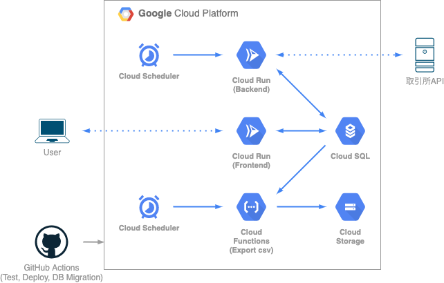

長いこと開発していた仮想通貨取引 bot が一段落したのでブログに書こうと思います。

## 開発の動機、目的

1 年ほど前まで、AtCoder のコンテストに参加したり数独ソルバーを作ったりなどアルゴリズムの勉強をよくやっていました。
アルゴリズムの勉強で培った力をよりエキサイティングな分野に適用できないかと考えたところ、今後成長していきそうな仮想通貨で自動取引をするのが面白そうだなと思い、Udemy の動画講座にて Golang による仮想通貨取引 bot 開発の勉強をしました。
そこで作った bot を自分なりに運用できる＋利益が出せるレベルまで発展させてみようということで、今回の開発を始めた次第です。

この時点での目標としては以下を挙げていました。

- 低コスト（月額 1000 ~ 1500 円程度）で運用できる
- 取引の利益が安定して出せる
- すでに勉強していた GCP を活用する

## 作ったもの

以下を公開しています。

- コード：<https://github.com/Fukkatsuso/cryptocurrency-trading-bot>
- 管理画面：<https://dashboard-qboqrrfuaq-an.a.run.app>

### 機能、アーキテクチャ

開発前から考えていたような機能は全て実装できたと思います。

- 定期的（5 分おき）に bitFlyer から価格データを取得し、DB に保存する
- 定期的（毎日 8:56）に価格データを分析し、出た売買シグナルに従って bitFlyer で仮想通貨を売買する
- 管理画面
  - チャートや取引履歴を閲覧できる
  - バックテスト（過去の価格データを用いてロジックを試す）が実行できる
  - 管理者のみ、分析・取引用のパラメータを調整できる

取引対象にはイーサリアムを選びました。
bitFlyer の API で取引できる最小量は 0.01 となっており、自分の財力的に判断して最大手のビットコインは諦めて 2 番手のイーサリアムにしました。
当時はお金で選んだだけでしたが、NFT やメタバースなどがもてはやされるようになった今、ビットコインよりもよく話題に上がっているイーサリアムを選んでなかなかいい判断をしたなと思っています。
（投機対象としてしか見れていないのでイーサリアムについてはもう少し深く勉強したいです）

勉強のためとはいえあまりコストをかけると破産してしまうので、取引などの実行間隔はよく検討して決めました。
まず取引は最大でも 1 日 1 回にすることで、取引に関して急を要するエラーが発生した場合でも余裕を持って対応できます。
そして 1 日 1 回の取引時の分析には 1 日ごとの値動きを表す「日足」というデータを使うため、定期的に価格データを取得する必要がありました。
日足を用意するための価格データ取得間隔はなるべく短くすべき一方、価格データを常に取得するのはコスト的に難しい、というトレードオフを考慮した結果、5 分おきであれば両者許容できると判断しました。

また、いつでもどこでもチャートと取引履歴をチェックできるように管理画面も作成しました。

管理者ログイン機能も付け、取引を一時停止させたり諸パラメータを変更したりできるようにもしました。

アーキテクチャはこのようになっています。

Cloud Scheduler からの HTTP リクエストをトリガーにして定期実行します。
外部からの未知のリクエストを防ぐためプライベートなバックエンドで取引や価格データ取得を担い、管理画面用のフロントエンドと分けて開発しました。
後でも説明しますが、Cloud Functions で価格データを毎日 csv にエクスポートして Cloud Storage に保存するということもやっています。

GitHub Actions ではコードの変更を検知して自動テストやデプロイなどを実行します。

### 使用技術

言語は一番慣れている Golang を使い、フレームワークは使わず標準の net/http パッケージで作りました。
管理画面の方は CDN 版の Vue.js と Golang の静的ファイル配信で提供する形です。

- Golang
- Vue.js (CDN)
- Vuetify

インフラ関連は以下のものを使用しました。
個人開発でとりあえず無料・スピーディに作るなら Cloud Run だろうということで、これを軸になるべく低コストで動かせる構成を目指しました。

- Docker
- MySQL
- GitHub Actions
- Cloud Run
- Cloud SQL
- Cloud Scheduler
- Cloud Functions
- Cloud Storage

費用は月 1500 円弱＋消費税で、その内訳はほとんど Cloud SQL が占めています。
安くて低レイテンシで容量大きい DB サービスないかなぁ…

### 開発期間、工数

期間は 2021 年 4 月 ~ 2022 年 1 月で、ほとんど毎日 10 分 ~ 1 時間程度コードを書いていました。

取引自体は 2021 年 9 月頃にはできていて、そこからリファクタリングやら売買ロジックの改良やら管理画面の管理者ログインやらに精を出していました。
さらに ORM も導入しようか考えましたが、工数に対する成果に魅力を感じなかったので断念しました。

## 工夫点、苦労したこと

### CI/CD

GitHub Actions で、PR 作成時の自動テストと main ブランチマージ後の自動デプロイを整備しました。

自動デプロイを開発の一番始めの頃に整備したことで開発計画とコーディングに集中できました。
デプロイでは DB のマイグレーションも実行しており、そのあたりは [この記事](https://blog.fukkatsuso.com/posts/cloudsql-migration-action) で解説しているので読んでいただけると嬉しいです。

上に書いていた「Cloud Functions で価格データを毎日 csv にエクスポートして Cloud Storage に保存する」ですが、これはテスト時やローカル開発時に本番環境の DB から直接データを読み取るのは避けたいということで用意した仕組みです。
どこかのサービスからイーサリアムの価格データを API で取得する方法も検討したのですが、ある程度長期間に渡る日本円のイーサリアム価格となると提供されているものが見つからず、自前で用意するほかないということで本番データを使うことになりました。

### リファクタリング

最初のコードは Udemy で勉強した際のコードの配置を少し変えた程度で、MVC といった感じのアーキテクチャでした。

ところがいざテストを書くとなると、bitFlyer の API を叩いて本当に取引しないといけないような非現実的な箇所が出てしまう問題に直面しました。
bitFlyer API のリクエスト/レスポンスなどをダミーに差し替えられるよう、外部への依存を抽象化できるアーキテクチャに書き換えることとなり、そこでレイヤードアーキテクチャを採用して大規模なリファクタリングを行いました。

レイヤードアーキテクチャはたまたま読んでいたドメイン駆動設計の本で出てきたので、実践の場としてもぜひやってみようということで選びました。

導入してみた感想としては、分割と抽象化の影響でコード量がめちゃくちゃ増えて大変でしたが、テストはすごくやりやすくなったので次に個人で新規開発するときも採用したいと思いました。

1 つ今でもよく分かっていないのが、cookie とセッション ID を用いたログイン・ログアウトなどの認証・認可をどの層に書くべきかということです。
今回はインフラ層に cookie のセット・取得・削除を実装し、これらを抽象化した cookie インタフェースを使って、ログイン・ログアウトのハンドラをインタフェース層に実装する方法を取りました（[詳細はこのあたり](https://github.com/Fukkatsuso/cryptocurrency-trading-bot/pull/150)）.
認証・認可周りはインフラ層に含めるべきという記事を読んだことがありますが、「HTTP リクエストのこの情報を使う」というインタフェース層に依存してしまうような実装が、インフラ層に混入しても良いのか？という疑念が拭えません。

### 取引ロジック

最後まで苦労したのが、**大損せず、上昇トレンドに乗って確実に利益を出すような、ロバスト性のある**取引ロジックを作ることでした。

基本的には価格データをテクニカル分析して、例えば EMA（指数平滑移動平均線）であればゴールデンクロスで買いデッドクロスで売るといった仕組みで、他にインジケータとしてボリンジャーバンドや RSI, MACD なども使用していました。

最初は「どれかのインジケータで 1 つでもシグナルが出たら売買する」というロジックでしたが、上昇して買いシグナルが出たから買ったもののすぐに下落する、というジリ貧 bot になってしまっていました。

このようないわゆる騙しというものに引っかからないよう、次に考えたのが「同時に 2 個以上のインジケータでシグナルが出たときだけ売買する」というロジックですが、基準が高すぎて売買の機会すらなくなってしまう始末だったのでボツになりました。

最終的には、難しいインジケータの組み合わせを考えるよりも、信頼性の高いインジケータを 1,2 個だけ使ってなるべくシンプルにしたほうが予測も立てやすいという結論に至り、MACD（と RSI）ベースのロジックに落ち着きました。

迷走の過程は [ここ](https://github.com/Fukkatsuso/cryptocurrency-trading-bot/issues/50) で全世界に公開しているのでどうぞご覧ください。

また研究していく中で気づいたのは、インジケータの選定と同じかそれ以上に損切りが重要であるということです。
有用そうなインジケータさえ見つけられれば、そのインジケータが「これから上昇するはず」と予測したのに下落しているということは即座に損切りして次に備えるべきで、これがシンプルでロバスト性が高い方法だと思います。

最終的なロジックは使い始めたばかりで性能を見れていませんが、5 回に 1 回くらいは大きな上昇トレンドが来ればきっと利益を出せる bot になると考えています。

## 今後の課題

現段階では運用費も含め大赤字なので、まずは現行のロジックでうまくいくことを確認し次第、取引量を増やしたり、利益を次の取引に重ねて複利を狙ったりするつもりです。
最低でも運用費くらいは賄えたら万々歳ですね。

また、今使用している注文方式である成行注文（相場価格に従って売買する）だけでなく、指値注文（能動的に取引価格を決めて売買する）も試してみたいと考えています。
仮想通貨 bot 界隈ではむしろ指値注文が使われている印象なので、調べがいがありそうです。

振り返ってみて、長期間に渡ってしっかり作り込んだ個人開発は初めてでしたが、割と満足度の高いモノづくりができたかなと思います。
