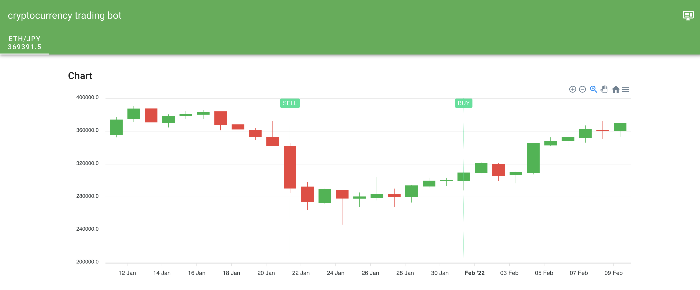
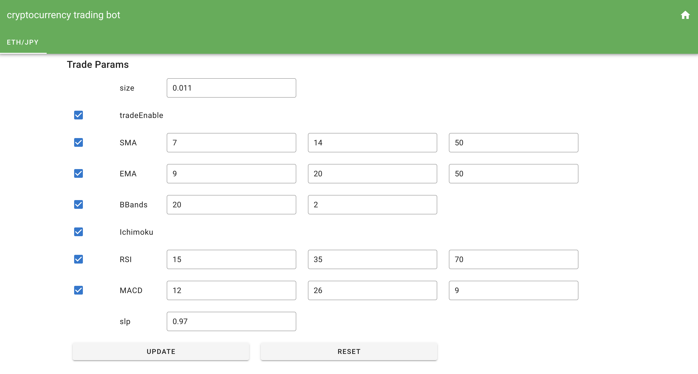
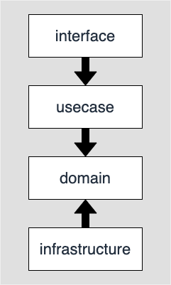

長いこと開発していた仮想通貨取引botが一段落したのでブログに書こうと思います．

## 開発の動機，目的

1年ほど前まで，AtCoderのコンテストに参加したり数独ソルバーを作ったりなどアルゴリズムの勉強をよくやっていました．
アルゴリズムの勉強で培った力をよりエキサイティングな分野に適用できないかと考えたところ，今後成長していきそうな仮想通貨で自動取引をするのが面白そうだなと思い，Udemyの動画講座にてGolangによる仮想通貨取引bot開発の勉強をしました．
そこで作ったbotを自分なりに運用できる＋利益が出せるレベルまで発展させてみようということで，今回の開発を始めた次第です．

この時点での目標としては以下を挙げていました．

- 低コスト（月額1000~1500円程度）で運用できる
- 取引の利益が安定して出せる
- すでに勉強していたGCPを活用する

## 作ったもの

以下を公開しています．

- コード: <https://github.com/Fukkatsuso/cryptocurrency-trading-bot>
- 管理画面: <https://dashboard-qboqrrfuaq-an.a.run.app>

### 機能，アーキテクチャ

開発前から考えていたような機能は全て実装できたと思います．

- 定期的（5分おき）にbitFlyerから価格データを取得し，DBに保存する
- 定期的（毎日8:56）に価格データを分析し，出た売買シグナルに従ってbitFlyerで仮想通貨を売買する
- 管理画面
  - チャートや取引履歴を閲覧できる
  - バックテスト（過去の価格データを用いてロジックを試す）が実行できる
  - 管理者のみ，分析・取引用のパラメータを調整できる

取引対象にはイーサリアムを選びました．
bitFlyerのAPIで取引できる最小量は0.01となっており，自分の財力的に判断して最大手のビットコインは諦めて2番手のイーサリアムにしました．
当時はお金で選んだだけでしたが，NFTやメタバースなどがもてはやされるようになった今，ビットコインよりもよく話題に上がっているイーサリアムを選んでなかなかいい判断をしたなと思っています．
（投機対象としてしか見れていないのでイーサリアムについてはもう少し深く勉強したいです）

勉強のためとはいえあまりコストをかけると破産してしまうので，取引などの実行間隔はよく検討して決めました．
まず取引は最大でも1日1回にすることで，取引に関して急を要するエラーが発生した場合でも余裕を持って対応できます．
そして1日1回の取引時の分析には1日ごとの値動きを表す「日足」というデータを使うため，定期的に価格データを取得する必要がありました．
日足を用意するための価格データ取得間隔はなるべく短くすべき一方，価格データを常に取得するのはコスト的に難しい，というトレードオフを考慮した結果，5分おきであれば両者許容できると判断しました．

また，いつでもどこでもチャートと取引履歴をチェックできるように管理画面も作成しました．

管理者ログイン機能も付け，取引を一時停止させたり諸パラメータを変更したりできるようにもしました．

アーキテクチャはこのようになっています．

Cloud SchedulerからのHTTPリクエストをトリガーにして定期実行します．
外部からの未知のリクエストを防ぐためプライベートなバックエンドで取引や価格データ取得を担い，管理画面用のフロントエンドと分けて開発しました．
後でも説明しますが，Cloud Functionsで価格データを毎日csvにエクスポートしてCloud Storageに保存するということもやっています．

GitHub Actionsではコードの変更を検知して自動テストやデプロイなどを実行します．

### 使用技術

言語は一番慣れているGolangを使い，フレームワークは使わず標準のnet/httpパッケージで作りました．
管理画面の方はCDN版のVue.jsとGolangの静的ファイル配信で提供する形です．

- Golang
- Vue.js (CDN)
- Vuetify

インフラ関連は以下のものを使用しました．
個人開発でとりあえず無料・スピーディに作るならCloud Runだろうということで，これを軸になるべく低コストで動かせる構成を目指しました．

- Docker
- MySQL
- GitHub Actions
- Cloud Run
- Cloud SQL
- Cloud Scheduler
- Cloud Functions
- Cloud Storage

費用は月1500円弱+消費税で，その内訳はほとんどCloud SQLが占めています．
安くて低レイテンシで容量大きいDBサービスないかなぁ...

### 開発期間，工数

期間は2021年4月〜2022年1月で，ほとんど毎日10分〜1時間程度コードを書いていました．

取引自体は2021年9月頃にはできていて，そこからリファクタリングやら売買ロジックの改良やら管理画面の管理者ログインやらに精を出していました．
さらにORMも導入しようか考えましたが，工数に対する成果に魅力を感じなかったので断念しました．

## 工夫点，苦労したこと

### CI/CD

GitHub Actionsで，PR作成時の自動テストとmainブランチマージ後の自動デプロイを整備しました．

自動デプロイを開発の一番始めの頃に整備したことで開発計画とコーディングに集中できました．
デプロイではDBのマイグレーションも実行しており，そのあたりは[この記事](https://blog.fukkatsuso.com/posts/cloudsql-migration-action)で解説しているので読んでいただけると嬉しいです．

上に書いていた「Cloud Functionsで価格データを毎日csvにエクスポートしてCloud Storageに保存する」ですが，これはテスト時やローカル開発時に本番環境のDBから直接データを読み取るのは避けたいということで用意した仕組みです．
どこかのサービスからイーサリアムの価格データをAPIで取得する方法も検討したのですが，ある程度長期間に渡る日本円のイーサリアム価格となると提供されているものが見つからず，自前で用意するほかないということで本番データを使うことになりました．

### リファクタリング

最初のコードはUdemyで勉強した際のコードの配置を少し変えた程度で，MVCといった感じのアーキテクチャでした．

ところがいざテストを書くとなると，bitFlyerのAPIを叩いて本当に取引しないといけないような非現実的な箇所が出てしまう問題に直面しました．
bitFlyer APIのリクエスト/レスポンスなどをダミーに差し替えられるよう，外部への依存を抽象化できるアーキテクチャに書き換えることとなり，そこでレイヤードアーキテクチャを採用して大規模なリファクタリングを行いました．

レイヤードアーキテクチャはたまたま読んでいたドメイン駆動設計の本で出てきたので，実践の場としてもぜひやってみようということで選びました．

導入してみた感想としては，分割と抽象化の影響でコード量がめちゃくちゃ増えて大変でしたが，テストはすごくやりやすくなったので次に個人で新規開発するときも採用したいと思いました．

一つ今でもよく分かっていないのが，cookieとセッションIDを用いたログイン・ログアウトなどの認証・認可をどの層に書くべきかということです．
今回はインフラ層にcookieのセット・取得・削除を実装し，これらを抽象化したcookieインタフェースを使って，ログイン・ログアウトのハンドラをインタフェース層に実装する方法を取りました（[詳細はこのあたり](https://github.com/Fukkatsuso/cryptocurrency-trading-bot/pull/150)）．
認証・認可周りはインフラ層に含めるべきという記事を読んだことがありますが，「HTTPリクエストのこの情報を使う」というインタフェース層に依存してしまうような実装が，インフラ層に混入しても良いのか?という疑念が拭えません．

### 取引ロジック

最後まで苦労したのが，**大損せず，上昇トレンドに乗って確実に利益を出すような，ロバスト性のある**取引ロジックを作ることでした．

基本的には価格データをテクニカル分析して，例えばEMA（指数平滑移動平均線）であればゴールデンクロスで買いデッドクロスで売るといった仕組みで，他にインジケータとしてボリンジャーバンドやRSI，MACDなども使用していました．

最初は「どれかのインジケータで1つでもシグナルが出たら売買する」というロジックでしたが，上昇して買いシグナルが出たから買ったもののすぐに下落する，というジリ貧botになってしまっていました．

このようないわゆる騙しというものに引っかからないよう，次に考えたのが「同時に2個以上のインジケータでシグナルが出たときだけ売買する」というロジックですが，基準が高すぎて売買の機会すらなくなってしまう始末だったのでボツになりました．

最終的には，難しいインジケータの組み合わせを考えるよりも，信頼性の高いインジケータを1，2個だけ使ってなるべくシンプルにしたほうが予測も立てやすいという結論に至り，MACD（とRSI）ベースのロジックに落ち着きました．

迷走の過程は[ここ](https://github.com/Fukkatsuso/cryptocurrency-trading-bot/issues/50)で全世界に公開しているのでどうぞご覧ください．

また研究していく中で気づいたのは，インジケータの選定と同じかそれ以上に損切りが重要であるということです．
有用そうなインジケータさえ見つけられれば，そのインジケータが「これから上昇するはず」と予測したのに下落しているということは即座に損切りして次に備えるべきで，これがシンプルでロバスト性が高い方法だと思います．

最終的なロジックは使い始めたばかりで性能を見れていませんが，5回に1回くらいは大きな上昇トレンドが来ればきっと利益を出せるbotになると考えています．

## 今後の課題

現段階では運用費も含め大赤字なので，まずは現行のロジックでうまくいくことを確認し次第，取引量を増やしたり，利益を次の取引に重ねて複利を狙ったりするつもりです．
最低でも運用費くらいは賄えたら万々歳ですね．

また，今使用している注文方式である成行注文（相場価格に従って売買する）だけでなく，指値注文（能動的に取引価格を決めて売買する）も試してみたいと考えています．
仮想通貨bot界隈ではむしろ指値注文が使われている印象なので，調べがいがありそうです．

振り返ってみて，長期間に渡ってしっかり作り込んだ個人開発は初めてでしたが，割と満足度の高いモノづくりができたかなと思います．
