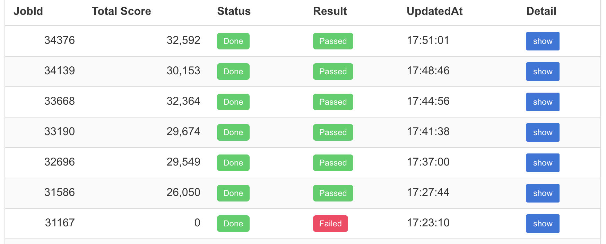

ISUCON13 にチーム「俺らの latestMap」として出場し、結果はスコア 32,592 で 60 位でした。

振り返りと来年に向けての課題をブログに書いておこうと思います。

## チームメンバー

僕を含め、この 3 人で出場しました。

- [t-kinomura](https://github.com/t-kinomura)
- [roaris](https://github.com/roaris)
- [Fukkatsuso](https://github.com/Fukkatsuso)

## 当日までの準備

このチームは会社の同期と組んだチームで、メンバー全員 ISUCON は初めてという状態からのスタートでした。
新卒研修で一緒だったということもあり高い熱量で、本番の半年以上前の 5 月から毎週のように練習や準備を行っていました。

ちなみに使用言語は Go です。
近年の ISUCON で主流となっている言語であり、全員ある程度習得していたのが選定理由です。

初期のチーム練習では、1 つの問題を 1 ヶ月前後かけてみんなでじっくり解くという取り組み方をしていました。
少し慣れてきたところで ISUCON12 予選問題を個人戦で競いながら鍛錬を積んだり、本番直前の 1 ヶ月は本番形式でチームとしての動き方を練習したりと、いい感じに準備ができたのではないかと思います。

- 5 ~ 7 月：11 予選、11 本選をみんなでじっくり
- 8 月：予定が合わずお休み
- 9 ~ 10 月：12 予選を個人でじっくり
- 10 ~ 11 月：12 本選、10 予選、10 本選を本番形式で
- 本番 1 週間前：最後にまた 12 本選を本番形式で

個人的な準備としては、チーム練習の合間に以下のことをやっていました。

- ISUCON 本を読む
- コマンドベースでのサーバセットアップ手順書を整備
- プロファイリング周りのコマンド整備

## 本番の流れ

### 初動

事前に決めていた役割分担に従って、僕がサーバのセットアップをしている間に、他の二人はマニュアルを読んだり最初の改善に乗り出したりする、という流れで動きました。
初動は自分の作業に集中しきっていたので、初動に関しては自分の担当であるセットアップについての記録になります。

まずスタック構築からですが、CloudFormation の構築からいきなりコケました。
これはサーバの authorized_keys に保存する公開鍵が多すぎたことによるエラーが発生したためです。
ここで使用する公開鍵は、CloudFormation のテンプレートダウンロード時に選手の GitHub から引っ張ってくる仕組みになっています。
そのため GitHub に登録している公開鍵が一定数を超えてしまうと、スタック構築時に「データが許容サイズを超えています」というエラーが出て構築に失敗してしまいます。
ということで、メンバー全員 GitHub から不要な公開鍵を削除し、再度テンプレートをダウンロードし直して、ようやく構築に成功しました。

普段の練習では CloudFormation を使わずに環境構築していたので事前に気づくことができず、本番での思わぬ失敗＋タイムロスになってしまいました。

スタック構築が完了したら最初のベンチマークを取り、問題なく動作することと初期スコアを確認しました。
初期スコアは 3,600 でした。

その後サーバに SSH で入り、webapp ディレクトリやミドルウェア設定ファイルなどを git 管理下に入れる作業と、デプロイやプロファイリングのためのツール整備をしていきました。
自分たちのチームが取っているデプロイ方法は、サーバに入って `make build` してアプリケーションをビルドし、環境変数ファイルやミドルウェア設定ファイルを cp / シンボリックリンクで配置するという方法です。
プロファイリングで使用しているツールは top, alp, pprof, pt-query-digest です。

しかしここでも想定外の事態が 2 つ発生してしまいました。
まず Nginx の `sites-(available|enabled)` ファイルの構成が、普段練習していた過去問とは微妙に違っていたという問題ですが、これは自分の確認不足のせいでもあってすぐ挽回できました。
ただ、2 つ目の「pprof のエンドポイント (`/debug/pprof/profile`) が `404 Not Found` を返す」という問題については 12 時を回っても原因がわからず、今回は泣く泣く pprof を使わずに分析する方針にしました…

pprof が使えないのは痛いですが、大体競技の最初は DB が律速なことが多く、直近の本番形式練習でも pprof が活躍する機会がほぼなかったという経緯もあったので、思い切って pprof を使わないという決断をしました。
この問題については後日調査して、来年同じ轍を踏まないようにするしかないですね…
他のチームからは同じ問題に遭遇したという話が上がってきていないので、本当に謎です。

色々とつまずきながら、1.5 ~ 2 時間ほどでサーバ 3 台のセットアップを完了させました。
ここから改善に入っていきますが、1 台目のセットアップが終わった段階で自分以外の二人には改善に入ってもらっていたので、それを含めて以下に記録しておきたいと思います。

### DB にインデックスを貼る & interpolateParams=true

MySQL が CPU を食っていたので pt-query-digest を見たところ、SELECT 系のクエリが上位に来ていました。

livestream_tags, icons, themes, livestreams, livecomments, reactions, それと DNS のための records テーブルにインデックスを貼って検索負荷を下げました。

ちなみに今回は initialize 時に init.sql などで DB テーブルから作り直す仕組みではありませんでした。
テーブル構造を変えるには initialize のやり方を変えるか、DB を直接操作するかのどちらかが必要だったのですが、自分たちのチームでは後者の方法を選びました。
先に書くとこの選択はあまり良くなく、サーバ分割で DB を別サーバに移した際、インデックスを貼り忘れるというミスに繋がってしまいました。

また、インデックスを貼るついでに、pt-query-digest で `ADMIN PREPARE` が上に来ていたので、お決まりの `interpolateParams=true` を入れました。

これでスコアは 8,500 くらいまで上がりました。
そしてこのあたりで 2,3 台目のサーバセットアップも完了し、僕も改善に合流しています。

### サーバ分割その 1

依然として MySQL が重く、どうせ後で分割するだろうということで、1 台目サーバにアプリケーション用の DB を残し、他は 2 台目サーバに移しました。

- server1: DB（app 用）
- server2: Nginx, app, PowerDNS

これによりスコアは 10,000 ~ 12,000 ほどまで上昇しました。
（ブレがあるのは、改善内容とスコアの対応を正確に記録していなかったため）

### getUserStatisticsHandler の N+1

1 台目サーバの MySQL（アプリケーション用）がボトルネックだとわかったので、pt-query-digest と alp で分析したところ、ユーザ統計のエンドポイントが異様に遅く、その原因は N+1 クエリによるものだとわかりました。

`getUserStatisticsHandler` でユーザごとにリアクション数と合計チップからスコア付けするところの N+1 を解消しました。

軽く書いていますがここで実装に詰まってしまい、整合性チェックに通るまで 2 時間近くかかったのが痛かったです…
N+1 は見つけやすい割に、ミスなく解消するのが難しいですね。

### moderateHandler の DELETE 文の N+1

同様に、`moderateHandler` 内の DELETE 文で N+1 クエリがあったので解消しました。

上の N+1 解消と合わせて、スコアは 13,000 ほどまで上がりました。

### Nginx のコネクション数 / DB のコネクション数 (app 側上限)を上げる

この時点で 1 台目サーバの MySQL は CPU 使用率 120%, 2 台目サーバは全部合わせても CPU 使用率 180% ほどでした。

top を見たところ、ベンチマーカーからの負荷が完全にはかかりきっていないように感じ、ひとまずリクエストの入り口である Nginx のコネクション数上限を上げてみることにしました。
ついでに 1 台目の余裕がありそうだったので、app → DB のコネクション数上限を 10 から 50 に上げました。

ところがベンチマークを回して top を見ても負荷は大して上がらず、スコアも 14,000 と微増でした。
まあでもコネクション数は後で上げるからということで、このまま進めました。

### fillLivestreamResponse の tag 取得 N+1

「アプリケーション関連のリソース (DB, Nginx, app) に負荷がかかりきっていない原因は DNS 水責め攻撃かな〜」と予測を立て始めましたが、すぐにできそうな対処法が思いつかなかったので、DNS 側は後回しにして、アプリケーション側の改善を行いました。

このとき一番重かったのは 1 台目サーバの MySQL で、pt-query-digest から `fillLivestreamResponse` 内のタグ取得で N+1 問題が発生していたことがわかりました。
これは IN 句を使う方法で N+1 を解消しましたが、実はタグは更新されないデータらしく、キャッシュを使えばもっと速くなっていたことを競技終了後に知りました。

### reservation_slots テーブルにインデックスを貼る

pt-query-digest を見ると reservation_slots テーブルの検索効率が悪かったので、`(start_at, end_at)` にインデックスを貼りました。

ここまででスコアは 16,000 ほどです。

### getLivestreamStatisticsHandler の N+1

ライブストリーム統計のエンドポイントがタイムアウトになるほど重かったので改善に乗り出しました。

しかし pt-query-digest を見ても上位に入るようなクエリはなく、とりあえず N+1 だけ解消しておくか、くらいの感じで対処していた記憶があります。

N+1 を解消した結果、リクエスト数が 5 から 17 まで増え（そもそもあまり使われていないですが…）、平均レスポンスタイムも 13sec から 4sec まで短縮できたので、効果がないわけではなかったです。
ただスコアは 400 点くらいしか伸びなかったので、この N+1 が本質的なボトルネックではなかったということですね。

16 時を過ぎて焦りが出始め、プロファイリング結果の分析が雑になっていたのは大きな反省点でした。
pprof さえ使えたら、もっとボトルネックを見つけやすかったのではないかと悔やまれます。

### サーバ分割その 2

やはり根本的な改善をするとしたら、DNS をどうにかして、ベンチマーカーからのリクエストが増えるように仕向けるしかないだろう、という話でメンバーと合意を取りました。

そこで水責め攻撃を対策するか、残っていた 3 台目サーバを活用するかの 2 択が出ましたが、比較的簡単そうな後者（サーバ分割）をやることにしました。

2 台目サーバでは PowerDNS が使用する DB が重かったため、最初は PowerDNS とそれ用の DB を 3 台目に移そうとしていました。
しかしベンチマーカーの整合性チェックで名前解決がなかなか成功できず、最終的にアプリケーションサーバを分割する構成に落ち着きました。
DNS 関連のエンドポイントは PowerDNS と同じ 2 台目サーバに残し、それ以外のエンドポイントを 3 台目に移す、という方法です。

- server1: DB（app 用）
- server2: Nginx, app (initialize, register), PowerDNS+DB
- server3: app (other)

これでスコアは 29,000 まで伸びました。
ベンチマークを通せるようになるまで 1 時間近くかかってしまいましたが、サーバ分割に成功してスコアも伸びたので、決めた方針をしっかりやりきることができて良かったと思います。

### ログ出力をオフ

時刻は 17:30 を回り、これ以上変更を入れるチャレンジもできそうになかったので、仕上げとして諸々のログ出力を切りました。

そして最後に、裏で進めていた「アイコン画像のハッシュをキャッシュしておく」「不要なトランザクションを削除する」といった改善を 1 つずつ試してみましたが、スコアの上昇には繋がらず（むしろ下がったので）マージせずに終えました。

ということで、最終スコア 32,000 ほどでフィニッシュです。

## 結果

スコアは 32,592 で 60 位でした。
（[ISUCON13 受賞チームおよび全チームスコア](https://isucon.net/archives/57993937.html)）

600 チーム以上の中で 60 位ということで、初めてにしては健闘できた方かなと思います。

## やり残した改善・できなかったこと

セットアップでいつもと違うトラブルが発生したり、改善の量もそこまで多くなかったり、できなかったことはたくさんありました。
この 8 時間では、サーバ分割とインデックス貼り貼りと一部の N+1 クエリ解消が限界でした。

- なぜか pprof が使えなかった
- server2 の DNS 用 DB にインデックスを貼り忘れた
- いくつかの N+1 クエリ解消
- キャッシュ戦略…エンドポイントをまたいだ改善、アプリケーション特性を活かした改善がほとんどできなかった
- icon を Nginx で配信する…技術力も時間も足りなかった
- DNS 水責め攻撃対策…何やればいいかさっぱり

## 反省点

### 沼にはまる時間が長かった

特に N+1 クエリの解消に足を取られ、ベンチマーカーを何度も回してデバッグを繰り返していました。

今回初めて本番のベンチマーカーを使ってみて、1 回あたりの実行時間が想定より長く、別の改善を並行して進めづらいことがわかり、不整合を起こさずに一発でベンチマークを通し切る力が大事だと感じました。
そして N+1 クエリ解消など恒例の改善は手癖でミスなくできるようにして、アプリケーション特性に合わせた改善（キャッシュ戦略、ミドルウェア活用と最適化）まで手が回らなければ、上位入賞は狙えないとも思いました。

いかに "ベンチマーカーデバッグ" の回数を減らしていくかについてですが、そもそも動作確認だけなら `curl` だけでできるエンドポイントもあったのではないかという気がしています。
あとは、たとえ動作確認手段がベンチマーカーデバッグしかなかったとしても、実装に取り掛かる前にやるべき項目を洗い出しておけば無駄なバグ・ミスを減らすことができそうです。
バグらせてベンチマークデバッグを繰り返すくらいなら、最初からしっかり考えて実装して一発で通るほうが、結果的には早いと思います。
一通り実装しきるまでのスピードは練習すれば上げられるはずですし、デバッグをベンチマーカーに頼りすぎないのが大事です。

### サーバセットアップに 2 時間近くかかってしまった

セットアップを素早く終えて改善に入ることは、上位に食い込むための必須条件だと思います。
ミドルウェアや設定ファイルの構成を確認しながら進めているため、時間がかかるのは一定仕方がないところはあるのですが、今回はその肝心の確認を怠ったせいでセットアップにモタついてしまうという有様でした。

ミスをなくすためには、「よく確認すべきところ」と「あとは流れでできるところ」のメリハリを付けて作業するのが良さそうです。
現状、セットアップ方法はほぼ全てコマンドベースの手順書として記していますが、「あとは流れでできるところ」は make コマンドなどにまとめて自動化し（ついでに時短も狙う）,「よく確認すべきところ」だけ丁寧に作業するように、方法を洗練していこうと思います。

### DB のスキーマをファイルベースで管理せず、修正の反映漏れが起こった

今回は initialize 時に DB をテーブルごと作り直す仕組みになっていなかったことから、手作業でインデックスを貼るという運用を選びました。
1 台目サーバはそれで回せていたのですが、DNS を 2 台目に移行した際、1 台目の DNS 用テーブルに貼っていたインデックスを 2 台目のテーブルにも貼りなおすのを忘れてしまうというミスが起こりました。

反省として、今回のように initialize でテーブルを作り直す仕組みになっていなくても、スキーマをファイルベースで管理して、なおかつスキーマ修正が initialize 時に自動で反映されるような仕組みを自力で整備すべきでした。

また、そこまでやらずとも、2 台目サーバの pt-query-digest を見てみれば、インデックスの貼り忘れには一目で気づけたはずでした。
そう考えるとプロファイリング結果の見忘れがあったことも問題で、これについてはプロファイリング結果をもっと楽に収集・閲覧できるような仕組みを整備するしかないのかな、というのが現時点で取れる対策です。
（たとえば 1 コマンドで GitHub の PR/issue ページに上げられるとか）

## 感想

競技開始直後の役割分担はいい感じにできたんじゃないかと思います。

1. セットアップ担当が 1 台目サーバのセットアップをやっている間、他のメンバーはマニュアルを読んでおき、
2. 1 台目のセットアップが終わり次第、マニュアル理解済みのメンバーはサーバ 1 台での改善を開始して、セットアップ担当は 2 台目以降のセットアップをする

という分担方法は結構おすすめです。
初動で手が空く人を作らないためにどう分担するか、チームで練習しながら見つけていくことができました。

自分の立ち回りについてですが、反省点でも上げた通り、セットアップでモタついたのが良くなかったです。
それとメンバーのバグ対応サポートに時間を割きすぎて、自分がやると宣言した N+1 クエリ解消をやらずじまいにしてしまいました。
振り返ると自分が手を動かして改善した要素は少なかったですが、チーム全体の詰まりどころを考えて、少しでも早く改善を入れることができるように動いた結果なので、そこに関しては後悔はありません。
自分一人で素早く実装を完結できる筋力は、これからの練習で身につけていきたいと思います。

本番ならではの経験としては、生理現象の我慢が集中力の低下を招くことを身をもって感じました。
具体的には「[サーバ分割その 2](#サーバ分割その-2)」で DNS のサーバ分割に苦戦していたとき、初参加の緊張と、思うように進まない焦りに加え、飲み食いもせずトイレを我慢して…という状態になっていました。
途中でサーバ分割の成功よりも先に生理現象が我慢の限界を迎え、仕方なく離席しながら競技のことを考えていると解決の糸口がパッと思いついた、という場面があり、それが今回の僕の中で屈指のハイライトとなりました。

ただこの経験は生理現象の我慢だけが原因ではなく、離席したことによってターミナルやブラウザからの視覚情報とチームメンバーの声という聴覚情報が入らなくなり、脳内イメージだけを頼りとする環境ができ、その結果集中力を発揮できたのではないかと考えています。

そして初参加の素直な感想ですが、ISUCON は楽しかったです。
ダッシュボードでトップチームとの無慈悲な実力差を見せつけられても、なんだかんだ自分たちのスコアが上がる瞬間はやっぱり嬉しいです。
追試に通り、失格にもならず、正のスコアでランクインできたのも何よりでした。

今回の参加で上位チームとの差を感じつつも、自分たちでもきっと上位を狙えるはずだという自信が少し付きました。
チームメンバーとは「次回は結果発表でドキドキできるくらいのスコアを出したいね」と話していて、次回はさらに上の順位を狙っていきたいと思います。
（少なくとも 30 位以内で入賞したい…！）
