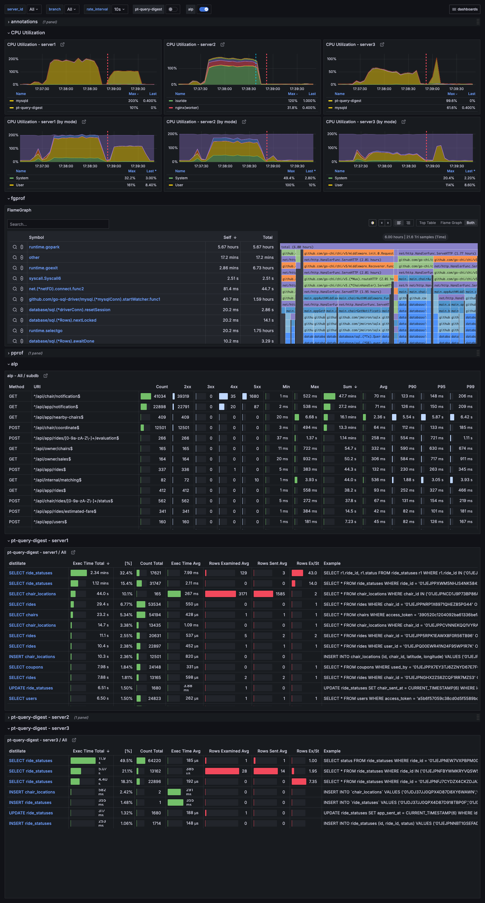
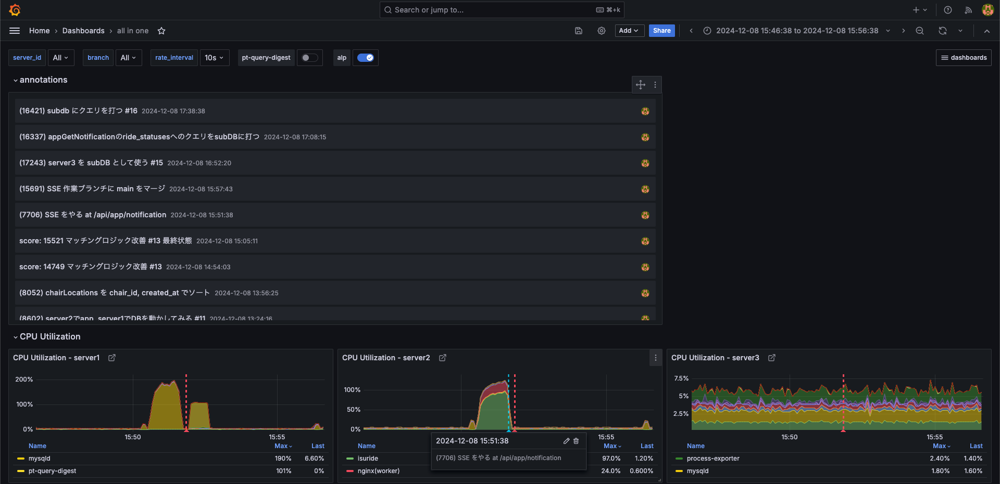
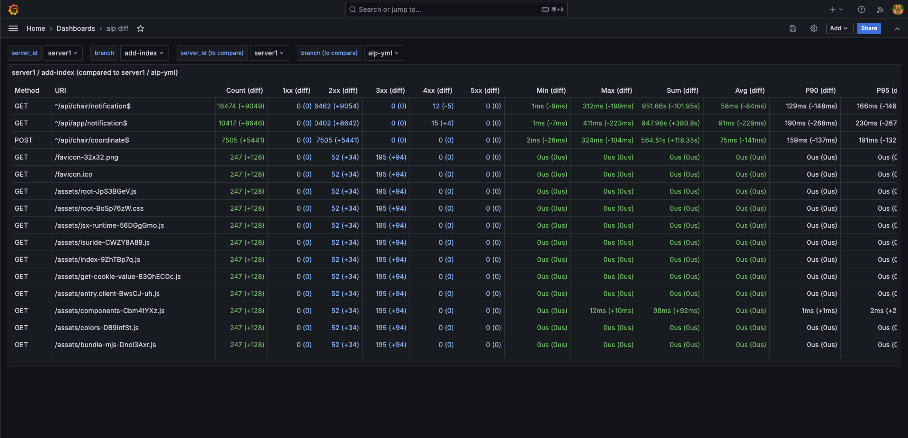
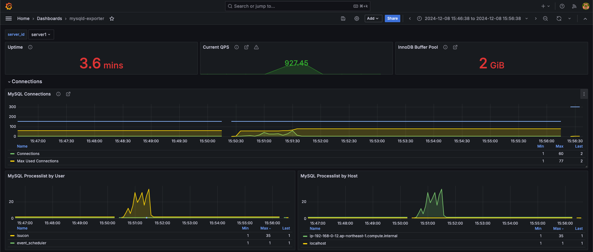
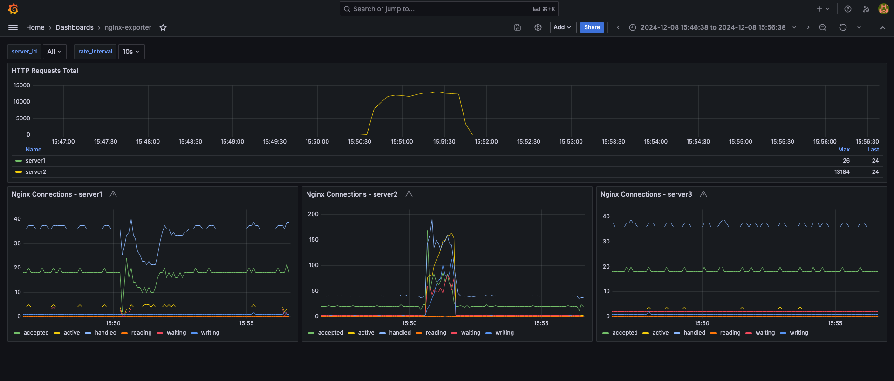
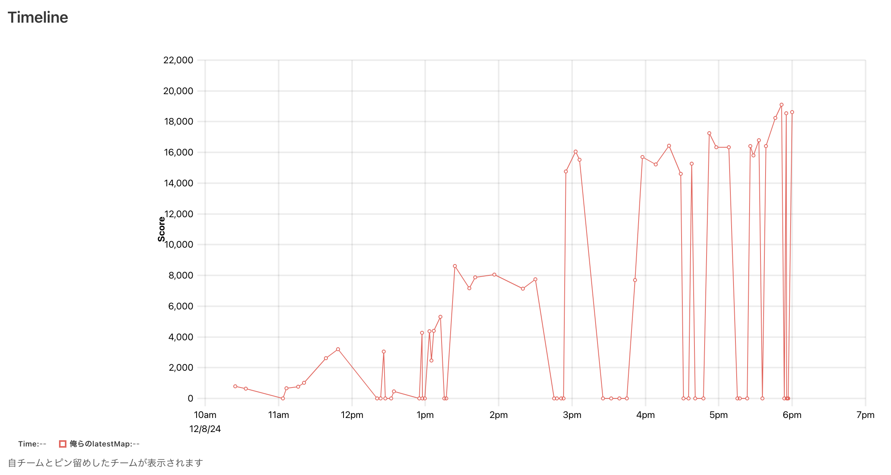

## はじめに

ISUCON14 にチーム「俺らの latestMap」として出場しました。

結果は最終順位 54 位（スコア 18610）でした [^final-score]。

[^final-score]: <https://isucon.net/archives/58837992.html>

去年は 60 位だったので微妙な上昇ですが、今年はメンバーの 1 人が私用により最初の 2 時間だけ参加となったので、2 と 1/4 人日の工数だったと言い訳をしておきます。

去年の記事：[ISUCON13 に参加して 60 位（スコア 32,592）だった](https://blog.fukkatsuso.com/posts/isucon13)

自分はインフラ担当で、今年の目標の 1 つが「セットアップと計測周りの工数を減らし、問題に向き合う時間を増やす」でした。
問題と向き合うにはまず向き合うための十分な時間を確保することが前提になると考えて、今年の準備はセットアップや計測などの基盤整備に力を入れてきました。

その結果、top（CPU 使用率）、pprof/fgprof, alp, pt-query-digest を完全自動収集する仕組みを作ることができたので、それをメインに紹介します。

## 計測周りの整備

### 昨年の計測周り

昨年は、ISUCON 始めたての頃から慣れ親しんだツール群を継続して使っていました。

- top コマンドでサーバ・プロセスごとの CPU 使用率を観察する
- pprof で webapp の CPU 負荷を見る
- alp でアクセスログの統計を見る
- pt-query-digest でスロークエリログの統計を見る

これらを見るために、ベンチマークの実行前後にサーバ上で `make prepare` `make result` 的なコマンドを手動で実行し、その結果を GitHub の PR に貼り付けていました。

top の結果は共有して分析するのに不便だったり、pprof は計測忘れや結果閲覧までの手順が面倒だったり、alp, pt-query-digest はベンチマーク後にコピペして PR に貼り付けるのが地味に時間がかかったりします。

軽く見積もっても 1 分 x 60 ベンチ = 1 時間は競技中の計測手順に消費してしまうので、そのあたりを快適にしたいなと思って自動収集の仕組みを作ることにしました。

### 計測周りを自動化した結果

こうなりました。

全体としては監視用サーバを外部に立て、競技用サーバと VPN (Tailscale) で接続し、継続的に計測データを収集するという構成です。
収集したデータは Grafana ダッシュボードから閲覧できます。

**各種計測データ**は以下のように自動収集する仕組みです。

- top（CPU 使用率）
  - process-exporter, node-exporter で計測し、Prometheus で収集
- pprof
  - webapp に計測用のコードを仕込む（これまでと変わらず）
  - Grafana Agent で収集、Pyroscope に保存
  - デフォルトで [fgprof](https://github.com/felixge/fgprof) を使うようにした
- alp, pt-query-digest
  - 競技用サーバ上で kicker デーモン（お手製ツール）を動かす
    - アクセスログやスロークエリログのファイル増分から、ベンチマークの実行状況を判定
    - ベンチマークの終了を検知すると、alp や pt-query-digest を実行
  - alp, pt-query-digest の結果は json ファイルに書き出し、競技用サーバ上の Nginx で配信
  - 監視用サーバ上の epimetheus（お手製ツール）がその json を収集し、MySQL に保存
- その他追加のメトリクス
  - mysqld-exporter, nginx-exporter でミドルウェアの負荷状況も計測

alp や pt-query-digest については、本格的にやるならアクセスログやスロークエリログを Loki などで監視用サーバに収集するのが理想ですが、そうはせず集計結果の方を収集することにしました。
生のログを収集する場合、膨大なログが流れることによって監視用サーバの負荷が大きくなったり、クラウドの通信コストがかさんだり、ダッシュボードで表示するための集計クエリにラグが生じたりと不安要素がありましたし、それを超えてまで 1 個 1 個のログを永続保存しておく需要はないと判断したからです。

webapp のトレースも取得したいなと思って一度やってみましたが、活用できるイメージが湧かなかったのと、データ量が膨大すぎたせいか監視用サーバがダウンしたので諦めました。

いきなりオレオレ構成を導入してチームメンバーに手順の大幅変更を強いるのは避けたかったというのもあり、昨年までの計測環境をベースにしつつ、自動化の効果を感じてもらえるように作りました。

随時「自動収集できたよー」とチームメンバーに報告して反応を見ながら進められましたし、実際に ISUCON 練習で使ってみながら徐々に自動化できた部分もあるので、不満なく導入できたのではないかと思っています。

**他に嬉しいポイント**を挙げると、このあたりになります。

- 監視用サーバはローカルでも EC2 でも同じように動かせるのでツール開発が捗った
- EC2 の t4g.small インスタンスが 2024/12/31 まで無料トライアルを利用できる [^t4g-trial] ので、それを使って監視用サーバのコストを浮かせた
- Tailscale の導入が簡単だった。VPN のおかげでセキュリティグループのレギュレーション違反を心配しなくてよくなった

[^t4g-trial]: <https://aws.amazon.com/jp/ec2/faqs/#t4g-instances>

### ダッシュボード

Grafana ダッシュボードはこんな感じです。
個別の計測要素についての詳細なダッシュボードも作っていますが、見るページ・要素を増やすと逆にわかりづらくなるので、全体をパッと見渡せる all in one なダッシュボードをメイン武器として作りました。

工夫した点として、ベンチマーク結果が出たらダッシュボードのグラフにアノテーションを付ける（下の図の `CPU Utilization - server2` グラフのように）運用にすることで、annotations パネルに履歴が表示され、そこからワンクリックでダッシュボードの時間帯をお望みの時間に巻き戻せるようにしました。
サッと巻き戻せるので「今入れた改善は前と比べてどの程度効果があったのか？」が確認しやすくなりました。

チームメンバーの要望を受けて、alp の diff コマンド相当のダッシュボードも作りました。
`(+10ms)` のような差分を表示するために、SQL を頑張りました…

他にも MySQL や Nginx のメトリクスをダッシュボード化しました。
コネクション数を可視化できたのが、一番チューニングに役立ちました。

## 競技中やったこと

以下は時刻とやったこと、ベンチマークスコアです。

- 10:32 1 台目サーバのセットアップと初回計測が完了 (645)
- 11:19 getLatestRideStatus の bulk 化 / interpolateParams = true (1007)
- 11:47 DB にインデックスを貼る (3213)
- 12:24 getChairStats の N+1 を解消 (3053)
- 13:11 ownerGetChairs 関数の激重クエリを分解 (5297)
- 13:23 MySQL を server1, webapp を server2 で動かす (8602)
- 13:34 appGetNearbyChairs をチマチマ改善しようとした (7166) -> revert
- 15:04 マッチングロジック改善 (15521)
- 15:55 GET /api/app/notification で SSE を実装 (15691) -> revert
- 16:51 ride_statuses テーブルへの参照クエリの一部を server3 に向けられるようにする (17243)
- 17:10 再起動試験に通るかチェック
- 17:35 最新の ride_statuses をキャッシュ -> revert
- 17:37 ride_statuses テーブルへの参照クエリをさらに server3 へ向ける (16421)
- 17:44 マッチングロジック改善その 2 (19110)
- 17:55 監視、ログを切る (0)
  - おそらくパフォーマンスが上がった影響？
- 17:58 急遽ログを出す状態に戻す (18610)

最終スコア 18610 でした。
ラスト 5 分でベンチマークがコケてめちゃくちゃ焦りましたが、正のスコアが残せてホッとしました。

タイムラインはこちらです。

## 個人的な反省

計測周りは問題なく完璧に動いてくれました。
競技序盤の定型的な改善はまずまず順調にできたと思います。

が、ラスト 3 時間はスコア 2000 点くらいしか伸ばせなかったのが悔しいです。

入賞ラインの上位 30 番以内に入るには、ラスト 3 時間で 2 倍くらい伸ばす必要がありました。
なので、どうやったら中盤〜終盤にスコアを伸ばせるだろう、そもそもなぜ停滞したのだろうということを考えてみました。

### 他チームと比較して焦った

自分自身の状況を振り返ると、順位が気になりすぎてリーダーボードを頻繁に見てしまったり、他チームと我々のスコアを比べて焦りを感じたり、**置き去りにされていないか不安な気持ちでいっぱいだった**というのが第一に思い浮かびました。

練習での競争相手は数分前の自分たちだけですが、本番は他のチームとも競争することになるという当然の事実をこれまで全く考えてこず、本番特有の焦りに無自覚に振り回されてしまいました。
その結果、問題に向き合う集中力がキープできず、丁寧にやればもっと改善できた箇所を中途半端にやってしまい、スコアアップに繋がらなかったのだと思います。

次回に向けて対策を考えたのですが、順位を気にしすぎない、リーダーボードを見すぎないようにするなどの対策だと、あまり普段の練習に活かせない気がします。
チーム内で個人戦を開き、スコアを競うプレッシャーに慣れるとかでしょうか…

### 計測では見づらい箇所に目を向けていなかった

今回、ベンチマーカーのログにはスコアアップのヒントとなる情報が出されていました。
幸いにもチームメンバーが気づいてくれて、マッチングを改善し、合計 1 万点ほどスコアアップしてくれたのですが、自分はというとベンチマーカーのログを見る余裕が全くありませんでした。

また、コードをちゃんと読めば DB を垂直分割できたのにそれを早々に諦め、別サーバの DB に複製テーブルを作って一部の参照クエリだけをそのサーバに向けるという雑な実装をやってしまいました。

そんな感じで、ベンチマーカーのログを軽視したり、コードの読み込みが雑になったり、今回準備した計測基盤では捕捉できない部分に目を向けることができていませんでした。
計測はここ 1 年の改善でとりあえず大丈夫になったので、今後は問題に向き合っていくことを考えます。

## 最後に

「本番ならではの焦りで力が発揮しきれなかった」というのは負け惜しみ感がありますが、もちろん素の実力も全然足りなかったです。

今年は計測周りでの貢献が主でしたが、来年は個人でも戦えるくらいには強くなって上位入賞を取りにいきたいです！
