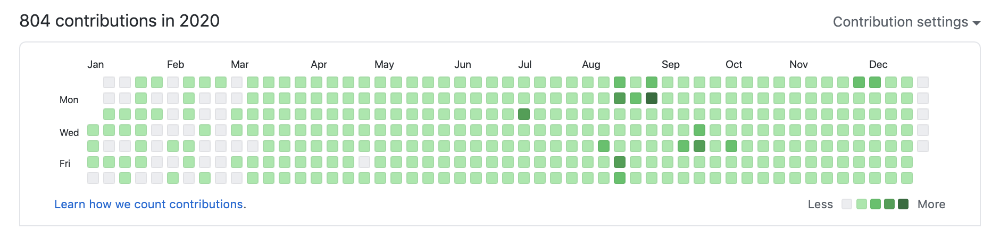
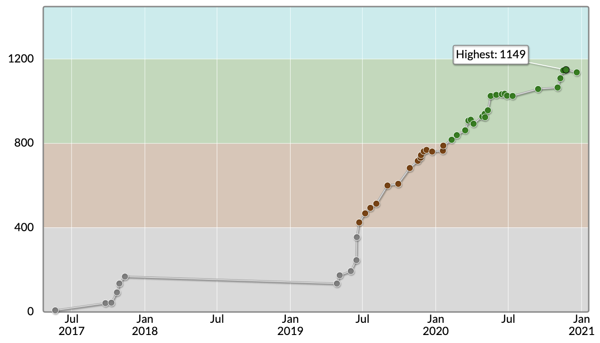
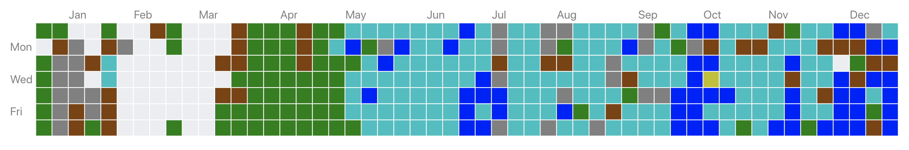

プログラミング、研究、進路、インターンについて 2020 年を振り返り、来年の目標をざっくりと立ててみました。

## プログラミング(学習, 個人開発)

2020 年に勉強したことや開発物を一覧に並べてみました。

勉強したこと

- GCP
- GitHub Actions
- [OAuth](https://github.com/Fukkatsuso/oauth-sample)
- [TDD](https://github.com/Fukkatsuso/tdd-sample)

開発物

- [メシガイド（飲食店検索 LINE bot）](https://github.com/Fukkatsuso/linebot-restaurant-go)
- [dotfiles](https://github.com/Fukkatsuso/dotfiles)
- [数独ソルバー（ライブラリ）](https://github.com/Fukkatsuso/sudoku)
- [数独ソルバー（Web アプリ）](https://github.com/Fukkatsuso/sudoku-solver-app)
- [技術ブログ](https://github.com/Fukkatsuso/blog)

2020 年前半は**メシガイド**という飲食店検索ができる LINE bot や数独を解いてくれる Web アプリなどのアプリ開発の他、dotfiles を作って新しい PC での環境構築を楽にする取り組みも行いました（[dotfiles の作成が一段落したのでまとめる](https://blog.fukkatsuso.com/posts/start-dotfiles/)）.

2020 年後半は Udemy で GCP を勉強したり、GitHub Actions でアプリのデプロイの自動化に取り組んだり、さらに勉強したことを活かして Google App Engine で動く技術ブログを作ったりしました（[Hugo+GAE でブログを作った](https://blog.fukkatsuso.com/posts/start-blog/)）.
また、OAuth のサーバーサイド実装練習（[Oauth に入門して Twitter ログインを試す](https://blog.fukkatsuso.com/posts/oauth1-twitter/)）やテスト駆動開発の勉強（[「テスト駆動開発」を読んでサンプルコードを Golang で真似してみた](https://blog.fukkatsuso.com/posts/read-tdd/)）なども行いました。

↑GitHub のコントリビューションは 804 でした（12/26 まで）.
AtCoder で 1 日 1 問解いてコミットを重ねていたのを除いても、平均して 1 日 1 コミットは超える計算になります。
薄いながらも草で埋め尽くされているのは達成感がありますね。

## 競プロ

今年、AtCoder のレートは**761**→**1137** (highest: 1149) になりました。

何度か停滞しましたが、その度に過去問を解いて実力を貯めてレートに還元することを繰り返し、着実に上げていきました。
グラフを見ると、今再び停滞期に入りそうな予感がしています。
苦手な DP の克服と蟻本の読破が目下の課題です。

↑AtCoder Problems を活用して日々解いた問題の max difficulty です。
1 日 1AC を 3 月上旬に始めたことがわかりますね。
12 月 1 日に Streak が 264 日（Longest Streak ランキング 206 位！）で切れましたが、これは「問題を解いたのに提出忘れ」事件によるものなので実質的に Streak は継続しています。
今は水色 diff 以下の問題はほとんど解いてしまって、簡単な問題は緊急時の Streak 繋ぎのためにいくつかストックしている状況です。

ABC の古い問題から青色 diff にも挑戦してはいますが、やはり難しくて解説 AC してしまうのがほとんどです。
ただし解けなくても紙に書いて最低限は考察してみたり、解説 pdf やブログを読んで自分で考えてコードを書いたりは心がけています。
コンテスト中の考察力・コーディング力を上げるための訓練です。

## 研究

4 月からデータマイニング系の研究室に所属しています。
「データマイニング」とは無数のデータから新たな発見をする研究分野で、画像の異常検知やテキストからの情報抽出など幅広く機械学習を適用します。

研究をやるならアプリ開発系か機械学習系かとは考えていました。
これといってやりたいテーマがあるわけではないですが、逆に言えば何でもやってみたいというわけで、そういう意味ではピッタリなんじゃないかと考えて今の研究室を選びました。

実際入ってみると、選択肢が多すぎるが故に自由度が高く何をやろうか迷ってしまうことに気づいてしまいました…
最初は何もわからない状態なのでそういうものとは思いますが、その中で自分のやりたいことを見つける過程もいい経験になるのではと前向きに考えています。

4 月からの所属でしたが既にコロナ禍で、B4 と先生で最初に 1 回打ち合わせてからはずっとリモートで活動していました。
進捗報告ミーティングと輪読会をオンラインで週 1 回ずつ実施しつつ、5 月末頃までは機械学習の基礎を勉強し、夏までは LeCun 先生の DeepLearning 論文を読んだり、BERT を動かしてみたりと少しずつ広げていきました。
夏休みが明けてからは卒論のテーマを決め、参考になる論文を読んだりデータを集めたりしながら研究を進めています。

果たして卒論を書くところまでいけるのか、なかなか先が見えない厳しい状況ですが「頑張る」としか言えないですね。

## 進路

大学院に進むか就職するか迷い、5 月までは 2021 卒エンジニア職として就活をしていました。
逆求人イベントに参加してみたり、就職エージェント経由でエントリーしてみたりしたものの、IT 業界の中でやりたい業界が特に決まっていたわけではなく、選考もなんとなくで進めてしまっていました。
当然内定まで進めるわけもなく（一応 1 社からいただくことはできましたが）,「本当にこれで良いのか」と自分の就活に納得がいかず、加えて就活を通して見えてきた自分の課題を社会に出る前に克服したいと思うようになり、大学院への進学を決意しました。

就活で見えた自分の課題は「人に伝えるスキルの低さ」です。
僕は小さい頃から目立つことが苦手で、とにかく目立たないように自己主張を抑える人間でした。
大学生にもなると目立たないための行動なんて損しかないなとわかってきましたが、それまでの消極性の積み重ねで「伝える力、自己主張スキル」が全くなく、自己アピールの必要な就活でやはり躓いてしまいました。

B4 からの研究活動は、ラボの人とのやりとりや研究発表など「伝えるスキル」が重要なため、課題を克服する絶好の機会です。
ただ 1 年間だけでは研究も発表も十分にできないだろうと考えて、さらなるスキルと学びを求めて大学院に進学することにした次第です。

11 月に受けた院試で無事に合格したので、大学院での 2 年間を大事に過ごしていきたいですね。

## インターン

11 月から株式会社 AIoT さんのもとで長期インターンとして週 11 時間ほどリモートで働いています。

- [株式会社 AIoT に長期インターンとして参加して 1 ヶ月が経った](https://blog.fukkatsuso.com/posts/aiot-intern-impression/)

主に Golang のサーバーサイドを担当していますが、分野の枠を設けずに幅広く対応できるよう、Node.js や機械学習も少しずつ勉強させてもらっています。

まだまだ半人前で簡単なタスクにもいちいち躓き、その度に自分で調べて解決しがちで非常に時間がかかってしまうのが一番の悩みです。
業務はあくまでも業務であって勉強のためではないので、分からない点は分かる人に質問して即解決し、自分で調べる無駄な時間を減らすことを意識してやっていきます。
まずは質問を素早く投げるスキルから練習して身につけていくつもりです。
（2 ヶ月経ってようやくこの地点…?）

## 2020 年の総括

大きく分けて上半期は就活を、下半期は実務を考えた開発の勉強をやったという感じです。
就活はあまりうまくいきませんでしたが、自分の進路に自信を持つためにプラスに働いたと考えて 2023 卒の就活に向け頑張っていきます。

AtCoder で 1 日 1AC を積み重ねたことは「一度決めたことを続ける継続力」と「毎日コードを書いて養った思考力・コーディング力」としてアピールできるのではないかと思います。
ゆっくりとはいえ着実にレートに反映されたのも、目に見える成果として 1 つ実績になりました。

またこうしてやってきたことを評価していただいた結果、長期インターンを掴み取れたと思っています。

研究、インターン、個人開発にメリハリを付けて取り組み、いい具合にバランスが取れている今の状態を継続していこうというところです。

## 来年の目標

目標リストです。

- 新規に Web アプリを開発する
- クリーンアーキテクチャ、ドメイン駆動設計、アジャイル開発など開発手法に関する本を読む
- AtCoder のレート 1200 以上（水色）へ
- M1 の夏はインターンに参加する

年末年始は Udemy の [Golang で仮想通貨 bot 開発の講座](https://www.udemy.com/share/101XFGAEESc1pTRXgH/) をやるつもりです。
他には企業の技術ブログの更新や自分のブログの PV 数などを通知してくれる、「自分だけの便利」を叶える Slack bot（または LINE bot）を 2021 年のうちに作ってみたいと思っています。
また、プログラミングだけでなくアーキテクチャや開発の進め方の部分も知識を増やしたいと思います。

AtCoder では 1 日 1AC の継続、苦手の DP の補強、積読の蟻本を消化して 2021 年上半期のうちに水色に到達したいです。

そして最後のチャンスになるであろう M1 の夏、悔いのないようインターンに挑戦していきます。
研究がおろそかにならない程度に開発と勉強に励みたいと思います。
