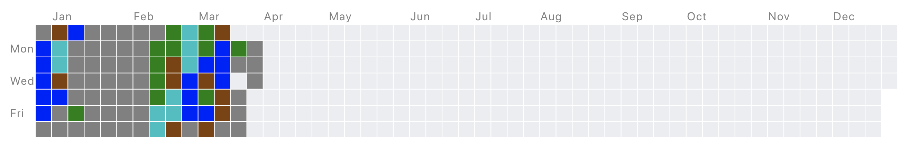
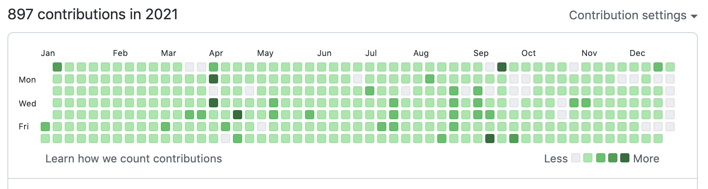

2021年の目標と活動を振り返り，2022年の目標を立ててみました．

## 目標の達成度

去年の年末には，こんな目標を掲げていました．

- 新規にWebアプリを開発する
- クリーンアーキテクチャ，ドメイン駆動設計，アジャイル開発など開発手法に関する本を読む
- AtCoderのレート1200以上（水色）へ
- M1の夏はインターンに参加する

1個ずつ振り返っていきます．

### 新規にWebアプリを開発する

Webアプリと言えるかは微妙なところですが，個人で[仮想通貨の自動取引bot](https://github.com/Fukkatsuso/cryptocurrency-trading-bot)を開発しました．

昨年少し勉強したGCPやテストの経験を活用して，開発しやすいプロダクトを作ることを目標に，CI/CDやドキュメント整備などに力を入れて作っていきました．

4月から現在まで長いこと開発が続いていて，取引botとしての機能は十分満たしていますが，botを管理するための管理画面の整備は完了していません．
なので目処が立ったタイミングでブログ記事にしようと考えています．

### 開発手法に関する本を読む

ドメイン駆動設計の本を読みました．
振り返ってみると，ドメイン駆動設計そのものよりも，レイヤードアーキテクチャや依存関係逆転の原則についての知識を得たと言うべきかもしれません．
こういうのは今すぐ実践できるものでもないですし，話題に挙がったときの共通言語というか引き出しとして持っておくくらいの意識で勉強しています．

あとKindle（端末ではなくアプリ）デビューしました．
PCでも読めて省スペースなところが最高ですね．
今はクリーンアーキテクチャの本を積んでいて，春休みとか就活終わった頃に消化したいです．

### AtCoderのレート1200以上（水色）へ

3月いっぱいで競プロを打ち切りにした関係で達成できませんでした．

それまで精進もやるにはやっていましたが，実際のところは卒論との兼ね合いで十分な時間が取れず，1日1ACを簡単な問題でばかり済ませてしまっていました．

卒論を終えてからも，緑diffや水色diffで肩慣らしして3月上旬のコンテストに出たのですが，レートが下がってしまう始末で...

精進にしてもコンテストにしてもこれ以上続けたところで今の自分では伸びそうにないなと感じ，個人開発の時間に充てたほうがよっぽど有意義だということで止めました．
いつかまた，やる気が出てきたら水色を目指します．

### M1の夏はインターンに参加する

8社ほど選考を受けましたが残念ながら夏季インターンには参加できず，その分長期インターンにて開発を頑張りました．

早いところで3月から選考が始まるのに初動が5月の1on1面談からで，本格的に選考に進み始めたのが6月という手遅れさが原因の一つでした．
あとは面接でのアピールが下手ですね．

ただ，大学院が忙しかったこともあり，選考を受けるにつれて「無理にインターンに参加せず，自分のやりたいことを思いっきりやる方向でも全然悪くない」と気持ちに変化が生まれ，そういう意味では自分を振り返るきっかけになったので良かったのかなと思っています．

インターン参加は叶いませんでしたが，選考を受けたおかげでハッカソンに招待いただいたり本選考にスムーズに進めたりとメリットもたくさんあったので，ダメ元で挑戦していくのも悪くないと思えました．

...そんな感じで，今年の目標は半分達成できました．
自分一人で実現できる目標は達成して，誰かと関わったり比較したりするような目標は達成せずということでしょうか．

## 個人開発

今年個人で取り組んだのはこれらになります．

- [仮想通貨取引bot](https://github.com/Fukkatsuso/cryptocurrency-trading-bot)の開発
- [メシガイド（飲食店検索LINE bot）](https://github.com/Fukkatsuso/linebot-restaurant-go)の改善

今年は4分の3くらい仮想通貨取引botの開発に費やしました．
予定よりずっと時間がかかってしまいましたが，実現したいことは概ねできているのでOKです．
メシガイドの方はリファクタリングしたり，複数画像のGETをGoの並行処理で高速化したりと結構楽しみながら改善を加えていけたと思います．

数としては少ないですが，人に語れるくらいモノを作り込むことって大事なんだなと感じた経験（技育祭とか就活とか）を機に，腰を据えてじっくりやっていった結果そうなっているだけです．

GitHubのコントリビュート数は，去年の850から微増の897でした．
mainブランチに反映していない分を考慮しても大体900です．

できるだけ毎日草を生やすという目標は約92%達成できました．
来年も継続していきますが，今度は質の部分をレベルアップさせていきたいと思います．

## 長期インターン

株式会社AIoTさんにて昨年11月に始めた長期インターンですが，就活や大学院での忙しさを考慮して9月をもって退職しました．

インターンでは主にバックエンドを担当してCRUD APIを開発したり，HTML/CSSによる帳票pdfの作成などのフロント方面も触らせてもらったりしました．
言語・フレームワークとしてはGoやNestJSをメインに使い，他にはVue.jsも少し使っていました．
他にも実務を通じてDBのマイグレーションやgitの使い方なども勉強させてもらいました．

そんな感じで色んな技術に触れつつ実務経験ができたのは良かったと思っています．

心残りとしては，フルリモートなこともあってチームで連携しながらの開発経験はあまりできなかったこと，新規開発がほとんどで改善に挑戦する機会が少なかったことがあります．
これから学生のうちにチーム開発できるかは不明ですが，工夫・改善なら個人開発でもできそうなので意識してやっていくつもりです．

## 大学院，就活

4月から大学院へ進学し，現在23卒として就活しています．

大学院では機械学習やソフトウェア開発について勉強しています．
研究の方はというと，分野的には自然言語処理が近いですが，教授や先輩と研究テーマについて議論するということが多かったです（あまり進んでいない）．

就活ではIT業界，特にWeb系企業の選考を受けていて，割合としてはゲーム・エンタメ関連の事業をやっている企業が多いです．
受ける企業はある程度絞り，集中して選考に臨もうというスタンスでやっています．
本格的に本選考に進み始めたのは11月頃からで，できればM2に進む前の2月・3月までには就活を終わらせたいなと考えています．

## 2021年の総括

今年は大学院に進んで途中まで長期インターンと両立し，空き時間に個人開発をチマチマ進めつつ本を少し読み，就活も始めるといった年でした．

長期間の活動が多かったせいか，始めたことよりも止めたことの方が多い1年だった印象です．

来年は多分，これまで色々手を伸ばしてきたのを大学院修了と就職に向けて収束させていく1年なんだろうなと考えています．

## 来年の目標

就活とか研究は「やらなきゃいけない」部類なので目標からは外し，エンジニア関連での目標を立てることにします．

全部できるかはともかく，やりたいことをリストアップしてみました．

- 仮想通貨取引botをひとまず完成させる
  - ブログも書く
  - できれば収益を出す
- 新規にWebアプリを開発する
  - 自分が本気で使いたいと思えることはもちろん，誰かに使ってもらえるようなサービスを作りたい
  - CLIツール等でも可
- 開発手法に関する本を読む
  - クリーンアーキテクチャなど
- 並行処理について勉強する
  - 「Go言語による並行処理」を読みたい
- インフラ方面の知識を得る
  - AWS, GCPの活用法
  - Terraform
  - kubernetes
- フロントエンドの技術も触ってみる
  - React, Next.jsがスタンダードっぽい雰囲気
- イーサリアムについて知る
  - [この本](https://www.amazon.co.jp/dp/4873118964)とか読んでみたい

「大学院修了と就職に向けて収束させていく」と言った割に多方面に手を伸ばす感じになりましたが，新しい知識の吸収は積極的にやっていきたいです．

最低でも目標の50%は達成できるよう頑張ります．
