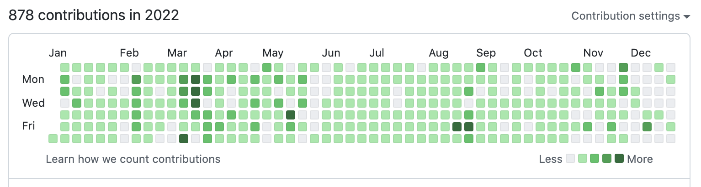

2022 年の目標と活動を振り返り、2023 年の目標を立ててみました。

## 目標の達成度

今年の目標一覧です。
半分以上達成できたかなという項目にはチェックを入れてみました。
（チェックボックスの視認性が悪いので要修正ですね）

- [x] 仮想通貨取引 bot を完成させる
  - ブログも書く
  - できれば収益を出す
- [x] 新規に Web アプリを開発する
  - 自分が本気で使いたいと思えることはもちろん、誰かに使ってもらえるようなサービスを作りたい
  - CLI ツール等でも可
- [x] 並行処理について勉強する
  - 「Go 言語による並行処理」を読みたい
- [x] インフラ方面の知識を得る
  - AWS, GCP の活用法
  - Terraform
  - kubernetes
- [x] フロントエンドの技術も触ってみる
  - React, Next.js がスタンダードっぽい雰囲気
- [ ] 開発手法に関する本を読む
  - クリーンアーキテクチャなど
- [ ] イーサリアムについて知る
  - [この本](https://www.amazon.co.jp/dp/4873118964) とか読んでみたい

約 7 割は達成できました。
[去年の目標](https://blog.fukkatsuso.com/posts/lookback-2021) よりも具体的な目標を立てたので、時々目標を見返して実行に移しやすかったのだと思います。

じっくり本を読んで知識を蓄える系はまた来年に持ち越しですね。

以下、1 個ずつ振り返っていきます。

### 仮想通貨取引 bot を完成させる

構想段階で予定していた機能は一通り完成させました。
ブログ記事も書きました。

記事：[Golang+GCP で仮想通貨取引 bot を開発した](https://blog.fukkatsuso.com/posts/cryptocurrency-trading-bot)

**できれば収益を出す** という目標は達成できていません。
2022 年は全体的に下落相場だったのもありますが、想定通りに取引させる難しさを感じる結果でした。

運用コストが結構バカにならない（月 2000 円くらい）ので、今後のモチベーション次第では bot を停止させるかもしれません。

### 新規に Web アプリを開発する

**自分が本気で使いたいと思える** **CLI ツール** を開発しました。

記事：[ツイートをリアルタイム検索してターミナルに流せる CLI ツール「twego」を開発した](https://blog.fukkatsuso.com/posts/twego)

使用時に Twitter API のキーが必要なので、**誰かに使ってもらう** のはハードルが高そうだなと考えて挑戦しませんでした。
自分の成果物を人に見てもらうことへの不安もあり、まずはそこから克服していくべきとは思っています。

### 並行処理について勉強する

春休みに「Go 言語による並行処理」を読みました。
channel を使ったシンプルな並行処理が書けるようになり、[twego の開発](https://blog.fukkatsuso.com/posts/twego) でもリアルタイム Tweet の受信＋標準出力への Tweet 表示を並行して行う処理に活用しました。

**5 章 大規模開発での並行処理** あたりは全く自信がありませんが、そこまで複雑な並行処理が必要になるケースが想像ついていないので、並行処理の勉強は一旦ここで区切りをつけようと思います。

### インフラ方面の知識を得る

夏休みに Terraform の勉強をしました。
公式のチュートリアルに沿ってハンズオンで触ってみた後、Web アプリの Docker イメージを GitHub Actions 経由で Cloud Run へデプロイする雛形的なインフラ構築をやってみました。

- <https://github.com/Fukkatsuso/terraform-study>
- <https://github.com/Fukkatsuso/nextjs-docker>

次は既存の自作アプリのインフラを Terraform でコード化していきたいところですが、手つかずのままです。

**AWS, GCP の活用法** と **kubernetes** についてはエンジニアとして就職してからの業務で触れることになるかもしれません。

### フロントエンドの技術も触ってみる

春休みの 2 日間だけ、**React** のチュートリアルをやってみました。
作りたいものも特になかったのでチュートリアルをなぞるだけとなってしまい、今振り返ってもあまり得るものがなかったような気がします。

- <https://github.com/Fukkatsuso/react-tutorial>

ちゃんとやるなら React の文法やベスト/バッドプラクティスを体系的に学んで簡単なアプリ作成までやるのが良いんですが、春休みも終盤に差し掛かる時期なので厳しかったんだと思います。

### 開発手法に関する本を読む

未達成です。

「クリーンアーキテクチャ」は既に Kindle 版を持っていますが、全然読めていません。
「マイクロサービスパターン」という本もセールで購入しましたが、未読のままです。

来年こそは読むぞという気持ちです。

### イーサリアムについて知る

はい、知ろうとしませんでした。

学ぶ対象として、ブロックチェーン関連の技術は、今主流の Web 技術よりも優先度が下だったからです。
2022 年はメタバースなどの影響でイーサリアムが話題になったこともありますが、ただでさえ既に触っている技術の理解度・習熟度が高くないのに、他の技術にまで手を伸ばすかと考えると…

仕事の合間に息抜きとして勉強するネタとしては興味があります。

--- ということで、以上が目標の振り返りとなります。

## 進路

1 月に DeNA に内定をもらい、そのまま承諾しました。

記事：[23 新卒ソフトウェアエンジニア職の就活を振り返る](https://blog.fukkatsuso.com/posts/job-hunting-newgrad)

記事にも書きましたが、ものづくりに対する姿勢やスキル面でのマッチ度が一番高く、等身大の自分をそのまま評価していただいた結果の内定だったので、来年の 4 月からこの会社で働くのが楽しみです。

## 個人開発

今年は学生最後の年であり、修士の研究も気が抜けないということで、個人開発は控えめになりました。

- [仮想通貨取引 bot](https://github.com/Fukkatsuso/cryptocurrency-trading-bot)
- [twego](https://github.com/Fukkatsuso/twego)：リアルタイム Tweet を流し見れる CLI ツール

ちなみに GitHub の contribution 数は 878 でした。
main ブランチ以外のコミットを含めても 900 に届かないくらいです。
基本は毎日コミットするつもりでいますが、研究関連の都合でできなかった日も多かったです。

就職してからは個人開発に充てられる時間も減っていくとは思いますが、新しい技術に触れてみたり、役立ちそう・面白そうなアプリを開発したりといった活動は、エンジニアでいる限り続けていきたいですね。

## 趣味

せっかくの振り返り記事なので、ゲーム、アニメなど技術以外の趣味についても書いてみようと思います。

### 今年購入・プレイしたゲーム

- Pokémon LEGENDS アルセウス
- ゼルダの伝説　ブレス オブ ザ ワイルド
- マリオカート 8 デラックス
- モンスターハンターライズ
- モンスターハンターライズ：サンブレイク
- Fall Guys
- GREEN HELL
- スプラトゥーン 3
- ポケットモンスター バイオレット
- Vampire Survivors
- Factorio

自分が面白いと思えるモノってどんなだろうというのを探りながらプレイしていました。
ポケモン、モンハン、ブレワイのようにフィールド探索したり攻略法を考えたりするのが好きで、マリカやスプラトゥーンのようにリアルタイムの反射神経が必要な対人ゲームは少し苦手だということは掴めたようです。

Factorio はニンテンドーダイレクトの紹介映像に惹かれたのがきっかけで Steam 版を購入しました。
生産を自動化し、工場を拡張していくエンジニアっぽさが刺さり、2 週間は寝ても覚めても Factorio のことばかり考えてしまうほどの中毒性でした。
自動化好きなエンジニアにはぜひおすすめしたいゲームです。

### 面白かった・印象深いアニメ

- 進撃の巨人 The Final Season Part2
- その着せ替え人形は恋をする
- 天才王子の赤字国家再生術
- かぐや様は告らせたいーウルトラロマンティックー
- SPY×FAMILY
- パリピ孔明
- 異世界おじさん
- オーバーロードⅣ
- シャドーハウス 2nd Season
- メイドインアビス　烈日の黄金郷
- ようこそ実力至上主義の教室へ 2nd Season
- リコリス・リコイル
- アキバ冥途戦争
- 陰の実力者になりたくて！
- チェンソーマン
- 不徳のギルド
- ぼっち・ざ・ろっく！

各クール、前評判や注目度が高めの作品だったり、前シリーズが面白かった作品だったりを選んで観ています。

「異世界おじさん」「不徳のギルド」「ぼっち・ざ・ろっく！」はギャグのキレが良くて、意外性で言うと指折りの面白さでした。
（不徳のギルドは開幕からアレなので人に勧めづらいですが、Abema のチェンソーマン放送まで待機視聴していたらハマったという）

## 2022 年の総括

目標は 7 割達成でき、就職先も無事決まり、全体的には良い年でした。
昨年の振り返りで **できれば M2 に進む前の 2 月・3 月までには就活を終わらせたい** と書いていたことが叶い、就活が研究と被らずに済んだのは大きかったと思います。

ただ研究はもう少し頑張らないといけなかった感じなので、満点とまでは言えません。

## 来年の目標

主に技術関連で取り組みたいことリストです。
来年から社会人という立場になり、新生活や配属先などの影響でどうなるのか想像が難しいところがあったので少なめになりますが、今年できなかったことと新しいことを半分ずつ目標として立てました。

- 新規にアプリケーションを開発する
  - 誰かに使ってもらい、感想を聞く
- 「クリーンアーキテクチャ」を読む
- インフラ方面の知識を得る
  - AWS, GCP の活用法
  - kubernetes
- 新しいプログラミング言語を習得する
  - Rust など
  - サーバーサイドで使えるものだと良し
- ISUCON に挑戦する
- 資産運用を始める
  - つみたて NISA
  - iDeCo

サーバーサイドの技術を突き詰めてみたいと考えているので ISUCON にも興味が出てきました。
過去問からやってみようと思いますが、チームで出場するところまでいけるかは不明です。
（ぼっち・ざ・いすこん！になりそうな気が）

スキルアップのための自己投資の他に、資産運用にも挑戦しようと考えています。

以上、来年もよろしくお願いします！
