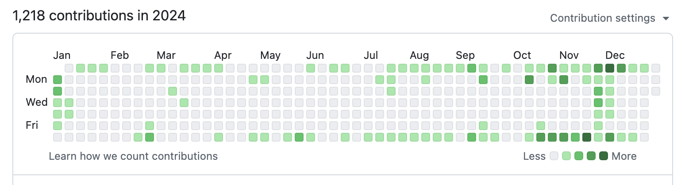

2024 年の目標を振り返り、2025 年の目標を立ててみました。

## 今年の目標の達成度

半分の目標が達成できました。

- ✅ 技術書を 3 冊読む → 達成。5 冊読んだ
  - [プログラマーのための CPU 入門](/posts/read-cpus-for-programmers/)
  - [Go ならわかるシステムプログラミング](/posts/read-go-system-programming/)
  - [Go 言語で作るインタプリタ / Writing a Compiler in Go](/posts/read-go-monkey-and-compiler/)
  - 自作エミュレータで学ぶ x86 アーキテクチャ
- ✅ プライベートで新しいプログラミング言語（Rust など）に触れる → ギリギリ達成
  - 「Rust の練習帳」という本でお勉強中
  - Rust の変数はデフォルトでイミュータブルなこと、trait は Go でいう interface みたいなもの、というのはわかった
  - Go のシンプルさに慣れすぎてまだ Rust を受け入れらていないが、新しい概念を学ぶのはとても良いと思っているのでちゃんと勉強したい
- ❌ ISUCON に出場して入賞する → 未達
  - 参加はしたものの、最終結果は 54 位だった（[参加記事](/posts/isucon14/)）
- ❌ iDeCo を始める → 断念
  - 数十年後にどれだけ課税されるか不安すぎるので、当面はやらないことにした
  - NiSA を先に始めていたので、そっちを優先的に膨らませたほうが運用益は大きいはず、という目論見もある

今年は ISUCON に向けての準備と、技術のインプットが両立できた年でした。
ISUCON に出るメンバーで時期によっては輪読会もやっていたので、ほぼ毎週土日のどちらか 8 時間は技術研鑽に充てられていて、とても充実感がありました。

実際、年間 contribution 数は 1200 を超え、過去最高でした。
仕事があるのでほとんど休日しかコントリビュートできないのですが、その休日にしっかり技術に熱中していた証拠だと思います。

そしてこのコントリビュートはほとんど ISUCON 関連なのですが、肝心の ISUCON 本番は悔しい結果に終わりました。
来年こそ入賞を目指します。

## 2024 年の出来事

- 1 月 ~ 6 月
  - factorio にハマったり、ISUCON に向けてのツール開発をしたり、ISUCON 出場メンバーで輪読会したり
  - それ以外はプライベートの記憶がない
- 7 月：引っ越し
  - 騒音被害に耐えかねて決意
  - 家賃が高くなった代わりに、治安の良さと出社時間の余裕を得た
- 7 月：EKS (k8s) 勉強会に参加
  - 会社の部内で募集があり、k8s に触ってみたかったので参加した
  - k8s の基本概念と EKS の役割を知れて、仕事でも個人でも機会があれば使ってみたいと思った
- 11 月：会社のテックブログを初執筆
  - [Terraform を活用した効率的な S3 バケット管理手法](https://engineering.dena.com/blog/2024/11/terraform-s3-management/) という記事
  - 需要や目新しさがあるかはあまり自信がなかったが、意外と Twitter で好評を貰えて嬉しかった
- 12 月：ISUCON14 に参加
  - 詳細は [参加記事](/posts/isucon14/) のとおり

7 月に引っ越しました…！

社会人の引っ越しは相当大変だろうなと思っていましたが、引っ越し中は有休を取ったり荷物詰め込みサービスを活用すればなんとかなりました。
それよりは、空き部屋の少ない時期に好条件の部屋を探すこと、内見のスケジュールを調整すること、違約金が発生しないように退去までのスケジュールを組むことが大変でした。
新卒のときに契約した部屋で痛い目を見たので、6, 7 月という閑散期に空いている部屋なんて地雷しかないだろうと疑心暗鬼になり、かといって退去日は既に決めたのであまり悠長に選ぶ時間もないということで、限られた候補の中で同じ部屋を 2 回内見するなど慎重に部屋探しをしました。
結果、新居の満足度は 80 点くらいとまあまあ上手くいったかなと思います。

## 娯楽

- ゲーム
  - 桃太郎電鉄ワールド ～地球は希望でまわってる！～
  - Outer Wilds
- アニメ（観た中で記憶に残っているもの）
  - ダンジョン飯
  - ようこそ実力至上主義の教室へ 3rd Season
  - 鬼滅の刃　柱稽古編
  - この素晴らしい世界に祝福を！3
  - 終末トレインどこへいく？
  - 無職転生 II ～異世界行ったら本気だす～
  - 負けヒロインが多すぎる！
  - Re:ゼロから始める異世界生活 3rd season

桃鉄は帰省中に家族と遊ぶのにぴったりなゲームでした。
人気があるのは知っていましたが、ハマる感覚は実際にやってみないと味わえないものですね。

Outer Wilds は面白いと聞いて買ってみたのですが、操作の難しさと画面酔いにやられてしまい、ほぼ積みゲーになっています…

他には factorio の Space Age (DLC) もとりあえず買いましたが、ボリュームと中毒感で生活がボロボロになるんじゃないかと心配していて、手を付けられていない状態です。

## 2024 年の総括

平日は仕事に集中して、休日は勉強会か ISUCON 準備、たまにゲームをする、という流れが固定された 1 年でした。

落ち着ける住居も得て、総じてプラスだったかなと思います。

## 2025 年の目標

- 技術書を 5 冊読む
- ISUCON に出場して入賞する
- ブログ記事を 4 本書く
- インフラエンジニアとして自身の強みを見つける

割と現状の生活に満足していますが、人生をもっと良くするためには、一番下の「インフラエンジニアとして自身の強みを見つける」という目標が大事だと思います。
来年は社会人 3 年目になり、インフラエンジニアとしてそこそこ経験を積んでくる頃なので、そろそろ自分の強みを見つけて深めていかなければならないフェーズです。
今のところ強みの候補として挙げられるのは、仕事で特に力を入れてきた監視と IaC (Terraform) ですかね。
何か今後チームにとって役立てられそう、かつ社外にも通用する分野があれば、それでも良いです。

この調子で来年も研鑽に励みます！
