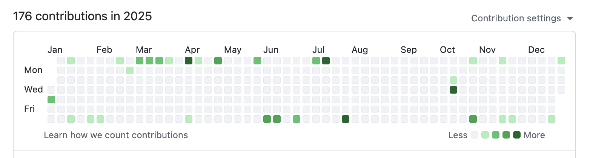
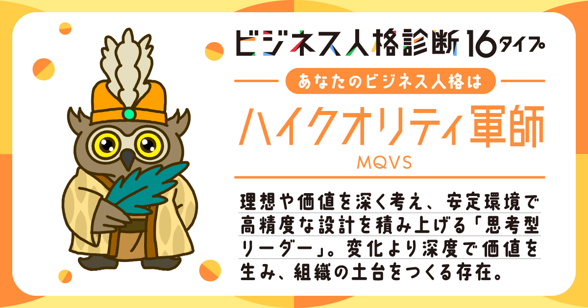

2025 年を振り返り、来年の目標を立てました。

去年の振り返りはこちら：[2024 年の振り返りと来年の目標](/posts/lookback-2024/)

## 目次

- [今年の目標の達成度](#今年の目標の達成度)
- [振り返り](#振り返り)
  - [質問 1: 仕事面について](#質問-1-仕事面について)
  - [質問 2: プライベートでの技術活動について](#質問-2-プライベートでの技術活動について)
  - [質問 3: プライベートの生活について](#質問-3-プライベートの生活について)
  - [質問 4: 2025 年を振り返って](#質問-4-2025-年を振り返って)
  - [質問 5: 2025 年の目標の達成度](#質問-5-2025-年の目標の達成度)
  - [質問 6: 2026 年の目標](#質問-6-2026-年の目標)
- [2026 年の目標まとめ](#2026-年の目標まとめ)

## 今年の目標の達成度

達成できたのは技術書の冊数だけでした。

- ✅️ 技術書を 5 冊読む → 達成。8 冊完読した
- ⛔️ ISUCON に出場して入賞する → 今年は開催されなかったので目標外
- ❌️ ブログ記事を 4 本書く → 未達。3 本書いたがあと 1 本届かず
  - [「Rust の練習帳」で Rust に入門して難しかったこと](/posts/read-rust-practice-book/)
  - [「詳解 Rust アトミック操作とロック」を読んだ](/posts/read-rust-atomics-and-locks/)
  - [Pironman 5 MAX で作る Raspberry Pi 5 おうちサーバ](/posts/setup-raspberrypi5-pironman5max/)
- ❌️ インフラエンジニアとして自身の強みを見つける → 技術的な強みを想定していたが、技術面の確固たる強みは見つけていないので未達としておく。ただ自分の特性は見えてきたと思う

今年読んだ本は以下です。

<!-- textlint-disable -->

- 技術書
  - Rust の練習帳
  - 詳解 Rust アトミック操作とロック
  - つくって、壊して、直して学ぶ Kubernetes 入門
  - ［試して理解］Linux のしくみ―実験と図解で学ぶ OS、仮想マシン、コンテナの基礎知識
  - （途中まで）［作って学ぶ］OS のしくみ Ⅰ ─⁠─メモリ管理、マルチタスク、ハードウェア制御
  - 入門 OpenTelemetry
  - 入門 監視
  - データ指向アプリケーションデザイン
  - LLM のプロンプトエンジニアリング
- 技術以外の本
  - 自分の小さな箱から脱出する方法
  - （途中まで）エンジニアリング組織論への招待-～不確実性に向き合う思考と組織のリファクタリング

<!-- textlint-enable -->

ハンズオン型の本と理論の本、技術以外の本も読むようになり、バランスは良かったと思います。

インプットの量は増えた反面、質に課題を感じることもありました。
特に下半期は内容が 100% 頭に入ってこず、大した感想も出てこず、集中力を欠いていた感じがします。

## 振り返り

今回は Claude に質問を投げかけてもらいながら今年を振り返ってみました。
自分だけで考えるよりも素直に心の中を吐き出せたので、そのままインタビュー形式の記事にしようと思います。

### 質問 1: 仕事面について

--- 2025 年は社会人 3 年目でしたが、仕事面で大きな変化や印象的なプロジェクトはありましたか？

> 担当するゲームタイトルや業務内容に変化はありましたか？

あまり詳しくは言えないが、インフラ構築をイチからやる経験と、大規模な負荷を安定して捌くための対策の経験がたくさん積めた。
インフラ構築の経験と負荷対策の経験によって、インフラの全体像を解像度高く把握できるようになり、安定したインフラ運用のために細かい部分まで考えられるようになってきたと思う。
一方、この仕事に携わっている間は外部からの要求がキツイ部分もあり、自分にとってもかなり負荷の高い仕事だった。
やったことが結果的に意味をなさなかったような場面にいくつも遭遇し、正直今も精神的に参ってしまっているところがある。

また、8 月から新卒のメンターに挑戦したのも大きな変化だった。
メンター初挑戦だったので、最低限の準備として「エンジニアリング組織論への招待」を読んでメンターの心構えを学んでおいた。
その本から得た学びは「メンターは教えるのではなく、メンティーが自立して仕事ができるようになってもらうための補助輪である」ということ。
答えを教える先生ではなく、メンティーにインフラチームの仕事に慣れてもらい、メンターがいなくても自分で考えてやっていける状態にすることが、メンターがやるべきことだと知った。
知ったとはいえ、付かず離れず・干渉しすぎず放置しすぎずの距離感を保つのはすごく難しい。
最初の方は詰まってそうだったらメンター側から壁打ちを提案してみたり日報にコメントを書いたりしていた。
だがそれも最初の 1 ヶ月弱くらいで、元々技術力をしっかり持っているメンティーだったので技術面は全く心配する必要がなく、自分で調べながらゴリゴリ進めてくれていた。
いまは配属から数ヶ月経ってある程度仕事に慣れてきており、もう自分がやることはインフラの安定運用のための観点をインプットするとか、タスクの方針をちょっと一緒に考えるとか、本番環境の操作権限の取得に向けて計画を考えたりとか、そのくらいになっている。

メンターとして成長できているか？というと自信はない。
自分はあまり会話が得意ではないこともあり、メンティーにとって十分な量の問いかけを提供できているだろうか？という心配がある。
これについては年明けの 1on1 で聞いてみようかな。

> 新しい技術やツールの導入に関わりましたか？（監視、Kubernetes、IaC など）

自分が関わったものは特になかった。
チーム状況的にも新しいものを取り入れる余裕が少しなくなってきているのを感じており、自分ももっと外の世界の情報を取り入れてチームに還元していかねばと思う。

> チーム内での役割や責任範囲は変わりましたか？

慎重なオペレーション意識を買われ、チーム内でも強めのインフラアカウント権限をもらい、権限を使ったアカウント周りの定常業務を任されるようになった。
「安全なオペレーションを遂行する意識」は強みとして評価されているっぽく、レビューだったり作業立ち会いだったりを結構やるようにもなった。
他には、さっき書いたように新卒メンターをやっている。

> 会社のテックブログなど、対外的なアウトプットはありましたか？

なし

### 質問 2: プライベートでの技術活動について

--- すでに技術書を 8 冊読まれたことは書かれていますが、それ以外について教えてください。

> ISUCON 2025 について：今年は ISUCON が開催されなかったとのことですが、それに関連する準備や練習はしていましたか？開催されなかったことについての思いは？

年内の開催がないことは 6 月時点で告知されていたので練習していなかったが、準備は少しだけ進めていた（自分は監視の整備を頑張る役割）。
具体的には、監視に使っているツールをアップデートしたり、監視サーバの構成を改善したりした。
今年から新たに、メトリクスと LLM を活用したボトルネック分析ツールも作り始めている。

開催されなかったことについての思いは、仕方ないとしか言えない。
今年は LLM が普及してきたので作問難しいよなあと思う。
運営も大変だろうけれど、その中でさくらインターネットさんが運営を引き継いで 2026 年の開催を発表してくださったのは、とても希望が持てた。

> 個人開発や OSS 活動：何かプライベートでコードを書いたり、GitHub で活動したりしましたか？年間 contribution 数はどうでしたか？

今年はあんまりコードを書かなかった。
平日は仕事があるし、休日はインプットが多めだった。

年間 contribution 数は合計 260 くらい。
heatmap に出ている 176 contributions はほとんど書籍の写経のはず。
それに加え、ISUCON のツール開発で 92 コミットしていた。
ここ数年、開発の気力はほぼすべて ISUCON に注いでいる感じ。



> 勉強会やコミュニティ活動：社内外の勉強会や技術イベントに参加しましたか？

オープンな活動はなかった。
が、毎週末 ISUCON のチームメンバー 3 人で勉強会を続けている（勉強ネタは ISUCON 以外）。
300 時間くらいやったらしい。


> Raspberry Pi：ブログ記事で Pironman 5 MAX の記事を書かれていますが、これは何か目的があって始めたのでしょうか？（おうちサーバで何かやりたいことがあった？）

[ブログ記事](/posts/setup-raspberrypi5-pironman5max/#今後の使い道) に書いたとおり、ISUCON の監視サーバとして使おうと思っている。
今まで EC2 の無料枠をケチケチ使ってきたけど、もっとやれることを増やしたいと思って。

### 質問 3: プライベートの生活について

> 引っ越しや住環境の変化：2024 年 7 月に引っ越されていますが、今の住環境には満足していますか？何か新しい家具・家電を買ったりしましたか？

引っ越して 1 年半経ったけど、住環境には結構満足している。
騒音問題から解放され、職場へも近くなった。
軽い仕切りだけど、仕事スペースと寝るスペースを分けられて、仕事に集中しやすくなった気がする。

新しい家具・家電といえば、今年は加湿器と空気清浄機のほかに、ちょっと高い炊飯器とコーヒーミルを買った。
それと 5〜6 年くらい使ってきた macbook pro のバッテリーの寿命が終わってたので新調した。
バッテリーが長持ちするようになったし、処理も目に見えて速くなっているのが嬉しい。
良い投資だった。

> ゲーム：今年プレイしたゲームで印象に残っているものはありますか？factorio Space Age DLC には手を付けましたか？

factorio の Space Age はちょっとしかやれてないなあ…ヴルカヌス行って鋳造炉を作ったくらいだった記憶。

夏頃に switch でサクナヒメをやってみた。
あとは秋からポケモン ZA もやってる。

そういえば switch2 を買っていた。
初回の抽選販売からマリカセット一点張りしていたが当たらず。
ZA 発売までに入手できず残念だったが、諦めていたところに公式の招待販売メールが来たので即購入した。

> アニメや映画：観た作品で特に良かったものや印象に残っているものは？

<!-- textlint-disable -->

- Dr.STONE SCIENCE FUTURE
- Re: ゼロから始める異世界生活 3rd season 反撃編
- ウマ娘 シンデレラグレイ
- 青春ブタ野郎はサンタクロースの夢を見ない
- その着せ替え人形は恋をする Season2
- フードコートで、また明日。
- わたしが恋人になれるわけないじゃん、ムリムリ！（※ムリじゃなかった!?）
- 小市民シリーズ

<!-- textlint-enable -->

わたなれは DeNA が関わっているという贔屓目抜きで面白かった。
見てから 1 週間くらい、仕事中にバックグラウンドアニメとして再生していたほどハマった。

> その他の趣味や出来事：帰省、旅行、新しい習慣を始めた、健康面での変化など、何かありましたか？

年の瀬の 12/28、有馬記念で競馬デビューしてみた。
国民の恒例行事並の盛り上がりを感じていたので気になってはいたが、決心がついたのは当日の発走 1 時間前。
買い方から馬、騎手、レース前予想などを急いで調べ、少額だけ賭けてみた。
結果は全負け。
一番人気に乗っかりすぎた。
一番人気の馬は 3 着以内には来るだろうと思ってたが、競馬ってそんなに簡単じゃないんだなあ…。
負けはしたものの、競馬の知識が付いたし話のネタにはなるし大人の嗜みの 1 つを体験できたしで、損した気分にはならなかった。
こんな感じで気軽に新しいことをやってみるのも人生楽しく過ごすコツだと思った。

### 質問 4: 2025 年を振り返って

--- 記事の冒頭で「インプットの量は増えたが質に課題を感じた」「下半期は内容が頭に入ってこない、大した感想も出てこない」と書かれていますね。これについて掘り下げたいです。

> インプットの質の課題について：なぜ頭に入ってこなくなったと思いますか？仕事の負荷が高かったことが影響していそうですが、他に原因として考えられることは？

考えたくないけど加齢？
まだ 27 歳迎えてないんだけど…。

自分の傾向として、本を読むときに仕事と関連付けながら読んでいるフシがある。
そのせいで仕事の嫌な記憶を思い出してしまい、読書に集中できていないこともあった。

> 仕事での精神的な負担：「やったことが結果的に意味をなさなかった場面」「精神的に参ってしまっている」とのことですが、これが 2025 年全体にどう影響しましたか？

なにか仕事にとりかかるときに「これって本当にやる意味あるのかな」と立ち止まって考えてしまうことで、仕事のスループットが落ちたりした。

> ポジティブな面：一方で、インフラエンジニアとしての成長（全体像の把握、安全なオペレーションの評価、メンターとしての経験）など、良かった面も多いですよね。2025 年を通して得られた一番大きな学びや成長は何でしたか？

教わる・学ぶ立場から、周りに貢献する立場に変わってきたのが大きい。
まだ立ち回りは全然できていないが、立場の変化は間違いなくあって、仕事のレベルを一段上げていかないとと思っている。
今までやってきたタスクは片手間くらいにできるようになりたい。
それができてなくて今苦しんでいる自覚がある。
そして空いた手をもっと抽象度の高い仕事に使えるようにしたい。

> 2024 年との比較：2024 年は「充実感があった」「contribution 数過去最高」とありましたが、2025 年はどんな年だったと一言で表すとしたら？

3 年目に入って仕事の難しさに直面した年だった。
プライベートでインプットの量が増えたことは良かった反面、アウトプットが減った。
これまで通りじゃ仕事もプライベートもうまくいかなくなるという危機感がある。

### 質問 5: 2025 年の目標の達成度

--- 2025 年の目標として以下を掲げていましたね：

- ✅ 技術書を 5 冊読む → 8 冊読んだので達成
- ⛔️ ISUCON に出場して入賞する → 開催されず
- ❌️ ブログ記事を 4 本書く → 3 本に留まった
- ❌️ インフラエンジニアとして自身の強みを見つける

--- 最後の「強みを見つける」について教えてください：

> 強みは見つかりましたか？：2024 年の記事では「監視と IaC (Terraform)」を候補として挙げていましたが、2025 年を経て自分の強みは何だと思いますか？

特定の技術での強みは見つからなかった。
抽象スキルの部分だと、インフラエンジニアとして安全なオペレーションを遂行する意識、とかかな。
あとオペレーションだけじゃなく、持続可能なインフラ運用を見据えた提案がいくつかできたのも強みにできそう。

そういえば、最近 YOUTRUST のビジネス人格診断をやってみた。
自分はハイクオリティ軍師 (MQVS) らしい。
強み・弱みがまさにそうだなという結果。



```txt
理想や価値を深く考え、安定環境で高精度な設計を積み上げる“思考型リーダー”。
探究心が強く、答えが曖昧でも考え続ける粘り強さがあります。
安定した環境でこそ本領を発揮し、緻密な整理・構造化・品質担保に長けています。変化を追うより“深度”で価値を生むタイプで、組織の土台を丁寧につくる存在です。

強み
じっくり考える力と深い探究心があり、安定した環境で高精度の戦略や設計を積み上げられるタイプです。
複雑な情報を丁寧に整理し、長期的に成果が出る仕組みづくりが得意。
曖昧な課題も“構造化”して解像度を高めることができます。品質へのこだわりと誠実さがあり、組織の土台を作る役割に大きく貢献します。

弱み
変化のスピードが速い環境では負荷が大きく、急な方向転換が続くとパフォーマンスが落ちやすい傾向があります。
深く考えるがゆえに意思決定がゆっくりになり、周囲から「動きが遅い」と見られる場面も。また、内省に時間を使いすぎるとアウトプットが遅れ、進行が詰まることがあります。
```

> 「慎重なオペレーション」について：チーム内で評価されているこのスキル、これを今後も伸ばしていきたいと思いますか？それとも別の方向性を模索したいですか？

事故なくやるのは大事だと思ってるから、伸ばしていきたい（Keep していきたい）スキル。
でも根本的にはオペレーションの数はできるだけ減らすべきで、仕組み化・自動化によってシステムの頑健性を高める方が良い。
仕事の仕組み化・自動化という方向性で強みを発揮していきたいと思っている。

> 目標達成の反省：技術書は 8 冊で目標達成、ブログは 3 本で未達成でしたが、振り返ってみてこの目標設定は適切でしたか？「質より量」になってしまった感はありますか？

目標設定は定量的な部分では適切だったと思う。
十分実現可能な数値ではあったし、この目標が原因で量ばかり追うようになったとかは決してない。

反省点は、2024 年の目標とあまり変わらない内容にしてしまったことかなあ。
「今のままで良い」という気持ちがあったから、仕事の仕方やキャリアのことを深く考えずに 2025 年の目標を立ててしまっていた。

### 質問 6: 2026 年の目標

--- 記事にはまだ書かれていない部分ですが、2026 年に向けてどんな目標を立てたいですか？

> 技術的な目標：引き続き技術書を読む？ISUCON 2026 が開催されるなら参加する？新しい技術に挑戦したい？

本を読んでアウトプットするのは継続していきたい。
5 冊以上、ブログ 3 記事以上を目安に。

ISUCON 開催は決定しているから絶対参加する。
今回こそ上位 30 位以内に入賞する。

> キャリア・仕事面での目標：「片手間でできるようになって、空いた手で抽象度の高い仕事をする」と言っていましたが、具体的にどんなことに取り組みたいですか？（仕組み化・自動化、チームへの貢献、技術選定など）

システムの仕組み化・自動化を進め、しょうもないアラートや細かい作業を撲滅したい。
人間の介入なしに安定して動くことを目指してインフラの仕組みづくりをやっていきたい。

> アウトプットの目標：ブログ、テックブログ、登壇など、対外的なアウトプットについてはどう考えていますか？

個人ブログには学んだことを時々書こうと思っている。
会社のテックブログとか登壇とかは今のところ考えてないが、自分にとって意義があると納得できるなら、やってみるのは嫌ではない。

> 生活面やメンタル面での目標：今年感じた精神的な負担や不安を踏まえて、来年気をつけたいことや改善したいことはありますか？

今の仕事が何に繋がっているかイメージできていないから、仕事に納得感を持てていないんだと思う。
仕事の中身について考えるというよりは、自分の人生を軸にして仕事を捉え直すことで、今の仕事に意義を感じられるんじゃないかと思っている。

そのために、真面目にキャリアの方向性を考えていかねばと思っている。
真面目にと言ってもきっちり計画を練るわけではなく、決め打ちして行動しながら軌道修正していくイメージ。
今考えられる方向性は、マネジメントよりもスペシャリストとして、システムの安定性を保ったままチームの生産性を上げる仕組みづくりに貢献するインフラエンジニア、とかかな。
キャリアについて情報収集し、理想に向けてギャップを埋めるための行動をしていきたい。

> その他：上記以外で、2026 年に達成したいこと、挑戦してみたいことはありますか？

年末に競馬デビューしてみたように、失敗していいから気軽に挑戦してみるという経験をしたい。
今の自分は 1 つの失敗にクヨクヨしすぎているから、軽い失敗をたくさん経験して失敗への耐性を付けたい。
やったことないことに刺激を受けてリフレッシュしたい気持ちもある。

## 2026 年の目標まとめ

最後に目標をまとめて記事を締めたいと思います。

- 技術書を 5 冊以上読む
- ブログ記事を 3 本以上書く
- ISUCON に参加し、上位 30 位以内に入賞する
- （仕事で）仕組み化・自動化を進め、トイルを減らす
- キャリアの方向性を考え、スペシャリストとして成長するための行動をする
- 気軽に新しいことに挑戦して失敗への耐性を付ける

色々書きましたが、心と身体を労りながら来年を過ごしたいです。
