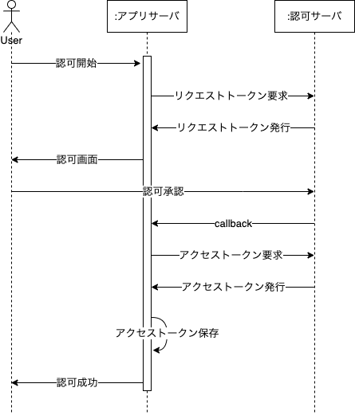
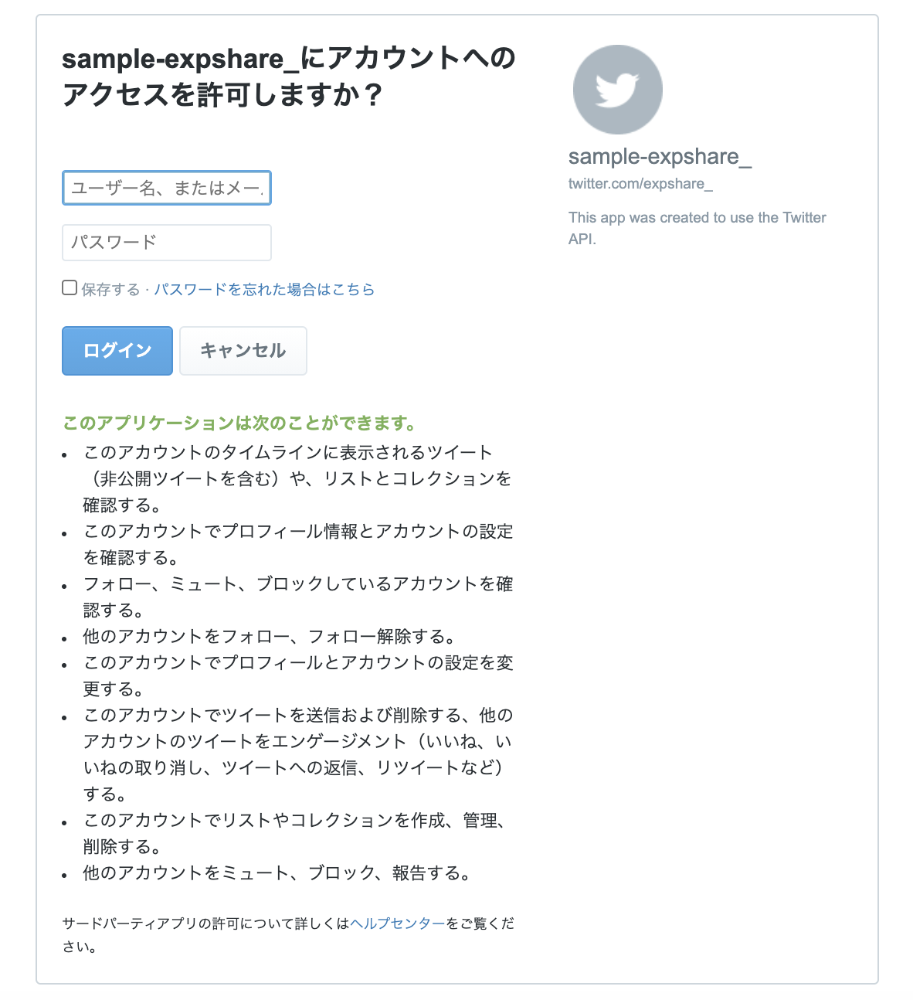
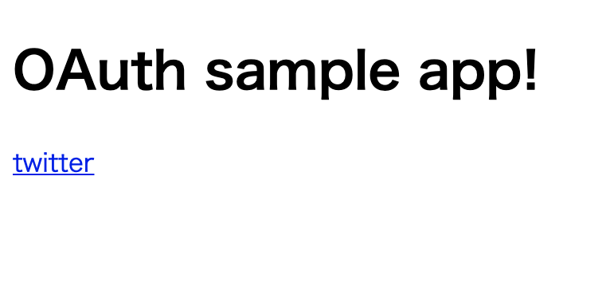
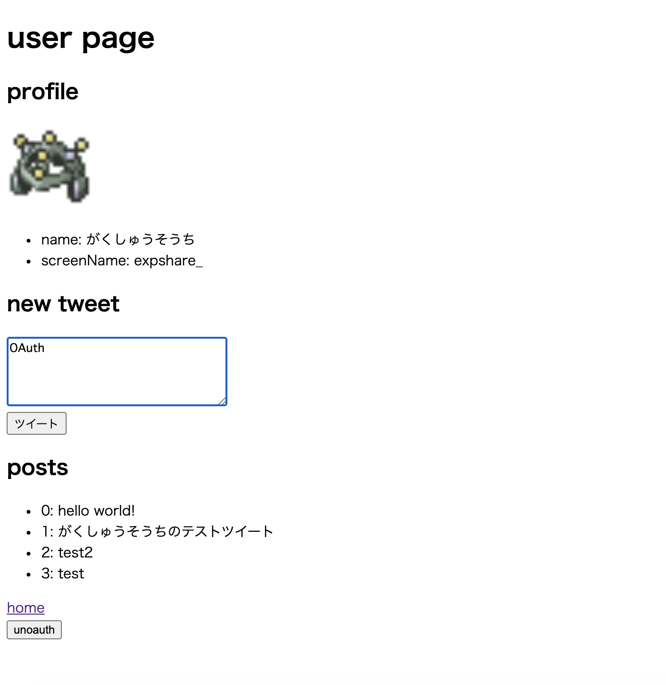
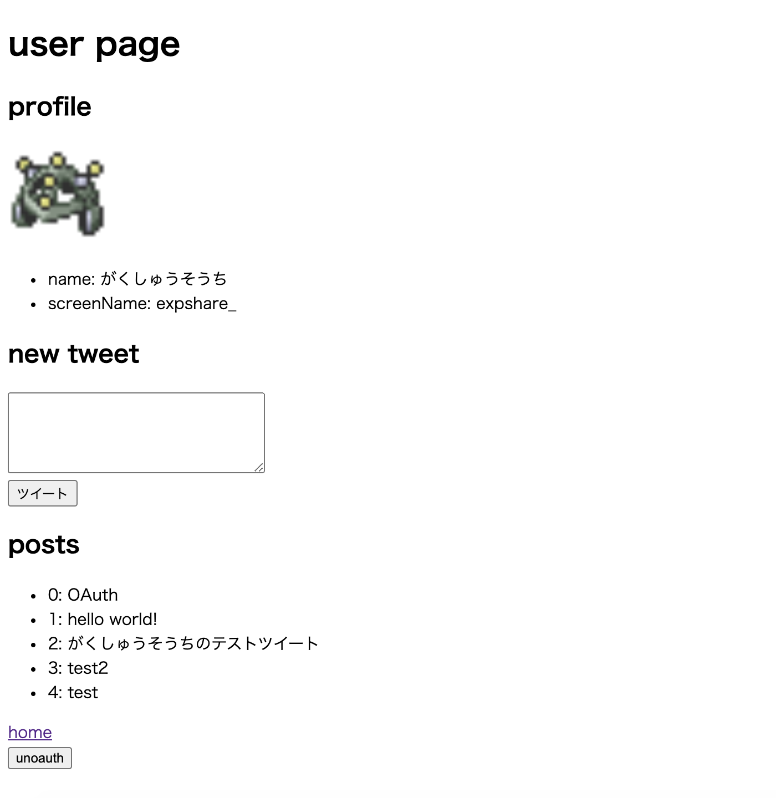

今後SNSアカウントやGoogleアカウントでログインできるアプリを作る!となったときに備え，OAuthに入門してTwitterログインやアカウント情報の取得，ツイートの投稿を試してみました．

## OAuthとは

一言で言うと**アプリユーザに，連携アプリのリソースを使用することを許可してもらう（認可）仕組み**です．
外部のアプリのリソースを使用するのに必要な，ユーザ固有のアクセストークンを取得・管理する権利を許可してもらうことで，自分のアプリから外部のアプリのリソースにあたかもそのユーザであるかのようにアクセスできるようになります．

OAuthには1.0と2.0があるらしいのですが，2.0の方が少しだけ簡易になっているくらいしか理解できていません．
TwitterはOAuth2.0も利用できますが機能が限定的で，今回はOAuth1.0の方を使うことにします．

## OAuth1.0の流れ(Twitterの例)

アプリのサーバ，ユーザ，そして連携したいアプリの認可サーバの3者で行います．

連携したいアプリのアクセストークンはユーザ一人ひとりに割り当てられます．
アクセストークンをまだ持っていなければ，認可フローを開始します．



### 1.リクエストトークンの発行を認可サーバに要求

アプリサーバはまずリクエストトークンという，認可フローの度に発行されるトークンを認可サーバに要求します．

### 2.ユーザにアクセス許可を求めるページを表示

認可サーバからのレスポンスにはリクエストトークンの他，ユーザがアクセス許可を行うページのURLも含まれているので，ユーザをそのURLへリダイレクトさせます．このURLは開発者があらかじめ設定しておきます．

### 3.ユーザがアクセスを許可

ユーザーには下のようなページが表示され，ユーザがTwitterアカウントにログインすると，アクセスが許可されたとしてリクエストトークンと共に認可サーバへとデータが送られます．



### 4.認可サーバからアプリサーバへcallback

アクセス許可されたことを知らせる情報が，アプリサーバへcallbackされます．callbackするURLも開発者が設定しておく必要があります．

### 5.アクセストークンを認可サーバに要求

アプリサーバはリクエストトークンが正しいことを確認し，リクエストトークンと認可証明書を添えてアクセストークンを認可サーバに要求します．

### 6.認可成功

アクセストークンが送られてきて成功です．アクセストークンは一番漏洩してはいけないトークンなので，データベースなどに慎重に保存しておきます．

その後任意のページをユーザに表示してフロー終了です．

## 実装

### 準備

事前にTwitterAPIの申請とプロジェクトの作成が必要になるのですが，ここでは書きません．ただ，Twitterの開発者ポータルで`3-legged OAuth`を有効にし，callback URLとwebsite URLを設定しておく必要があります．僕は以下のように設定しました．

- callback URL: `http://localhost:8080/twitter/callback` (アプリサーバが認可サーバからのcallbackを受け付けるURL)
- website URL: `https://twitter.com/expshare_` (サンプルアプリのために作ったTwitterアカウントのプロフィールページ)

### 環境

- MacOS 10.14.16(Mojave)
- docker desktop 2.4.0.0
- Go 1.14.4

GoのWebフレームワークにも入門してみたかったのでGinを使っています．

### ファイル構成

コードは[GitHub](https://github.com/Fukkatsuso/oauth-sample)に上げています．

```sh
.
├── app
│   ├── Dockerfile
│   ├── go.mod
│   ├── go.sum
│   ├── keys.env  # 環境変数
│   ├── lib
│   │   └── twitter
│   │       ├── action.go
│   │       ├── auth.go
│   │       ├── go.mod
│   │       ├── go.sum
│   │       └── model.go
│   ├── main.go
│   └── views
│       └── html
│           ├── _footer.html
│           ├── _header.html
│           ├── index.html
│           └── twitter.html
└── docker-compose.yml
```

セッション管理にデータベースも使いたかったのですが，セッションを扱ってくれるライブラリでMySQLに対応したものがうまく動かせず，仕方なくcookieでセッション管理することにしました．
ローカルでの開発なら問題ありませんが，一般公開する場合はちゃんとサーバ側でセッションを管理するべきです．

### フロントエンド

Goのtemplateを利用してサーバーサイドで描画することにしました．
CSSも全く使っておりません．

#### index.html

```html
{{ template "header" . }}

<a href="/twitter">twitter</a>

{{ template "footer" }}
```

#### twitter.html

```html
{{ template "header" . }}

<h2>profile</h2>

<ul>
  <li>name: {{ .user.Name }} </li>
  <li>screenName: {{ .user.ScreenName }}</li>
</ul>

<h2>new tweet</h2>
<form action="twitter/post" method="post">
  <div>
    <textarea name="content" cols="35" rows="4"></textarea>
  </div>
  <input type="submit" value="ツイート">
</form>

<h2>posts</h2>
<ul>
{{ range $i, $v := .timeline.Posts }}
  <li>{{ $i }}: {{ $v.Text }}</li>
{{ end }}
</ul>

<a href="/">home</a>
<form action="twitter/unoauth" method="post">
  <input type="submit" value="unoauth">
</form>

{{ template "footer" }}
```

#### _heafer.html

```html
{{ define "header" }}

<!DOCTYPE html>
<html lang="ja">
<head>
  <meta charset="UTF-8">
  <meta name="viewport" content="width=device-width, initial-scale=1.0">
  <title>OAuth sample app</title>
</head>
<body>

<h1>{{ .title }}</h1>

{{ end }}
```

#### _footer.html

```html
{{ define "footer" }}

</body>
</html>

{{ end }}
```

トップページのindex.htmlから`twitter`ページにアクセスすると，ユーザのTwitterアカウント情報が表示されます．
テキストだけのツイート投稿や，ユーザの最新のツイートを20件まで（API仕様）表示することができるようにしています．

### main.go

`GET("/twitter/oauth")`と`GET("/twitter/callback")`が今回の肝です．

```go
package main

import (
	"net/http"
	"github.com/Fukkatsuso/oauth-sample/app/lib/twitter"
	"github.com/gin-contrib/sessions"
	"github.com/gin-contrib/sessions/cookie"
	"github.com/gin-gonic/gin"
)

func main() {
  r := gin.Default()

  // views/htmlディレクトリ配下のHTMLファイルを呼び出す設定
  r.LoadHTMLGlob("views/html/*")
  
  // cookieでセッション管理する設定
  store := cookie.NewStore([]byte("secret"))
  r.Use(sessions.Sessions("session", store))

  // top page
  r.GET("/", func(c *gin.Context) {
		c.HTML(http.StatusOK, "index.html", gin.H{
			"title": "OAuth sample app!",
		})
	})

  // Twitterのアカウント情報等
  r.GET("/twitter", func(c *gin.Context) {
    aToken := twitter.GetAccessToken(c)
    // アクセストークンがなければ認可フローに移る
    if aToken == nil {
      c.Redirect(http.StatusSeeOther, "/twitter/oauth")
      return
    }
    // プロフィール取得
    user := twitter.User{}
    err := twitter.GetUser(c, aToken, &user)
    if err != nil {
      c.Redirect(http.StatusSeeOther, "/twitter/oauth")
      return
    }
    // タイムライン取得
    tl := twitter.UserTimeline{}
    err = twitter.GetUserTimeline(c, aToken, user.ID, &tl)
    if err != nil {
      c.Redirect(http.StatusSeeOther, "/twitter/oauth")
      return
    }
    // ユーザーページ表示
    c.HTML(http.StatusOK, "twitter.html", gin.H{
      "title":    "user page",
      "user":     user,
      "timeline": tl,
    })
  })

  // OAuth認可開始
  r.GET("/twitter/oauth", func(c *gin.Context) {
    loginURL, err := twitter.OAuth(c)
    if err != nil {
      c.Redirect(http.StatusSeeOther, "/")
      return
    }
    c.Redirect(http.StatusFound, loginURL)
  })

  // 認可サーバからのcallbackを受け付ける
  r.GET("/twitter/callback", func(c *gin.Context) {
    redirectURL, err := twitter.Callback(c)
    if err != nil {
      c.Redirect(http.StatusSeeOther, "/twitter/oauth")
      return
    }
    c.Redirect(http.StatusFound, redirectURL)
  })

  // アクセストークンを消去する
  // GinはDELETEメソッドのリクエストをうまく処理できないようなのでPOSTにした
  // GETメソッドがよかったかもしれない?
  r.POST("/twitter/unoauth", func(c *gin.Context) {
    err := twitter.UnOAuth(c)
    if err != nil {
      c.Redirect(http.StatusSeeOther, "/")
      return
    }
    c.HTML(http.StatusOK, "index.html", gin.H{
      "title": "twitter unauthorize successed",
    })
  })

  // ツイートを投稿
  r.POST("/twitter/post", func(c *gin.Context) {
    aToken := twitter.GetAccessToken(c)
    if aToken == nil {
      c.Redirect(http.StatusSeeOther, "/twitter/oauth")
      return
    }
    post := twitter.NewPost{
      Status: c.PostForm("content"),
    }
    err := twitter.Tweet(c, aToken, &post)
    if err != nil {
      c.Redirect(http.StatusSeeOther, "/twitter")
      return
    }
    c.Redirect(http.StatusFound, "/twitter")
  })

  r.Run() // listen and serve on 0.0.0.0:8080
}
```

`app/lib/twitter`にはTwitterのOAuthやプロフィール取得，ツイート取得，ツイート投稿などを行うプログラムを置いています．

### app/lib/twitter/model.go

```go
package twitter

// アカウント情報
type User struct {
	ID         string `json:"id_str"`
	Name       string `json:"name"`
	ScreenName string `json:"screen_name"`
	ImageURL   string `json:"profile_image_url_https"`
}

// 新規ツイート
type NewPost struct {
	Status string `json:"status"`
}

// タイムラインのツイート（テキスト）
type Post struct {
	Text string `json:"text"`
}

// タイムライン
type UserTimeline struct {
	Posts []Post
}
```

### app/lib/twitter/auth.go

callbackに使うURL，Twitter開発者ポータルで取得したプロジェクトのAPIキー及びシークレットを環境変数(keys.envファイル)に設定しておきます．
[docker-compose](https://github.com/Fukkatsuso/oauth-sample/blob/main/docker-compose.yml)で環境変数ファイルとしてkeys.envを読み込むようにしました．

```env
TWITTER_CALLBACK_URL=http://XXXXXX/YYY/ZZZ
TWITTER_API_KEY=hoge
TWITTER_API_SECRET=fuga
```

```go
package twitter

import (
	"errors"
	"os"
	"github.com/gin-contrib/sessions"
	"github.com/gin-gonic/gin"
	"github.com/mrjones/oauth"
)

const (
	requestTokenURL = "https://api.twitter.com/oauth/request_token"
	authenticateURL = "https://api.twitter.com/oauth/authenticate"
	accessTokenURL  = "https://api.twitter.com/oauth/access_token"
)

var (
	callbackURL    string
	consumerKey    string
	consumerSecret string
)

func init() {
	callbackURL = os.Getenv("TWITTER_CALLBACK_URL")
	consumerKey = os.Getenv("TWITTER_API_KEY")
	consumerSecret = os.Getenv("TWITTER_API_SECRET")
}

func NewClient() *oauth.Consumer {
	return oauth.NewConsumer(consumerKey, consumerSecret,
		oauth.ServiceProvider{
			RequestTokenUrl:   requestTokenURL,
			AuthorizeTokenUrl: authenticateURL,
			AccessTokenUrl:    accessTokenURL,
		})
}

func OAuth(c *gin.Context) (string, error) {
	client := NewClient()
	// リクエストトークンを取得
	rToken, loginURL, err := client.GetRequestTokenAndUrl(callbackURL)
	if err != nil {
		return "", nil
	}

	session := sessions.Default(c)
	session.Set("twitter_request_token", rToken.Token)
	session.Set("twitter_request_secret", rToken.Secret)
	session.Save()

	// アクセス許可画面へリダイレクト
	return loginURL, nil
}

func Callback(c *gin.Context) (string, error) {
  // リクエストトークンと認可証明書を取り出す
	var token, verificationCode string
	token = c.DefaultQuery("oauth_token", "")
	verificationCode = c.DefaultQuery("oauth_verifier", "")
	if token == "" || verificationCode == "" {
		return "/", errors.New("cannot get oauth_token/oauth_verifier")
	}

	// リクエストトークンの照合
	session := sessions.Default(c)
	rt := session.Get("twitter_request_token").(string)
	if rt == "" {
		return "/", errors.New("cannot get request token")
	}
	if token != rt {
		return "/", errors.New("request token is not correct")
	}
	// 送信するリクエストトークンの準備
	rs := session.Get("twitter_request_secret").(string)
	if rs == "" {
		return "/", errors.New("cannot get request secret")
	}
	rToken := oauth.RequestToken{Token: rt, Secret: rs}

	client := NewClient()
	// アクセストークンを取得
	aToken, err := client.AuthorizeToken(&rToken, verificationCode)
	if err != nil {
		return "/", err
	}
	session.Set("twitter_access_token", aToken.Token)
	session.Set("twitter_access_secret", aToken.Secret)
	session.Save()

	// リダイレクト
	return "/twitter", nil
}

// セッションからアクセストークンを取り出す
func GetAccessToken(c *gin.Context) *oauth.AccessToken {
	session := sessions.Default(c)
	vat := session.Get("twitter_access_token")
	vas := session.Get("twitter_access_secret")
	if vat == nil || vas == nil {
		return nil
	}
	at, as := vat.(string), vas.(string)
	if at == "" || as == "" {
		return nil
	}
	aToken := oauth.AccessToken{Token: at, Secret: as}
	return &aToken
}

// セッションからアクセストークンを削除する
func UnOAuth(c *gin.Context) error {
	session := sessions.Default(c)
	session.Delete("twitter_access_token")
	session.Delete("twitter_access_secret")
	session.Save()
	return nil
}
```

### app/lib/twitter/action.go

アカウント情報の取得，ツイート投稿，ユーザのタイムライン取得を行います．

```go
package twitter

import (
	"encoding/json"
	"errors"
	"github.com/gin-gonic/gin"
	"github.com/mrjones/oauth"
)

const (
	accountVerifyCredsURL = "https://api.twitter.com/1.1/account/verify_credentials.json"
	tweetURL              = "https://api.twitter.com/1.1/statuses/update.json"
	userTimelineURL       = "https://api.twitter.com/1.1/statuses/user_timeline.json"
)

func GetUser(c *gin.Context, token *oauth.AccessToken, user *User) error {
	client := NewClient()
	params := map[string]string{}
	resp, err := client.Get(accountVerifyCredsURL, params, token)
	if err != nil {
		return err
	}
	defer resp.Body.Close()

	if resp.StatusCode >= 500 {
		return errors.New("twitter is unavailable")
	}
	if resp.StatusCode >= 400 {
		return errors.New("twitter request is invalid")
	}

	err = json.NewDecoder(resp.Body).Decode(user)
	return err
}

func Tweet(c *gin.Context, token *oauth.AccessToken, post *NewPost) error {
	if len(post.Status) == 0 || len(post.Status) > 140 {
		return errors.New("status must be 0~140 chars")
	}
	client := NewClient()
	params := map[string]string{
		"status": post.Status,
	}
	resp, err := client.Post(tweetURL, params, token)
	if err != nil {
		return err
	}
	defer resp.Body.Close()

	if resp.StatusCode >= 500 {
		return errors.New("twitter is unavailable")
	}
	if resp.StatusCode >= 400 {
		return errors.New("twitter request is invalid")
	}

	return nil
}

func GetUserTimeline(c *gin.Context, token *oauth.AccessToken, id string, tl *UserTimeline) error {
	client := NewClient()
	params := map[string]string{
		"user_id": id,
	}
	resp, err := client.Get(userTimelineURL, params, token)
	if err != nil {
		return err
	}
	defer resp.Body.Close()

	if resp.StatusCode >= 500 {
		return errors.New("twitter is unavailable")
	}
	if resp.StatusCode >= 400 {
		return errors.New("twitter request is invalid")
	}

	err = json.NewDecoder(resp.Body).Decode(&tl.Posts)
	return err
}
```

## 実行

### ホーム画面

`twitter`リンクに移動して任意のTwitterアカウントでログインします．



### Twitterログイン後

ユーザのプロフィールとタイムラインが取得できています．



### ツイート実行後

"OAuth"というツイートの投稿が実行され，取得したタイムラインにも反映されました．



「プロフィール取得」「タイムライン取得」「ツイート投稿」ができていることが確認できます．

## 感想・学び

ユーザ側からはボタンをポチッと押すだけの処理ですが，調べてみるとデータやらURLやらがあちこち移動して意外と複雑に感じました．
「誰と」「何のデータを」やり取りするのかを意識することで，大きく躓くことなく実装できたと思います．

セッション管理は欲を言えばMySQLを使いたかったです．
MySQL対応と書いているパッケージを拝借しようとしたんですが，なぜか関係ないMongoDBがどうのみたいなエラーが出て結局使えませんでした．
今後解決したいと思います．
`gin-gonic`だの`gin-contrib`だの`gin-gonic/contrib`だのと紛らわしい名前のリポジトリが多くて依存関係を辿るのが大変だったのも影響しているかも...

そもそもセッション管理はMySQLよりもRedisとかMongoDBとかMemcachedとかのNoSQLの類がデファクトなんでしょうか?
MySQLでやっている例が明らかに少ないと感じました．
使おうと思えばRedisの方がすんなりできたかもしれません．
ただサーバーサイドの基礎を固めるという意味でリレーショナルなDBを使っていきたかったです．

Ginを使ってみて，フレームワーク独自仕様ゴリゴリではなくSinatraのような軽い感じで使いやすかったです．
ずっと疑問に思っていた`Context`は，セッションなど諸々をまとめてコントローラのサブルーチンに渡せる利点があると実感できました．
シンプルでメンテナンスしやすいコードを書くための開発の引き出しとして使い方を身につけておきたいです．

あとは自分の課題としてテストを書いた経験が少ないので，今回作ったサンプルアプリで試してみるのも良さそうです．

## 参考

- [Twitter API v1.1](https://developer.twitter.com/en/docs/twitter-api/v1)
- [Twitter API 登録 (アカウント申請方法) から承認されるまでの手順まとめ　※2019年8月時点の情報](https://qiita.com/kngsym2018/items/2524d21455aac111cdee)
- [TwitterOAuthでログイン認証をおこなう(OAuth)](https://noumenon-th.net/programming/2016/03/08/twitteroauth/)
- [GinでTwitter OAuthでaccess token取得](https://92thunder.hatenablog.com/entry/2017/09/11/022730)
- [GolangでTwitterのOAuth1.0認証](https://christina04.hatenablog.com/entry/2016/07/11/193000)
