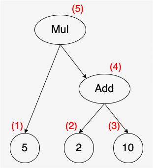

「[Go 言語で作るインタプリタ](https://www.oreilly.co.jp/books/9784873118222/)」とその続編である「[Writing a Compiler in Go](https://compilerbook.com/)」を読みました。

## 概要

「Go 言語で作るインタプリタ」では、monkey 言語という独自の簡易言語（インタプリタ型）を作りました。
本のコードを写経しながら、字句解析、構文解析、評価の順でボトムアップにインタプリタを組み上げて、最後に機能拡張として文字列型や組み込み関数、配列、ハッシュなどを追加するという流れでした。

「Writing a Compiler in Go」では、これまでに構築した字句解析と構文解析を使い、monkey 言語をバイトコードに変換するコンパイラと、バイトコードを動かす仮想マシンを作りました。
こちらは日本語版が出版されていないため英語の原書を読みましたが、しっかり理解したい箇所は翻訳ツールを使えば大抵問題なく読めましたし、コードが理解の助けになったので、1 ヶ月ほどで読破することができました。

コードはここに上げています：<https://github.com/Fukkatsuso/go-monkey>

以下、2 冊の各章を振り返っていきます。

## Go 言語で作るインタプリタ

### 第 1 章 字句解析

トークンの定義から始まり、ソースコードをトークン列に変換するための字句解析器を作ります。
字句解析器は文字列を一文字ずつ読み進め、プログラム中で意味を持つ最小単位の文字列であるトークンを返すというものです。

トークンは `=` や `{` のように一文字からなるものだけでなく、`==` などの二文字の演算子や `true`, `return` といった予約語、そして変数名や数字などもあるため、文字列の区切りまで読み進めてから判定する必要があります。

### 第 2 章 構文解析

字句解析器で得られるのはフラットなトークン列です。
これに意味を持たせてプログラムとして評価するためには、構造化された表現（構文木や抽象構文木など）に変換しなければなりません。
この章ではトークン列を抽象構文木 (AST) に変換する構文解析器を作ります。

本書では Pratt 構文解析をベースにしたトップダウンの解析方法を採用しており、優先度の高いトークンに出会ったら構文木を掘り下げて再帰的に解析していきます。

トークンを読み進める関数は複数の場所で呼び出されるので、今どこを読んでいるのかがわかりづらく、自力で構文解析器を書くとトークンを進め忘れたり余計に進めたりしがちです（off-by-one エラーというそうです）。
本書では、各所でトークンをどこまで読み進めるのかについては 1 つの規約に従うことになっており、それを頭の中にイメージとして持っておくとその後の理解もスムーズにいくと思います。
> 全ての構文解析関数 prefixParseFn や infixParseFn は次の規約に従うことにする。
> 構文解析関数に関連付けられたトークンが curToken に セットされている状態で動作を開始する。
> そして、この関数の処理対象である式の一番最後のトークンが curToken にセットされた状態になるまで進んで終了する。

また本書はテスト駆動で進めるので、ちゃんと動いているかどうかが明確に判断でき、テストが通った瞬間の気持ちよさがモチベーションの維持にもなっています。

### 第 3 章 評価

AST を再帰的に解釈する Tree-Walking インタプリタを作ります。

monkey では let 文と return 文以外をすべて式（値を返すもの）として扱うため、再帰的解釈がしやすいのが嬉しいポイントなのかなと思いました。

変数束縛はどう実現しているんだろうと疑問でしたが、現在のスコープで有効なハッシュマップを作り、変数名と実体のオブジェクトを関連付けるという、一度聞いてみればすんなり理解できる方法でした。
関数内に閉じた変数スコープを作るときは、外側スコープへの参照を持たせた新たな内側スコープを作り、そして名前解決時は現在のスコープで見つからなければ外側スコープを探しにいくという直感的な仕組みです。

あとは関数呼び出しの流れがやや難しかったですが、コードを丁寧に読んでいけば理解はできました。

### 第 4 章 インタプリタの拡張

3 章まででインタプリタが動作するようになっていますが、この時点で利用可能なデータ型は整数と真偽値だけです。
4 章では文字列、組み込み関数、配列、ハッシュを扱えるようにインタプリタを拡張します。

トークンを追加して、字句解析器を変更し、構文解析器を拡張し、評価器に対応させる、という流れを繰り返し、インタプリタの機能を充実させていくという内容でした。
既に土台は出来上がっているのでサクサク進められて、インタプリタのできることが増えていくのでボーナスステージ的な楽しい章だと思います。

## Writing a Compiler in Go

### chapter1. Compilers & Virtual Machines

まずはなぜ素のコンピュータではなく仮想マシンで動かすのかという話です。
利点は大きく 2 つあります。

- 仮想マシンを挟むことで、異なるアーキテクチャで同じプログラムを実行することが容易になる（移植性）
- コンピュータの提供する機能から一部だけ利用したい場合、仮想マシンでそれを提供することで複雑さが減り、メンテコストが下がる。また、命令の密度が上がり、コードの実行速度向上にもつながる

仮想マシンには種類があり、スタックだけで命令実行できる「スタックマシン」と、スタック＋レジスタで構成される「レジスタマシン」があります。
レジスタマシンの方が高速ですが、部品の少ないスタックマシンの方がシンプルな構成で済むため、本書ではスタックマシンを構築していきます。

そして monkey 言語を仮想マシンで動かすために、バイトコードへ変換するコンパイラも作ります。
バイトコードは op コードとオペランドが配置されたバイナリ形式のコードで、仮想マシンが読み込んで解釈するためのものです（人間が読みやすい `PUSH` などのニーモニックは表示されません）。

### chapter2. Hello Bytecode!

本書でも小さいものから作っていきます。
定数の加算を行うプログラムをバイトコードにコンパイルできるようにし、仮想マシンで動かせるようにします。

仮想マシンは 4 つの要素で構築します。

- 定数プール：プログラム中のリテラルがここに入っている
- instructions: バイトコードの命令
- スタック
- スタックポインタ：スタックの次の空きスロットを指す

定数プールは Go のスライスで作っており、整数や文字列などのプリミティブなものから、後の章では関数というデカめのリテラルまで入ることになります。
op コードのオペランドに定数プールの該当インデックスを渡すことで、定数を計算に使わせたり、関数を呼び出させたりします。

そうすることでオペランドの長さを一定バイト長に収めることができるのはわかったのですが、それにしたって関数まで定数プールに入れるのか…と軽い衝撃でした。

### chapter3. Compiling Expressions

加算ができたので他の中置演算子（`-`, `*` など）のコンパイルと演算処理を実装したり、比較演算子や前置演算子 (`-`, `!`) にも対応できるようにします。

ここからは機能拡張なので、基本的には op コードを定義して、コンパイラにバイトコードを生成させ、仮想マシンで実行するという流れです。

この章でなるほどと思ったことといえば、大小比較演算子は `>` だけで良いということです。
`<` はコンパイル時に演算子の左右を入れ替えれば `>` と等価になります。
2 種類の演算子を 1 種類の演算子に読み替えることで、仮想マシンの命令セットを小さくすることができる利点があります。

また、実際やってみてありがたみを感じたのは、コンパイラは構文解析器により優先順位付けされた AST を読んでバイトコードに置き換えていくだけでよく、コンパイラや仮想マシン自身が演算子の優先順位を判断する必要がないということです。
たとえば `5 * (2 + 10)` というプログラムを与えると、コンパイラは以下のようなバイトコードを生成します。

```sh
# 命令 (便宜上 op コードをニーモニックに置換した)
OpConstant 0 # 定数 5 をスタックに push
OpConstant 1 # 定数 2 をスタックに push
OpConstant 2 # 定数 10 をスタックに push
OpAdd        # 2 と 10 を pop して、2 + 10 = 12 をスタックに push
OpMul        # 12 と 5 を pop して、5 * 12 = 60 をスタックに push
OpPop        # 60 を pop

# 定数プール
5
2
10
```

優先順位に基づいて命令が記述され、それが後入れ先出しのスタックと噛み合って実行されます。



AST の深さ優先探索だと考えれば当然といえば当然ですが、綺麗な仕組みだなと思いました。

### chapter4. Conditionals

フラットな命令列であるバイトコードで、どうやって条件分岐を実現するか？という内容です。

以下の 2 種類の jump 命令を使います。

- 条件成立の場合、その後に続く命令を実行し、`OpJump` 命令に出会ったら if 式後の命令までジャンプする（if 式を抜ける）
- 条件不成立の場合、`OpJumpNotTruthy` 命令を実行し、不成立時の命令または if 式後の命令までジャンプする

（文字だけだと説明が難しいですが、書籍では図付きの解説があるので気になる方はぜひ読んでみてください）

ジャンプ先の命令アドレスをどうやって計算するのかという問題には、back-patching という方法で対処しています。
先に仮のアドレスを設定しておき、一連の命令生成が終わった段階で正式なジャンプ先を調べ、仮のアドレスを置き換えてやるという方法です。

理屈はわかっても細かい実装方法についてはわからなかったりしますが、この本は少ない労力で実装を追加できるようにしてあり、実装まで合わせてわかりやすかったと思います。

### chapter5. Keeping Track of Names

識別子をバイトコードで表現するために、`OpSetGlobal`, `OpGetGlobal` という op コードを導入します。
名前の通り、この段階ではまだグローバル変数のみのサポートです。

- コンパイラは let 文の識別子に対して一意の番号を割り当て、`OpSetGlobal` 命令を発行
  - 仮想マシンは識別子番号と中身の値を紐づける
- コンパイラは、見たことがある識別子に対しては `OpGetGlobal` 命令を識別子番号付きで発行
  - 仮想マシンは識別子番号をもとに中身の値を取り出して、スタックに push する

これを実現するために、コンパイラに「シンボルテーブル」を設けて識別子と番号を関連付けたり、仮想マシンに「グローバルストア」というスライスを持たせて識別子の中身の値を保持させたりします。

コンパイラも仮想マシンも色々な情報を持ちはじめて頭が混乱しました…

### chapter6. String, Array and Hash

配列やハッシュといった、複数の値を持つデータ構造をどう表現するかがメインです。

`OpArray`, `OpHash` という op コードを導入し、オペランドで中身の値（各要素）の個数を指定することで、仮想マシンがスタックから指定個数の値を取り出して配列やハッシュを構築することができます。
構築した配列やハッシュは、1 個の値として丸ごとスタックに突っ込みます。
（なかなかのパワープレイで、仮想マシンだからできたことだなあと思いました）

また、配列やハッシュの要素へのインデックスによるアクセスは、`OpIndex` 命令として実現します。
スタックには構築済みの配列もしくはハッシュがある状態なので、それを取り出して指定されたインデックスにアクセスします。

### chapter7. Functions

monkey 言語において関数はリテラルなので、chapter2 で書いたとおり仮想マシンの定数プールに定数として持たせます。
（実装の詳細は長くなるので省略します）

事前のイメージでは、関数はバイトコードの命令の中で定義され、関数実行時はアセンブリの call 命令のように、目的の関数の先頭アドレスまで移動するのかと思っていました。
理屈として、monkey 言語の関数は第一級オブジェクトでもあるので定数プールに入れる、という実装方針は理解できますが、他のメジャーな言語でもこういう実装になっているのか気になるところです。

ちなみにこの章でローカル変数も使えるようになります。

### chapter8. Built-in Functions

組み込み関数の中身はインタプリタと同じですが、どうやってコンパイルするのか、どうやって仮想マシンで実行するのかが問題となります。

答えとしては、こうです。

- コンパイル時：コンパイラ初期化時に、組み込み関数をシンボルテーブルの専用スコープに登録しておく。コンパイル中に組み込み関数への参照を検出すると、`OpGetBuiltin` 命令を発行する
- 仮想マシンでの実行時：`OpGetBuiltin` 命令では、該当の関数を取得して、スタックにまるごと push する。組み込み関数の実行は、通常の関数と共通の `OpCall` 命令を使う

前章の関数呼び出しの仕組みがわかっていれば、それほど難しくはない章です。

### chapter9. Closures

実質的に最後の章ですが、これまでとは打って変わってラスボス級の難しさでした。
というか未だによくわかっていません…

（クロージャの例を本書より掲載）

```
let newAdder = fn(a) {
  let adder = fn(b) { a + b; };
  return adder;
};

let addTwo = newAdder(2);
addTwo(3); // => 5
```

本書いわく、クロージャを実装するにあたって大きな問題があります。
本を読んで辛うじて理解したかもしれない内容を書くと、以下のような問題です。

> クロージャには後で渡すための変数（上のコードの `adder` 関数内の `a`）を設定できる。
> コンパイル時点では `a` の値は確定しない。仮想マシンの中で `newAdder(2)` を実行した時点で `a` の値がわかる。
> しかし `adder` はコンパイル済みであり、関数 `fn(b) { a + b; }` が定数プールから取り出されてスタックに入っている。
> この状態で、どうやって `a` に `2` を渡すのか？

うーん、`fn(b) { a + b; }` がコンパイル済みなことがキモな気がしますが、これだと本当に `a` が渡せないのか…？と何度読んでも釈然としません。

とりあえず読み進めましたが、最後まで分からずじまいでした。

### chapter10. Taking Time

インタプリタと仮想マシンそれぞれでフィボナッチ数列の計算をさせ、かかった時間を比較すると…

仮想マシンがインタプリタの 3.3 倍高速だ！ということで終幕です。

## 感想

2 冊とも小さく作って拡張していく流れで、最初の土台作りさえできればスムーズに進められた印象です。

大学でコンパイラの授業を受けたことがあったのですが、そのとき渡されたコードは C 言語で既に大半のコードが組まれており、動作の仕組みをコードベースで理解しきれていなかった記憶があります。
Go 言語で実装する本書は読みやすいと感じましたし、一から自分で書くのでずっと理解しやすかったです。

また TDD で写経しながら進められるおかげで、テストが通った瞬間は気持ちがいいです。
写経ミスがないことをある程度保証してくれるので良い方法だと思いました。

全体を通じてシンプルに作るという方針で統一されていたので、プログラミング言語を自作したことがない人や、これから自作してみたい人にとって、難しすぎないレベルで入門できる本としてもおすすめです。

「Writing a Compiler in Go」の chapter9 は、いつか理解できる日が来ることを期待します…
