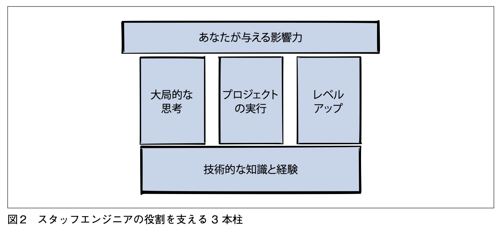
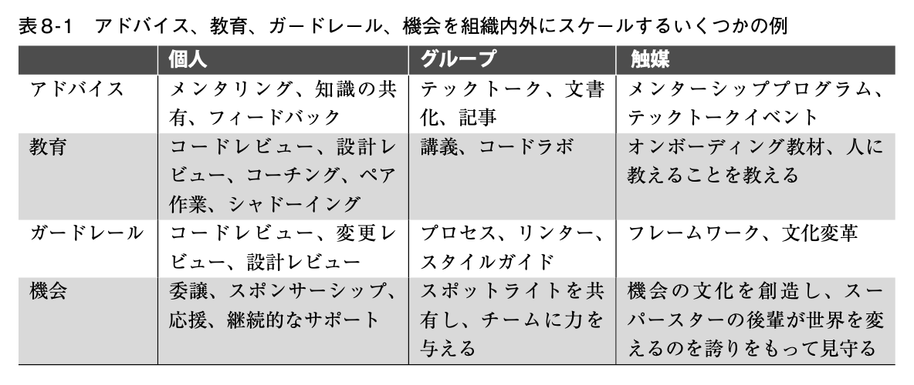

## はじめに

[「スタッフエンジニアの道」](https://www.oreilly.co.jp/books/9784814400867/) を読みました。

自分は技術スペシャリストとしてキャリアを積んでいきたいと思っており、これまでシニアエンジニアを目指すくらいのイメージしかなかったのですが、その先にスタッフエンジニアという役職があると知り、どんな役職なんだろうという興味から本書を手に取りました。

また、エンジニアとして 3 年ほど働いてみて、個人の技術力と同等かそれ以上に、周囲との関わり方やチームでの働き方を意識することが大切だと実感するようになっていました。
読んでみると、まさにそういったことを学ぶのにも良い本でした。

## スタッフエンジニアとは何者か

本書の冒頭に、スタッフエンジニアを端的に表す図が載っています。

技術的な知識と経験を土台として、**大局的な思考・プロジェクトの実行・レベルアップ**の 3 本柱で組織に影響力を与える存在、と定義されています。

最初にこの図を見たとき、正直ピンとこなかったです。
章を読み進めるうちに、それぞれが具体的にどういう考え方・行動を指しているのかが、だんだんわかってきました。

また、1.3 節「役割を理解する」では、技術に対して深さと広さどちらでアプローチするか、技術とマネジメントのバランスをどうするか、といった軸によって、スタッフエンジニアをテックリード・アーキテクト・ソルバー・右腕という 4 つのアーキタイプに分類しています ([Staff archetypes](https://staffeng.com/guides/staff-archetypes/))。
自分が目指したい方向性はアーキテクト（重要な領域の技術的な方向性と品質に責任を持つ）だなと思いました。

## 大局的な思考

### 3 つの地図

本書では、スタッフエンジニアが持つべき視点を「3 つの地図」という比喩で説明しています。

**ロケーターマップ**は、自分の立ち位置を把握するための地図です。
自分のチームやタスクに集中しすぎると局所最適解に陥るリスクがあるため、組織を超えた広い視野を持つことが求められます。
技術はあくまで手段であり、企業の目標や顧客の満足が重要です。

**トポグラフィックマップ**は、組織間の責任範囲やコミュニケーションラインを把握するための地図です。
どこで意思決定がなされているのか、情報の流れはどうなっているのか、どこに摩擦が生じやすいのかを知っておきます。
本書 2.3.2 項「組織を理解する」には次の一節があります。

> エンジニアは時々、組織に関するスキルを「政治的なもの」として軽視することがあります。
> しかし、システムの一部である人間を考慮し、解決すべき問題を明確に理解し、長期的な結果を把握し、優先事項についてトレードオフを行うといったスキルは、優れたエンジニアリングの一部です。

「エンジニアリング組織論への招待」という本に『組織設計とシステムアーキテクチャは本質的に同じ』という指摘があるように、エンジニアリングと組織は切っても切り離せないものです。
この一節はそのことを改めて示唆しています。

**トレジャーマップ**は、どこへ向かうのかを示す地図です。
長期的な目標を明らかにして、「今自分たちはどこにいて、どこへ向かっているのか」を他の人に語れるようにします。

### 技術ビジョン・戦略

ビジョン（あるべき未来の姿）と戦略（そこへ至るための行動計画）を作ることも、スタッフエンジニアの仕事のひとつです。

重要なのは、いろんなチームの人と対話しながら現状を理解することです。
技術的にすごい目標を立てる必要は全くなく、現実的に到達可能な目標を立て、意思決定の経緯をドキュメントに残します。
とはいえ言うは易しで、安易に解決策らしきものに飛びつかず、対話を繰り返して解くべき問題を見定めるのはとても根気が必要で、成し遂げられる人はそう多くないと思います。

技術ビジョンに関しては「ソフトウェアアーキテクチャの基礎」、戦略に関しては「良い戦略、悪い戦略」という本が参考になるらしく、気になったので今後読みたいです。

### 読んで思ったこと

3 年のエンジニア経験を経て、3 つの地図の中でも特にトポグラフィックマップの重要性は実感として頷けるものがありました。
ただ、全部を完璧に把握しようとしたら力尽きます。

- 正式な決裁ルートではなく、「あの人が GO と言えばみんなが動く」キーマンはだれか
- どのチームがどの技術領域に強いこだわりを持っているか

最低限このあたりをまず抑えておくと、無駄な衝突を防げて良いのかなと思いました。

## プロジェクトの実行

### 5 つのリソースと時間管理

スタッフエンジニアには、プロジェクトを引き受けるかどうかを自分で判断して動くことが求められます。
その判断軸として、本書では 5 つのリソースを挙げています。

- エネルギー：その仕事は自分を消耗させるか
- 人生の質：仕事内容や同僚と仕事をすることを楽しめるか
- 信用：自分の能力を示せるか、有能さへの評価を損なうリスクはないか
- 社会関係資本：他者との信頼関係を消耗させすぎないか、相手が自分を助けたいと思える関係を保てるか
- スキル：学びたいことにマッチしているか

「自分の時間を自分で守ることが成功への鍵」という言葉が刺さりました。
これは今すぐ意識し始めてもいいことだと思います。

信用の文脈で印象的だったのが、「絶対主義で信用を失う」という話です。
絶対主義とは、いかなる状況でも特定の技術の利用を主張し続けることを指します。
いくら技術力と実績があって信用されていても、特定の技術に固執し続けるとあっという間に信用を失います。
いびつなこだわりを持たず、全体を見て適切な方針を選べるよう、常に心がけておきたいです。

### 大規模プロジェクトのリード

大規模プロジェクトは、最初は誰も全体像を把握できていない状態から始まります。
そこに先陣を切って立ち向かい、混沌を整理していくのがスタッフエンジニアの役割だと理解しました。
「最初のうちこそ、無知をさらけ出すコストは低い」という言葉は、そんな状況に置かれたときに勇気を与えてくれそうです。

ゴール・成功指標・ステークホルダー・リスク・制約などを整理してロケーターマップを作り、各リーダーの役割定義・スコープの合意・時間の見積もり・コミュニケーション方法といった構造を設計してチームを動かしていきます。
重要なのは、「解決策ありきで進めない」こと、そして「正直なステータスを共有する」ことです。
見た目は順調でも実態は危機的だったという状況を招かないよう、現実を正直に共有し続けることが繰り返し強調されていました。

### プロジェクトの停滞と ADR

プロジェクトが動かなくなったとき、その原因はさまざまです。
他のチームがブロッカーになっている、未決定事項が宙に浮いている、誰か一人の作業待ちになっている…。

未決定事項への対処として紹介されていたのが [ADR (Architecture Decision Record)](https://cognitect.com/blog/2011/11/15/documenting-architecture-decisions) です。
設計に関する意思決定の記録で、「なぜその決定をしたのか」の経緯を残しておくものです。
こういった歴史的経緯のドキュメントが自分のチームには不足していると感じていましたが、ADR という確立されたフォーマットがあることは知りませんでした。
[原典の著者による ADR テンプレート](https://github.com/architecture-decision-record/architecture-decision-record/blob/main/locales/en/templates/decision-record-template-by-michael-nygard/index.md) もあり、シンプルで始めやすそうなのが良いと思いました。
[awesome-copilot の adr-generator](https://github.com/github/awesome-copilot/blob/main/agents/adr-generator.agent.md) のように LLM に ADR を生成させる方法も出てきており、（自分が知らなかっただけなのかもしれませんが、）これからもっと普及していってもいいのではないかと思います。

## レベルアップ

### ロールモデルとして振る舞う

スタッフエンジニアは、チームにとってのロールモデルです。
ロールモデルとは言っても完璧超人である必要はなく、自分の持つスキルを等身大で認識し、知らないことを理解しようとし続け、責任を持ってゴールまでやり切るといった誠実さが重要です。
そして自己の振る舞いが、暗黙のうちに他の人の「標準」になるということを忘れてはなりません。

ここで[「意図を放射する」](https://medium.com/@ElizAyer/dont-ask-forgiveness-radiate-intent-d36fd22393a3)という考え方が紹介されていました。
誰かに許可をもらって責任転嫁するのではなく、自分が何をしようとしているかを実行前に周囲に示す、というものです。
ここ数ヶ月でこういう動きを意識できるようになってきたと感じていたので、それに名前がついた感じがしました。

もう一点、印象的だったのが [glue work](https://www.noidea.dog/glue)（評価されにくく、誰の仕事でもない補助的な仕事）の話です。
本書では、若手ではなく上位職こそ glue work を引き受けるべきと主張しています。
若手のうちにやりすぎると技術スキルの向上が阻害され、長期的なキャリアを損なう恐れがあるからです。

みんなが平等に仕事を拾うのが理想だと思っていたので、これは意外でした。
将来シニアレベル以上になったら積極的に引き受けていくべきだと心に留めつつ、今の段階でチームの何でも屋として活動し始めるにはまだ早すぎる気がしてきました。

### 影響力の具体的な形

「影響力を発揮する」と言われると、人前に立つとか矢面に立つとか、そういう目立った活躍をするイメージを漠然と持っていました。
本書を読んで、影響力の発揮の仕方はずっと多様だとわかりました。

本書では影響力の形を「アドバイス・教育・ガードレール・機会」の 4 つに分類し、それぞれ「個人→グループ→触媒（文化・制度）」と段階的に広げていく方法が紹介されています。

必ずしも影響範囲が広ければいいわけではなく、必要かつ明確な価値がある範囲で行うのが適切であり、また自分の強みを発揮して楽しいと思える形で行うものであると書かれていました。

この章を読んだ後に、ちょうど仕事で手順書レビューをする機会がありました。
レビューは自分の中では得意で、手順自体も自分の経験範囲と重なるものだったので、おのずとその手順書のレビュー依頼が回ってくる流れになっていましたが、自分だけに依頼が集まり続けるのは知見が広まらないし良くないと思い、後輩を誘ってレビュー会を開いてみました。
結果、該当作業の経験がないメンバーに作業の流れを理解してもらえましたし、レビューの観点を共有することもできました。

「教育」の範囲を個人からグループレベルに広げられた出来事として、今の自分でも影響力を広げられるんだと少し自信になりました。
今後も機会を見つけてトライしてみたいと思います。

## まとめ

読み終えて、最初にピンとこなかった 3 本柱——大局的な思考・プロジェクトの実行・レベルアップ——の意味がようやく腑に落ちました。
特に、影響力の発揮の仕方については解像度が上がり、自分でもできそうだというモチベーションが湧きました。

職位に関係なく、今の自分にもすぐ意識できることも多い本でした。
「自分の時間を守る」「プロジェクトのステータスを正直に共有する」「影響力は小さく・自分の強みを活かして始める」。
どれも、スタッフエンジニアでなくても今日から実践できることです。

シニアエンジニアでもない自分が背伸びして選んだ本でしたが、アーキテクトという目指したい方向性を発見でき、仕事のレベルの上げ方を知ることができてよかったです。

この本で言及されていた「良い戦略、悪い戦略」「ソフトウェアアーキテクチャの基礎」はぜひ今後読んでみようと思います。
