これまでラズパイというものに興味はあれど、使う必要性があまりなく入門せずにいました。

が、ふと思い返すと、自分が使うサーバのスペックといえば EC2 の無料枠で提供されている t4g.small くらいなもので、それくらいのスペックだとできることに制限が出てきてしまうため、もう少し余裕のあるスペックのマシンを使いたいと思うようになりました。

せっかくなら安いミニ PC なりラズパイなりを買っておうちサーバを運用してみたい…。
そう思い立ったのは今年 (2025 年) の 12 月に入る直前のことで、12 月以降はメモリの高騰によって PC 価格が上がるらしいということも聞き、買うなら今のうちだと駆け込んだ感じです。

ミニ PC と悩んだ結果、遊びがいがありそうなラズパイに手を出すことにしました。

ラズパイに合わせて [Pironman 5 MAX](https://docs.sunfounder.com/projects/pironman5/ja/latest/pironman5_max/intro_pironman5_max.html) というハイグレードなケースも買ったので、本記事ではケースの組み立ての様子もお届けしたいと思います。

## 買ったもの

ラズパイは秋月で、それ以外は Amazon のブラックフライデーセールで買いました。

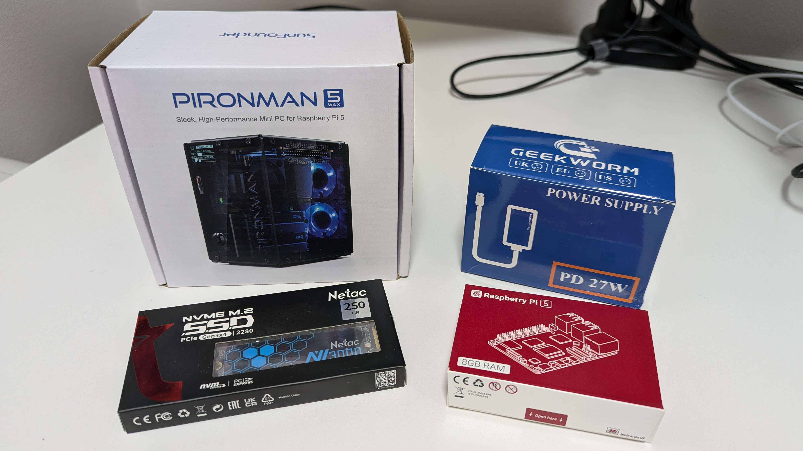

- [Raspberry Pi 5 8GB](https://akizukidenshi.com/catalog/g/g129326/) (¥14,960)
- [Pironman 5 MAX](https://www.amazon.co.jp/dp/B0F8J5HW21) (¥11,889)
- [Netac NV3000 SSD M.2 250GB](https://www.amazon.co.jp/dp/B07WDQ9GQF) (¥4,490)
- [Geekworm USB-C 電源アダプター PD 27W](https://www.amazon.co.jp/dp/B0CQLVS4L2) (¥1,599)

合計 ¥32,938 でした。
4 コア 16GB の安いミニ PC と同程度の費用です。

ラズパイは小型ケースやクーラーや SD カードとのセットが 2 万円前後で売られてますが、そちらはスルーして、必要なものだけを自分で選んで買ったほうがモノとお金の無駄が減ると判断し、単品を定価で購入しました。

というのも、せっかくならストレージには SD カードではなく SSD を使いたいという野望があったからです。
SSD を取り付けるなら HAT とそれに対応した大きめのケースも別途必要で、一般的なラズパイセットを買った場合、セットに付いてくる小型ケースや SD カードはすぐ不要になってしまいます。
Pironman は 1 万円以上するお高いケースですが、どうせ必要になる HAT とケースの費用に数千円上乗せするだけで冷却性能とカッコ良さもついでに手に入ると考えれば、買う価値はあると思います。

## Pironman 5 MAX の組み立て

購入から数日で届きました。
事前に得た情報では組み立てに数時間かかるそうだったので、休日に時間を取って組み立てました。

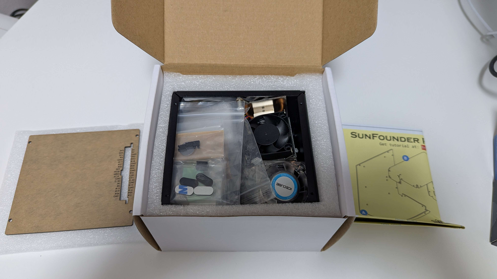

パーツは外側のケースいっぱいに入る量。
ドライバーも付属するのがありがたいです。

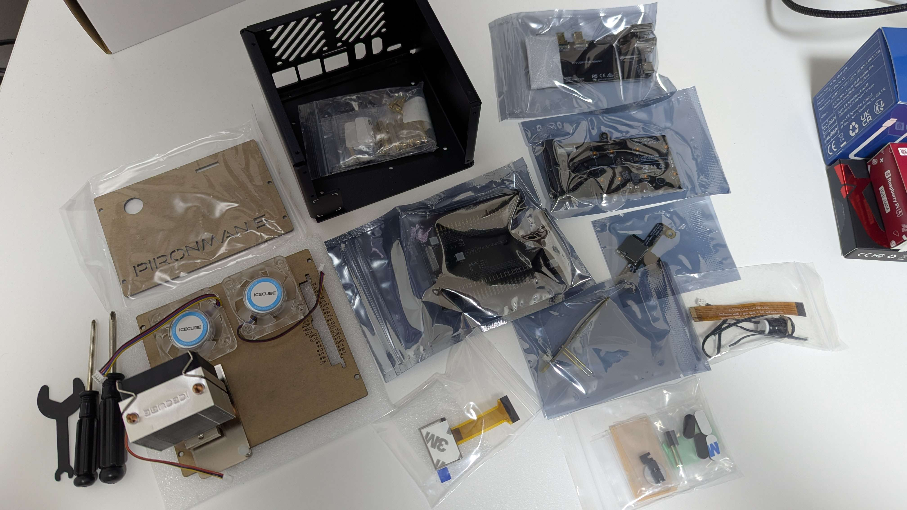

まずはケースにスタンドオフを取り付け。

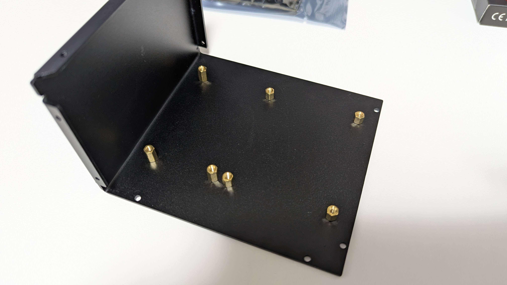

早速ラズパイご登場。

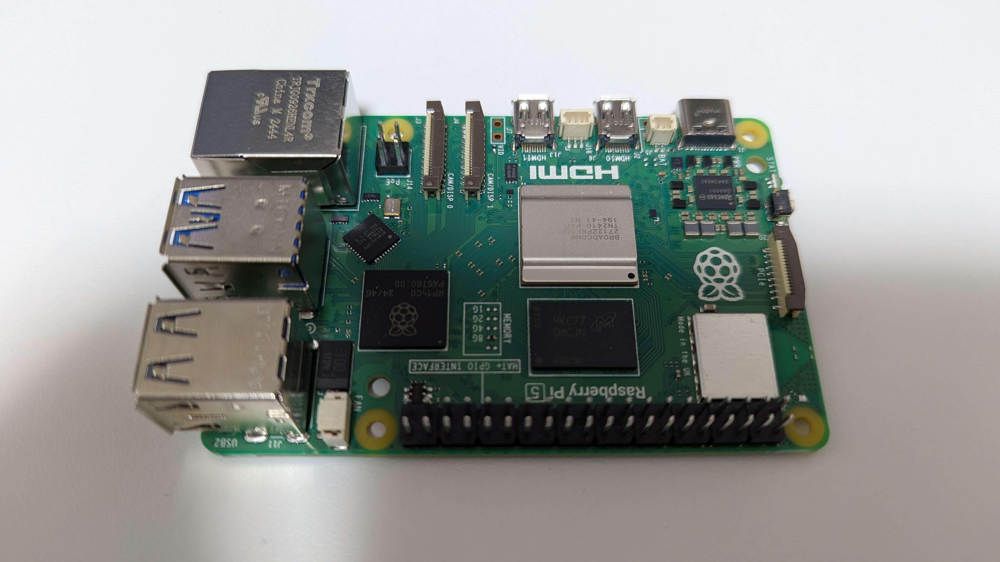

MicroSD Extender, USB HDMI Adapter, FPC などを取り付けます。
FPC はオレンジ色のピラピラしたケーブル状の基板で、後で SSD の HAT に接続するためのものです。
また、ラズパイ本体には micro HDMI の差込口が生えていますが、USB HDMI Adapter によって普通の HDMI を繋ぐことができるようになります。
おかげで HDMI 変換ケーブルを買わなくて済みました。

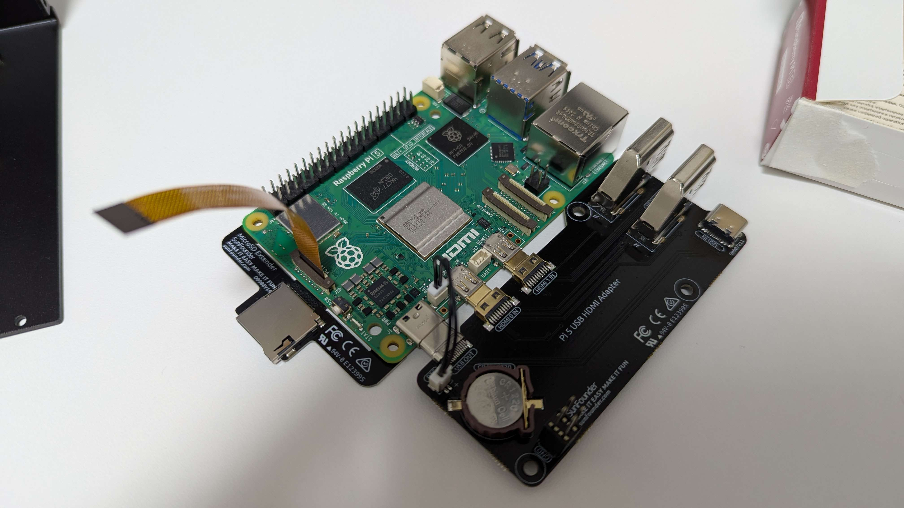

ラズパイをケースに取り付けたら、

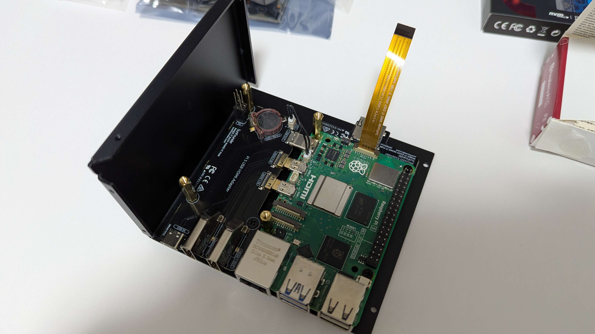

サーマルパッドを装着。

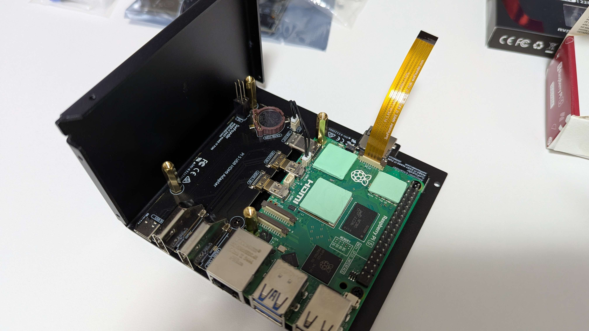

タワークーラーも装着。
バネ付きのプラスチック固定具が 2 箇所にあり、それを上から押し込むことでラズパイの基板に固定するのですが、これが一番の難所でした。
30 分にわたる苦戦の末、壊れるのを覚悟してフルパワーで押し込むことでやっと固定できました。

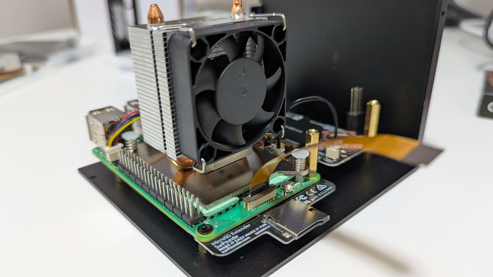

そして NVMe PIP を取り付け、SSD を差し込みます。

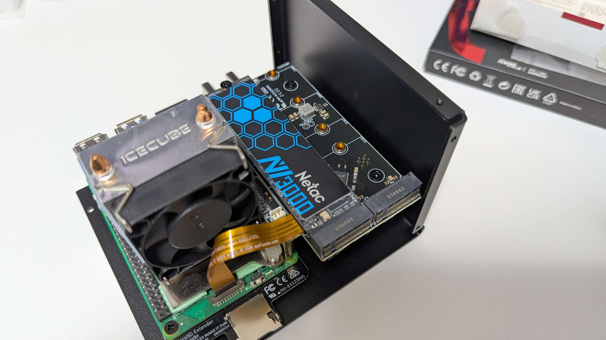

もう片方のアルミケースにはファンを取り付け、ファンと IO Expander を接続。

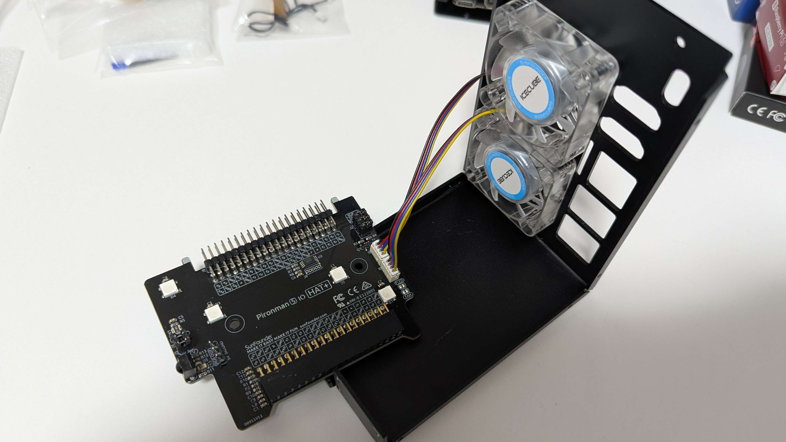

IO Expander をラズパイの GPIO ピンに差し、OLED ディスプレイを IO Expander に接続。


ケースを合体。

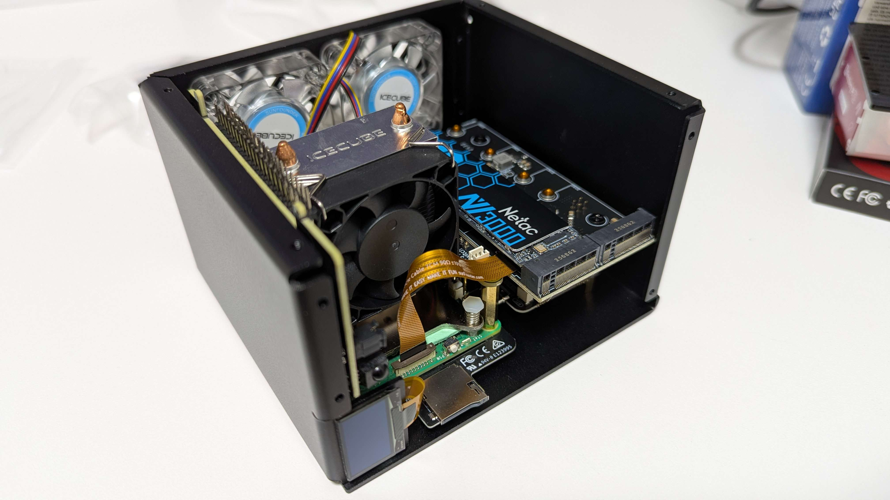

電源スイッチと一緒にアクリルのパネルを取り付けます。
パネルのフィルムを剥がすのがとても大変でした。

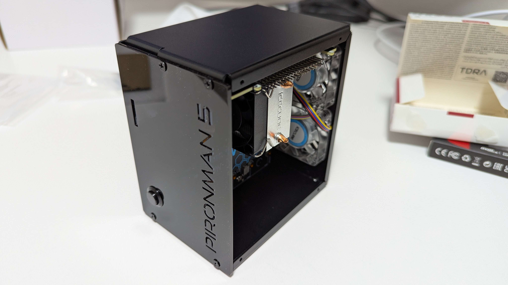

最後のパネルを取り付けて完成！
ちょうど手のひらに乗るサイズで愛着が湧きます。

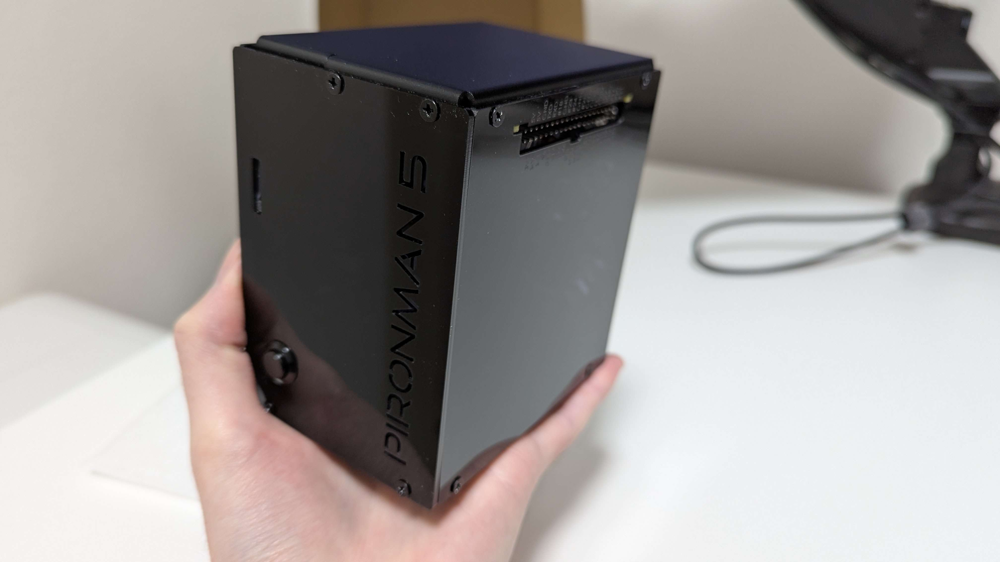

4 時間近くかかりましたが楽しかったです。
ちょっとした自作 PC 気分を味わえました。

## OS/ソフトウェアのセットアップ

さて、ハードウェアは整ったので次はソフトウェアのセットアップです。

### OS のインストール

Raspberry Pi OS をインストールしていきます。

どうせ SSD ブートするので最初から SSD に OS インストールできないかなと思いましたが、PC と SSD をつなぐアダプタを持っていないのでできません。
おまけに SD カードも持っていません。
唯一持っていた USB メモリを使って初期ブートをやってみることにしました。
結論、USB メモリからでも特に問題なく動きました。

まずは mac に Raspberry Pi Imager をインストールするところから。

```sh
brew install --cask raspberry-pi-imager
```

Raspberry Pi Imager を開き、セットアップに進みます。
OS は Raspberry Pi OS (64-bit) を選択。

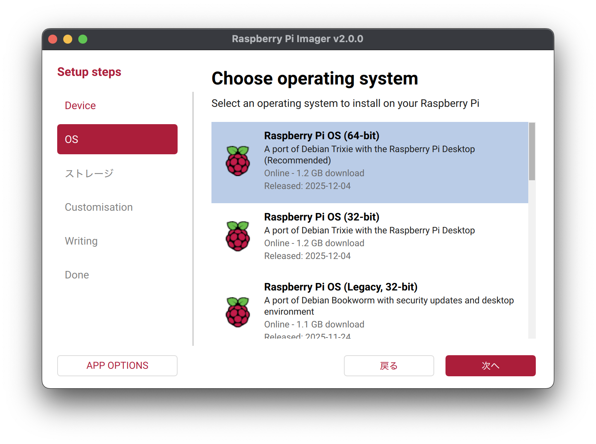

Hostname は raspi5, TimeZone は Asia/Tokyo, ユーザー名は fukkatsuso とし、Wi-Fi と SSH の認証設定をして、USB メモリにイメージを書き込みました。

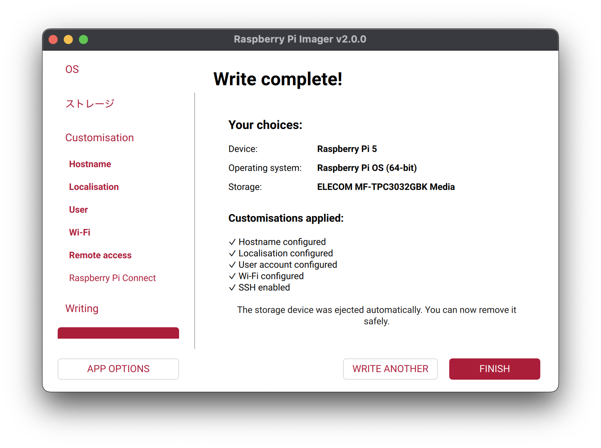

USB メモリを Pironman の背面に挿し、電源を入れてみます。
ラズパイ初心者なもので電源オン・オフの区別に最初戸惑いましたが、ランプが赤のときはシャットダウン状態のようです。

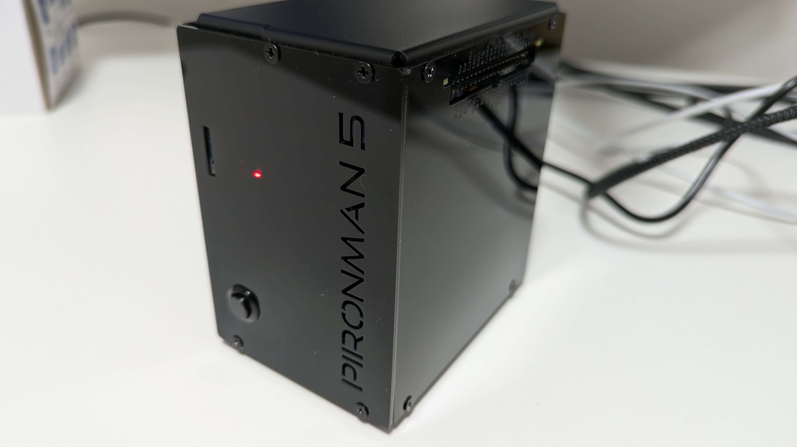

ここから電源ボタンを押すと、ランプが数秒間緑に点灯し、HDMI でつないだディスプレイにもデスクトップが表示されました。

mac から SSH で入れることを確認。

```sh
$ ssh fukkatsuso@raspi5.local
...
fukkatsuso@raspi5:~ $
```

無事 OS インストールできたので、次はインターフェースを整えます。

### マウス、キーボードの接続

マウスは本体と USB 受信機が Bluetooth で通信するタイプのもので、受信機をラズパイに繋げれば難なく使えました。

GUI 操作ができるようになったおかげで、キーボードの Bluetooth 接続も普通の手順でサクッとできました。

### pironman5 モジュールのインストール

Pironman 5 MAX には、前面に取り付けた OLED ディスプレイで CPU の使用率と温度、メモリ・ストレージの使用量などを表示する機能があります。
また、ファンを動かしたり光らせたりする機能もあります。

これらの機能を使うためには pironman5 モジュールをインストールする必要があります。
[公式のドキュメント](https://docs.sunfounder.com/projects/pironman5/ja/latest/pironman5_max/set_up/set_up_rpi_os.html)に従い、GPIO 電源を停止時に無効化する設定を入れ、pironman5 モジュールのダウンロードとインストールをしました。

無事、ファンがゲーミングな光を発しながら回りはじめ、OLED ディスプレイも表示されるようになりました。

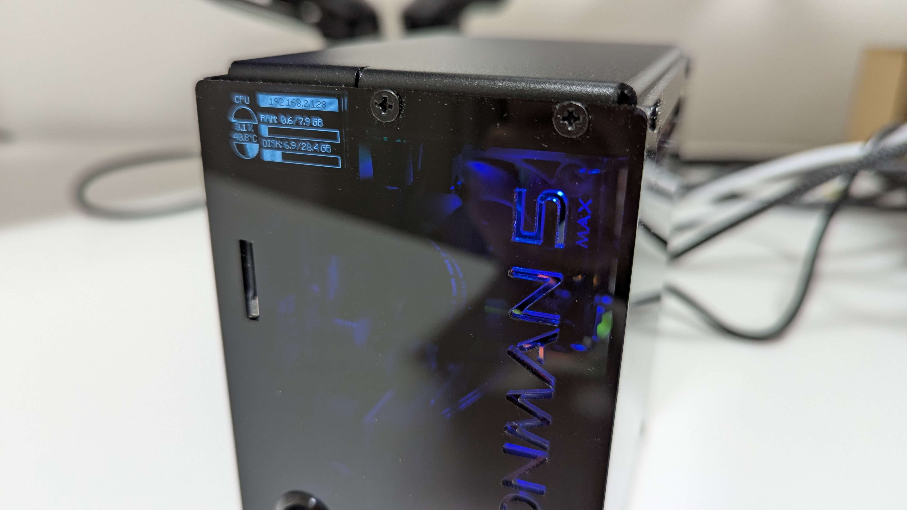

ちなみにダッシュボードもあるみたいなので見てみました。
`http://<ラズパイのホスト名>:34001/` からダッシュボードが開けます。

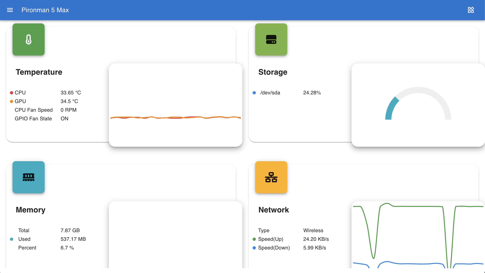

ダッシュボード右上のアイコンから設定をいじれます。
ダークモードにできたり、ファンや OLED の設定を色々変えられるみたいです。

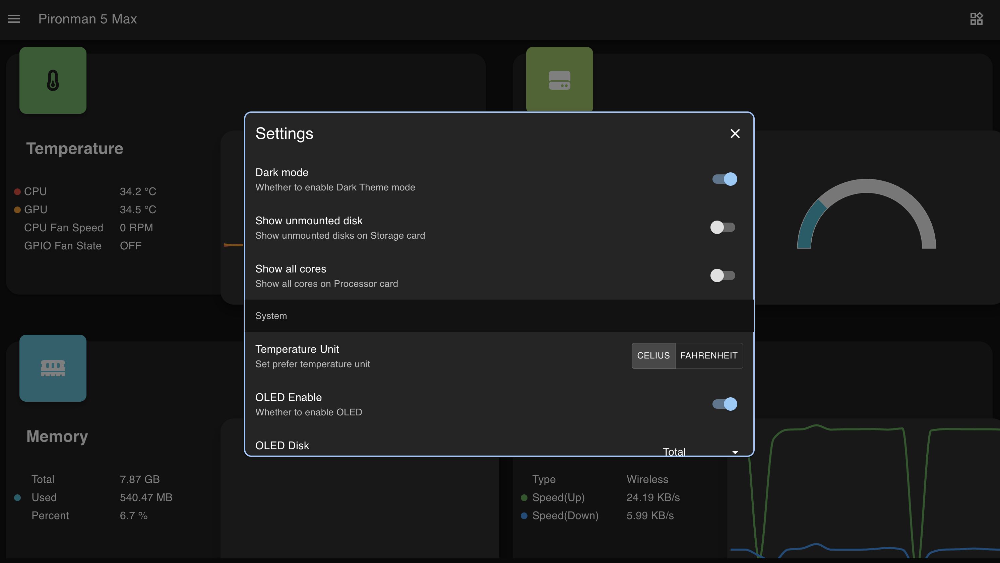

（あんまりピカピカ光るのも鬱陶しいので、青を薄く光らせることで落ち着いた雰囲気を醸し出させました）

### SSD ブートへの移行

USB メモリから SSD へ、さっさと移行してしまいます。

これも[公式の手順](https://docs.sunfounder.com/projects/pironman5/ja/latest/pironman5_max/install/copy_sd_to_nvme_rpi.html)があります。
**MicroSD から** SSD へ OS をコピーする手順なのですが、USB メモリの場合でも SD Card Copier を使った同じ手順でコピーすることができました。

コピー後、`sudo reboot` で再起動が爆速になったのを確認しました。
Pironman の組み立てミスや部品の不具合がない確証も得られ、一安心です。

これで不自由なく動かせるようになったので、開発系のツールを入れていきます。

### 各種ツールのインストール

とりあえず vscode, tailscale, docker は入れました。

それ以外では、リモートデスクトップの設定をしてみました。
ラズパイ側は <https://www.raspberrypi.com/documentation/computers/remote-access.html#vnc> あたりを読んで VNC サーバを有効化しておきます。
mac （クライアント）側は RealVNC Viewer というツールを使うことにしました。

```sh
brew install --cask vnc-viewer
```

すぐ使い始められて遅延も気にならない。これは便利ですね…


最低限のセットアップはこんなところですかね。

日本語化もやってみましたが、ほとんどサーバ用途でしか使わない予定なので英語のままでも良かった感があります。

```sh
# locale を ja_JP に変更
sudo raspi-config nonint do_change_locale ja_JP.UTF-8
sudo reboot

# 日本語入力ができるようにする
sudo apt update
sudo apt -y install fcitx5 fcitx5-mozc
sudo reboot

# このままだと中華フォントなので、noto sans フォントを使う
sudo apt -y install fonts-noto fonts-noto-cjk fonts-noto-cjk-extra fonts-noto-color-emoji
# フォント選択で Noto Sans Mono CJK JP Regular にして、
sudo reboot
```


## 今後の使い道

これまで ISUCON の監視サーバを EC2 の t4g.small 1 台で稼働してきましたが、その役目をラズパイに引き継ぎます。
Cloudflare Tunnel を使えば無料でコンテンツを公開できるので、それで監視のダッシュボードをチーム内で共有して見れるようにするつもりです。

あとは雑に bot を動かす基盤にもできそうだなと思います。
昔、仮想通貨取引 bot を作って GCP で動かしたことがあるのですが、運用費を抑えたいがために自由度の低い bot しか作れず、その割にデータベースの費用だけで毎月赤字を垂れ流していたので結局クローズした、という苦い経験があります。
ラズパイならランニングコストはわずかな電気代だけですし、費用を気にせず bot を運用できるはずです。

将来的には、ラズパイを複数台用意して k8s クラスタを構築してみるのも楽しそうだなと思っています。

せっかく冷却機能の高いケースを買ったので、がっつりファンが回るくらいには使い倒していきたいです。
