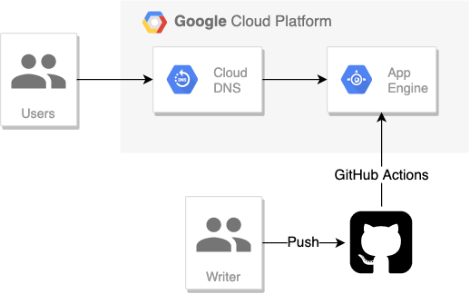

静的サイトジェネレータ **Hugo** と **Google App Engine** を使って、速い・簡単・安いの 3 拍子揃った（？）技術ブログを作りました。

## 構成

ブログを作るにあたり、最低限必要な機能の洗い出しから始めました。

- Markdown で編集
- Git/GitHub で管理
- シンタックスハイライト
- SSR or SSG（検索流入のため）
- 独自ドメイン + SSL 対応
- 低コスト
- 低レイテンシ
- 記事のタグ付け、タグ検索
- アクセス解析

ブログ記事を Markdown で書き Git で管理したいのはエンジニアっぽい気がするからです。
そして Markdown は普段使っていて書きやすいから。
技術ブログなのでプログラムを載せるときにハイライトを付けてくれると見栄えが良いですね。

調べたところ Hugo が上記の条件をクリアできそうで、なおかつ最近書いている Golang で作られたものだったので、Hugo を使うことにしました。

構成は以下のようなものを考えました。



静的サイトのホスティングであれば Netlify や GitHub Pages も候補に入りますが、クラウドの勉強がしたかったのと、GitHub Pages はすでにポートフォリオサイトに使用しているため、無料枠が豊富で多少経験のある GCP のサービスの中から料金や機能を考慮して GAE を選択しました。

独自ドメイン `blog.fukkatsuso.com` の設定と SSL 対応も行っています。
ドメインのわかりやすさと将来性を考えてサブドメインでの運用が適切と判断し、Cloud DNS を挟んだ構成にしました。[^subdomain]
[^subdomain]: [GAE でカスタムドメインにサブドメインを使う場合はちゃんとサブドメインをゾーン管理しなければならない](https://blog.kakakikikeke.com/2019/02/how-to-set-custom-domain-on-gae.html)

新しく記事を書いたら GitHub の master ブランチにプッシュすれば記事の公開ができます。
master ブランチへのプッシュをトリガーに、サイトのビルドから GAE へのデプロイまでを自動で実行するワークフローを作り、快適な執筆環境を用意しました。

費用をざっくり計算したところ 1 日 1000 アクセス以内なら少なく見積もって月 0.4 ドル、多めに見積もっても 1 ドルかからない程度なので、secret なキーが漏洩しない限り当面は心配ないと思います。
むしろアクセスが少ない方を心配するべきです。

デザインのテーマは [Hugo Notepadium](https://themes.gohugo.io/hugo-notepadium/) を選択しました。
シンプルなデザインで、特に記事一覧画面とカテゴリやタグの表示が気に入っています。

## 工夫点, 苦労した点

### デプロイ作業

「CUI 最高！GUI めんどくさい！」になりつつあるので、プロジェクトの作成から GAE にデプロイするまでの準備を、GCP のコンソールでボタンポチポチせず Cloud Shell 上でコマンドを叩くだけで完結させることにしました。

ここでは主に GitHub Actions からのデプロイを許可するための権限周りで苦労しました。

gcloud コマンドや Cloud IAM のドキュメント、GCP 公式の Actions のリポジトリ、エラーメッセージを見れば、どの API を有効化したりロールを付与したりすればいいのか理解できるはずなんですが、そもそもどのドキュメントを読めばいいかがわからなかったのが原因です。

参考にしたドキュメントはこちらです。

- [workflow の書き方と必要なロール](https://github.com/GoogleCloudPlatform/github-actions/tree/master/appengine-deploy)
- [gcloud コマンド](https://cloud.google.com/sdk/gcloud/reference?hl=ja)

プロジェクトの作成からデプロイの準備までの一連の流れは当ブログのリポジトリの [README](https://github.com/Fukkatsuso/blog/blob/master/README.md) に記しました。

ドキュメント読んで実行してエラー読んで修正を繰り返しただけですが、躓いた方の参考になると嬉しいです。

### カスタム 404 ページ

Hugo はビルドを実行すると、生成したサイトの静的ファイルを public ディレクトリに出力します。ホスティングする際はリクエストに合わせて public ディレクトリ内のファイルを提供するよう設定すれば良いです。

GAE は静的サイトのハンドラを app.yaml に記述できますが、ルーティングの正規表現に合致したパスが指すファイルが存在しない場合は即デフォルトの 404 エラーを返す仕様になっています。

そのため以下のような記述で、ファイルが見つからないパスを自分で書いたアプリケーションに渡し、カスタマイズした 404 ページを返す処理を実現しようとすることはできません。

```yaml
# app.yaml
handlers:
- url: /(.*\.css)
  static_files: public/\1
  upload: public/(.*\.css)

- url: /(.*\.(bmp|gif|ico|jpeg|jpg|png))
  static_files: public/\1
  upload: public/(.*\.(bmp|gif|ico|jpeg|jpg|png))

- url: /(.*\.xml)
  static_files: public/\1
  upload: public/(.*\.xml)

- url: /(.+)/
  static_files: public/\1/index.html
  upload: public/(.+)/index.html

- url: /(.+)
  static_files: public/\1/index.html
  upload: public/(.+)/index.html

- url: /
  static_files: public/index.html
  upload: public/index.html

- url: /.*
  script: auto
```

カスタム 404 ページを返すようにするには、上に書いた処理を自分で実装すれば良いです。Golang での例：

```go
func staticFileHandler(w http.ResponseWriter, r *http.Request) {
  if _, err := os.Stat("public/" + r.URL.Path); os.IsNotExist(err) {
    http.ServeFile(w, r, "public/404.html")
  } else {
    http.ServeFile(w, r, "public/"+r.URL.Path)
  }
}

func main() {
  port := os.Getenv("PORT")
  if port == "" {
    port = "8080"
    log.Printf("Defaulting to port %s", port)
  }

  http.HandleFunc("/", staticFileHandler)

  log.Printf("Listening on port %s", port)
  if err := http.ListenAndServe(":"+port, nil); err != nil {
    log.Fatal(err)
  }
}
```

参考： [3. Hugo を使いブログを GAE で管理 - Puliyo ブログ](https://blog.puliyo.com/jp/posts/hugo-on-gae-3/)

app.yaml のハンドラはこれだけで十分になります。

```yaml
handlers:
- url: /.*
  script: auto
```

ちなみに go1.6 より前の `http.ServeFile` には**ディレクトリトラバーサル脆弱性**なるセキュリティホールがあったそうで、セキュリティの勉強にもなりました。
古いバージョンをお使いの場合はご注意ください。[^serve_file]
[^serve_file]: [net/http で安全に静的ファイルを返す - Shogo's Blog](https://shogo82148.github.io/blog/2016/04/13/serving-static-files-in-golang/)

## 今後の改善点

- SNS シェアボタン
- 関連記事の表示

などを追加するともっとブログっぽさが出る気がします。

キャッシングについても調べておきたいところです。

## 所感

環境構築から 1 週間ほどでブログのベースを作ることができました。
ローカルサーバにはホットリロード機能がついているので、編集してセーブすると一瞬でビルドしてくれてページを確認できるのも非常に快適です。

定期的に更新できるように開発の方も力を入れていきたいと思います。
